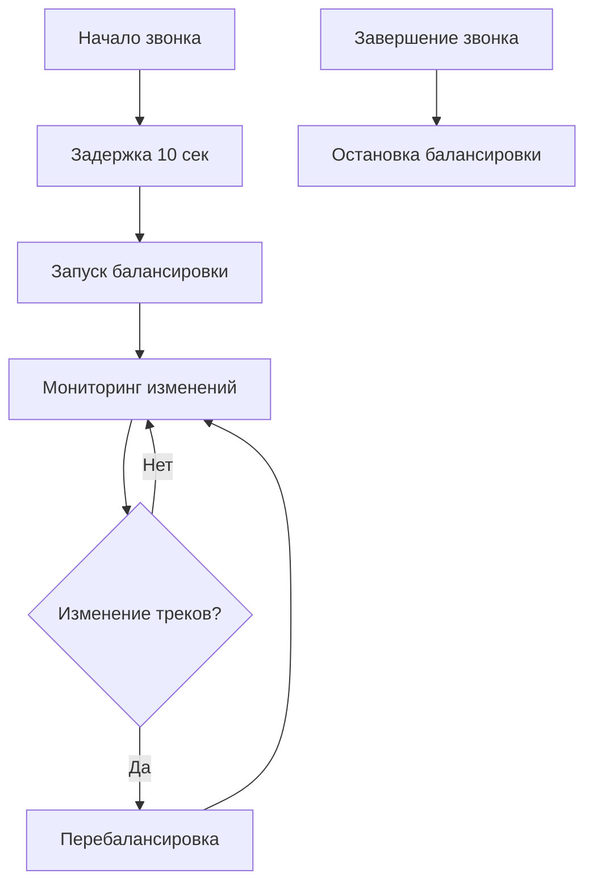

# sip-connector

[](https://www.npmjs.com/package/sip-connector)


---

## 📖 Описание

**sip-connector** — это TypeScript SDK для интеграции WebRTC-приложений с платформой Vinteo через SIP-протокол. Библиотека построена на базе `@krivega/jssip` и предоставляет высокоуровневый API для создания полнофункциональных видеоконференций.

### 🚨 Breaking Changes в версии 16.0.0

**Важные изменения, требующие обновления кода:**

- **VideoSendingBalancer перенесен в SipConnector**: Теперь балансировка видео настраивается через конструктор `SipConnector` с параметром `videoBalancerOptions`
- **Удален параметр `simulcastEncodings`**: Вместо него используется `sendEncodings` для настройки кодировок
- **Автоматический запуск балансировки**: VideoSendingBalancer теперь автоматически запускается через 10 секунд после начала звонка
- **Новые события балансировки**: Добавлены события `video-balancer:*` для мониторинга состояния балансировки

### 🆕 Новые возможности версии 16.0.0

- **Адаптивный polling**: Улучшенная система опроса для мониторинга изменений видеотреков
- **Поддержка maxBitrate в PresentationManager**: Автоматическое управление битрейтом для презентаций
- **Предпочтительные кодеки в SipConnector**: Настройка приоритетов кодеков на уровне коннектора
- **Обработка смены треков**: Автоматическая адаптация балансировки при изменении видеотреков
- **Улучшенная статистика**: Расширенные возможности сбора и анализа WebRTC статистики
- **Автоматический перезапуск ICE**: Обработка событий `restart` от сервера с автоматическим вызовом `restartIce`

### 🎯 Основные возможности

SDK предоставляет комплексное решение для:

| Категория                    | Возможности                                                                                |
| ---------------------------- | ------------------------------------------------------------------------------------------ |
| **SIP-подключения**          | Регистрация на сервере (SIP REGISTER), управление сессиями                                 |
| **WebRTC-коммуникации**      | Исходящие/входящие звонки (SIP INVITE/200 OK), медиа-потоки, автоматический перезапуск ICE |
| **Презентации**              | Отправка второго потока (screen sharing, демонстрация экрана)                              |
| **Системные сообщения**      | DTMF, SIP INFO, синхронизация медиа-состояния                                              |
| **Событийная архитектура**   | Подписка на события платформы в реальном времени                                           |
| **Мониторинг**               | WebRTC-статистика (RTCRtpStats, ICE candidate stats)                                       |
| **Управление конференциями** | Перемещение участников между ролями (участник/зритель)                                     |
| **Лицензирование**           | Мониторинг использования лицензий и состояния презентаций                                  |

### 🏗️ Архитектура

SDK построен по принципу **слоистой архитектуры**:

- **SipConnector** — низкоуровневый слой с менеджерами (Connection, Call, Presentation, API)
- **SipConnectorFacade** — высокоуровневый фасад с готовыми сценариями
- **Специализированные менеджеры** — для статистики, участников, медиа-потоков

---

## 🚀 Установка

### Команды установки

```bash
# npm
npm install sip-connector

# yarn
yarn add sip-connector

# pnpm
pnpm add sip-connector
```

### 📋 Системные требования

#### Обязательные зависимости

| Компонент          | Требование           | Описание                       |
| ------------------ | -------------------- | ------------------------------ |
| `@krivega/jssip`   | peer dependency      | Для SIP-функциональности       |
| WebRTC API         | Поддержка в браузере | Стандартные WebRTC возможности |
| JavaScript runtime | ES2017+              | Современный синтаксис          |

#### Рекомендуемые зависимости

| Компонент  | Версия | Назначение          |
| ---------- | ------ | ------------------- |
| TypeScript | 4.5+   | Полная типизация    |
| Node.js    | 16+    | Сборка и разработка |

---

## 🎯 Быстрый старт

### Шаг 1: Инициализация

```typescript
import { UA, WebSocketInterface } from '@krivega/jssip';
import { SipConnector, SipConnectorFacade, tools } from 'sip-connector';

// Создание низкоуровневого коннектора с настройками кодеков
const sipConnector = new SipConnector(
  { JsSIP: { UA, WebSocketInterface } },
  {
    // Приоритизация современных кодеков
    preferredMimeTypesVideoCodecs: ['video/AV1', 'video/VP9'],
    excludeMimeTypesVideoCodecs: ['video/H264'],
    // Настройки видеобалансировщика (опционально)
    videoBalancerOptions: {
      ignoreForCodec: 'H264',
      onSetParameters: (result) => {
        console.log('Video parameters updated:', result);
      },
    },
  },
);

// Создание фасада
const facade = new SipConnectorFacade(sipConnector);
```

### Шаг 2: Подключение к серверу

```typescript
await facade.connectToServer({
  userAgent: tools.getUserAgent({ appName: 'MyApp' }),
  sipWebSocketServerURL: 'wss://sip.example.com/ws',
  sipServerUrl: 'sip:example.com',
  name: '1001', // SIP URI user part
  password: 'secret',
  isRegisteredUser: true, // Включить SIP REGISTER
});
```

### Шаг 3: Исходящий звонок

```typescript
// Получение локального медиа-потока
const localStream = await navigator.mediaDevices.getUserMedia({
  audio: true,
  video: true,
});

// Инициация звонка
const pc = await facade.callToServer({
  conference: '12345',
  mediaStream: localStream,
  setRemoteStreams: (streams) => {
    // Обработка удаленных потоков
    console.log('Получены удаленные потоки:', streams);
  },
});

// Подписка на WebRTC-статистику
const unsubscribeStats = facade.onStats(({ outbound, inbound }) => {
  console.log('Исходящая статистика:', outbound);
  console.log('Входящая статистика:', inbound);
});
```

### Шаг 4: Завершение работы

```typescript
await facade.disconnectFromServer();
unsubscribeStats();
```

---

## 📞 Входящие звонки

### Обработка входящих вызовов

```typescript
// Подписка на входящие события
sipConnector.on('incoming-call:incomingCall', () => {
  // Автоматический ответ с локальным потоком
  facade.answerToIncomingCall({
    mediaStream: localStream,
    setRemoteStreams: (streams) => {
      // Отображение удаленных потоков
      displayRemoteStreams(streams);
    },
  });
});
```

### Управление состоянием звонка

```typescript
// Отслеживание жизненного цикла звонка
sipConnector.on('call:accepted', () => {
  console.log('Звонок принят');
});

sipConnector.on('call:ended', () => {
  console.log('Звонок завершен');
});

sipConnector.on('call:failed', (error) => {
  console.error('Ошибка звонка:', error);
});
```

---

## 🖥️ Управление презентациями

### Запуск презентации

```typescript
// Получение потока экрана
const displayStream = await navigator.mediaDevices.getDisplayMedia({
  video: true,
  audio: true,
});

// Запуск презентации с настройками качества
await facade.startPresentation({
  mediaStream: displayStream,
  isP2P: false, // MCU режим
  contentHint: 'detail', // Оптимизация для детального контента
  maxBitrate: 4000000, // Максимальный битрейт 4 Мбит/с
  degradationPreference: 'maintain-resolution', // Приоритет разрешения
  sendEncodings: [
    { width: 1920, height: 1080, scalabilityMode: 'L3T3_KEY' },
    { width: 1280, height: 720 },
  ],
});
```

### Обновление и остановка

```typescript
// Обновление потока презентации с новыми настройками
await facade.updatePresentation({
  mediaStream: newDisplayStream,
  isP2P: false,
  maxBitrate: 6000000, // Увеличенный битрейт для HD контента
  contentHint: 'text', // Оптимизация для текстового контента
});

// Остановка презентации
await facade.stopShareSipConnector();
```

### Настройки качества презентации

| Параметр                | Описание                         | Рекомендуемые значения                  |
| ----------------------- | -------------------------------- | --------------------------------------- |
| `maxBitrate`            | Максимальный битрейт (bps)       | 2-8 Мбит/с в зависимости от контента    |
| `contentHint`           | Тип контента для оптимизации     | `'detail'`, `'text'`, `'motion'`        |
| `degradationPreference` | Приоритет при ухудшении качества | `'maintain-resolution'` для презентаций |

```typescript
// Адаптивные настройки в зависимости от типа контента
const presentationSettings = {
  // For detailed graphics/images
  highQuality: {
    maxBitrate: 8000000,
    contentHint: 'detail' as const,
    degradationPreference: 'maintain-resolution' as const,
  },

  // For text documents
  textOptimized: {
    maxBitrate: 4000000,
    contentHint: 'text' as const,
    degradationPreference: 'maintain-resolution' as const,
  },

  // For video content
  videoOptimized: {
    maxBitrate: 6000000,
    contentHint: 'motion' as const,
    degradationPreference: 'maintain-framerate' as const,
  },
};

// Использование настроек
await facade.startPresentation({
  mediaStream: displayStream,
  isP2P: false,
  ...presentationSettings.textOptimized,
});
```

---

## 👥 Управление участниками конференции

### Отслеживание перемещений

```typescript
// Подписка на перемещение в зрители
const unsubscribeMoveToSpectators = facade.onMoveToSpectators(() => {
  console.log('Участник перемещен в зрители');
  updateParticipantRole('spectator');
});

// Подписка на перемещение в участники
const unsubscribeMoveToParticipants = facade.onMoveToParticipants(() => {
  console.log('Участник перемещен в участники');
  updateParticipantRole('participant');
});

// Отписка при необходимости
unsubscribeMoveToSpectators();
unsubscribeMoveToParticipants();
```

### Административные функции

```typescript
// Принудительная остановка презентации
facade.onMustStopPresentation(() => {
  console.log('Администратор требует остановить презентацию');
  facade.stopShareSipConnector();
});

// Мониторинг лицензий
facade.onUseLicense((license) => {
  console.log('Используется лицензия:', license);
  updateLicenseStatus(license);
});
```

---

## 📊 Управление медиа-потоками

### Работа с удаленными потоками

```typescript
// Получение текущих удаленных потоков
const remoteStreams = facade.getRemoteStreams();
if (remoteStreams) {
  console.log('Активные удаленные потоки:', remoteStreams.length);
  remoteStreams.forEach((stream) => {
    displayStream(stream);
  });
}
```

### Обработка готовых потоков

```typescript
// Обработка с debounce (рекомендуется для UI)
const handleReadyRemoteStreamsDebounced = facade.resolveHandleReadyRemoteStreamsDebounced({
  onReadyRemoteStreams: (streams) => {
    console.log('Готовые удаленные потоки:', streams);
    updateStreamsDisplay(streams);
  },
});

// Обработка без debounce (для критичных операций)
const handleReadyRemoteStreams = facade.resolveHandleReadyRemoteStreams({
  onReadyRemoteStreams: () => {
    console.log('Новый поток готов');
    handleNewStream();
  },
});
```

### Управление разрешениями

```typescript
// Запрос разрешения на камеру
try {
  await facade.askPermissionToEnableCam();
  console.log('Разрешение на камеру получено');
} catch (error) {
  console.error('Ошибка получения разрешения:', error);
}
```

### Перезапуск ICE-соединения

#### Ручной перезапуск

```typescript
// Перезапуск ICE для восстановления соединения
try {
  const success = await sipConnector.callManager.restartIce({
    useUpdate: true, // Использовать SIP UPDATE вместо re-INVITE
    extraHeaders: ['X-Restart-Reason: Connection-Reset'],
    rtcOfferConstraints: {
      offerToReceiveAudio: true,
      offerToReceiveVideo: true,
    },
  });

  if (success) {
    console.log('ICE перезапущен успешно');
  } else {
    console.warn('Перезапуск ICE не удался');
  }
} catch (error) {
  console.error('Ошибка перезапуска ICE:', error);
}
```

#### Автоматический перезапуск по событию сервера

SDK автоматически обрабатывает события `restart` от сервера и инициирует перезапуск ICE-соединения:

```typescript
// SDK автоматически подписывается на события restart от ApiManager
// и вызывает callManager.restartIce() при получении таких событий

// Мониторинг событий restart (опционально)
sipConnector.on('api:restart', (data) => {
  console.log('Получено событие restart от сервера:', {
    tracksDirection: data.tracksDirection, // 'incoming', 'outgoing', 'bidirectional'
    audioTrackCount: data.audioTrackCount,
    videoTrackCount: data.videoTrackCount,
  });

  // SDK автоматически вызовет restartIce()
  console.log('ICE будет перезапущен автоматически');
});
```

### Параметры перезапуска ICE

| Параметр                | Тип      | Описание                                 | По умолчанию |
| ----------------------- | -------- | ---------------------------------------- | ------------ |
| `useUpdate`             | boolean  | Использовать SIP UPDATE вместо re-INVITE | `false`      |
| `extraHeaders`          | string[] | Дополнительные SIP заголовки             | `[]`         |
| `rtcOfferConstraints`   | object   | Ограничения для создания SDP offer       | `{}`         |
| `sendEncodings`         | array    | Параметры кодирования для видеопотока    | `[]`         |
| `degradationPreference` | string   | Приоритет при ухудшении качества         | `undefined`  |

---

## 📡 События и их обработка

### Архитектура событий

SDK использует **событийно-ориентированную архитектуру** с префиксами для группировки:

| Префикс            | Описание                 | Примеры событий                           |
| ------------------ | ------------------------ | ----------------------------------------- |
| `connection:*`     | События подключения      | `connected`, `disconnected`               |
| `call:*`           | События звонков          | `accepted`, `ended`, `failed`             |
| `api:*`            | События от сервера       | `enterRoom`, `useLicense`, `restart`      |
| `incoming-call:*`  | События входящих звонков | `incomingCall`                            |
| `presentation:*`   | События презентаций      | `started`, `stopped`                      |
| `stats:*`          | События статистики       | `collected`                               |
| `video-balancer:*` | События балансировки     | `balancing-started`, `parameters-updated` |

### Основные события

```typescript
// Подключение
sipConnector.on('connection:connected', () => {
  console.log('Подключение установлено');
});

sipConnector.on('connection:disconnected', () => {
  console.log('Подключение разорвано');
});

// Звонки
sipConnector.on('call:accepted', () => {
  console.log('Звонок принят');
});

sipConnector.on('call:ended', () => {
  console.log('Звонок завершен');
});

// API события
sipConnector.on('api:enterRoom', ({ room }) => {
  console.log('Вход в комнату:', room);
});

sipConnector.on('api:useLicense', (license) => {
  console.log('Лицензия:', license);
});

sipConnector.on('api:restart', (data) => {
  console.log('Событие restart от сервера:', data);
});
```

### Продвинутые паттерны

```typescript
// Ожидание одного из нескольких событий
sipConnector.onceRace(['call:ended', 'call:failed'], (_payload, eventName) => {
  console.log('Звонок завершен событием:', eventName);
  cleanupCall();
});

// Ожидание конкретного события
const roomData = await sipConnector.wait('api:enterRoom');
console.log('Данные комнаты:', roomData);
```

### События балансировки видео (версия 16.0.0+)

```typescript
// Мониторинг автоматической балансировки видео
sipConnector.on('video-balancer:balancing-scheduled', (data) => {
  console.log(`Балансировка запланирована через ${data.delay}ms`);
});

sipConnector.on('video-balancer:balancing-started', (data) => {
  console.log(`Балансировка запущена после задержки ${data.delay}ms`);
});

sipConnector.on('video-balancer:balancing-stopped', () => {
  console.log('Балансировка остановлена');
});

sipConnector.on('video-balancer:parameters-updated', (result) => {
  console.log('Обновлены параметры:', result);
});

// Ручное управление балансировкой
sipConnector.videoSendingBalancerManager.startBalancing(); // Принудительный запуск
sipConnector.videoSendingBalancerManager.stopBalancing(); // Остановка
```

---

## 📈 WebRTC Статистика

### Обзор возможностей

SDK предоставляет детальную WebRTC-статистику, основанную на [W3C WebRTC Statistics API](https://www.w3.org/TR/webrtc-stats/), включающую:

| Тип статистики     | Описание              | Метрики                       |
| ------------------ | --------------------- | ----------------------------- |
| **RTP статистика** | Потоковые данные      | Пакеты, байты, jitter, loss   |
| **Кодеки**         | Параметры кодирования | Параметры, реализация         |
| **ICE кандидаты**  | Сетевые соединения    | Типы, приоритеты, состояния   |
| **Транспорт**      | Защищенные соединения | DTLS, соединения, сертификаты |

### Использование статистики

```typescript
import { StatsPeerConnection, EStatsTypes, hasAvailableStats } from 'sip-connector';

// Проверка доступности
if (hasAvailableStats()) {
  const statsCollector = new StatsPeerConnection();

  // Подписка на события статистики
  statsCollector.on('collected', ({ outbound, inbound }) => {
    console.log('Исходящая статистика:', outbound);
    console.log('Входящая статистика:', inbound);

    // Новая метрика availableIncomingBitrate
    if (inbound.additional?.candidatePair?.availableIncomingBitrate) {
      console.log(
        'Доступный входящий битрейт:',
        inbound.additional.candidatePair.availableIncomingBitrate,
      );
    }

    // Анализ качества соединения
    analyzeConnectionQuality(outbound, inbound);
  });

  // Запуск сбора статистики с адаптивным интервалом
  statsCollector.start(peerConnection);
}
```

### Адаптивный интервал сбора статистики

SDK автоматически адаптирует частоту сбора статистики в зависимости от времени выполнения:

| Время выполнения | Множитель интервала | Интервал (мс) |
| ---------------- | ------------------- | ------------- |
| < 16 мс          | 1x                  | 1000          |
| 16-32 мс         | 2x                  | 2000          |
| 32-48 мс         | 3x                  | 3000          |
| > 48 мс          | 4x                  | 4000          |

```typescript
// Мониторинг производительности сбора статистики
statsCollector.on('collected', (stats) => {
  const collectionTime = performance.now() - startTime;
  console.log(`Статистика собрана за ${collectionTime}мс`);
});
```

### Типы статистики

| Категория              | Типы                              | Описание                                   |
| ---------------------- | --------------------------------- | ------------------------------------------ |
| **Аудио потоки**       | `TInboundAudio`, `TOutboundAudio` | RTP, кодек, jitter buffer, audio level     |
| **Видео потоки**       | `TInboundVideo`, `TOutboundVideo` | RTP, кодек, frames, bitrate, resolution    |
| **Сетевая информация** | `TAdditional`                     | ICE кандидаты, DTLS транспорт, сертификаты |

---

## ⚡ Адаптивное опрашивание видеопотоков

### Принцип работы

SDK использует **адаптивное опрашивание** для мониторинга изменений в видеопотоках, что значительно снижает нагрузку на CPU:

```typescript
// TrackMonitor автоматически адаптирует частоту опрашивания
const trackMonitor = new TrackMonitor({
  pollIntervalMs: 1000, // Начальный интервал
  maxPollIntervalMs: 16000, // Максимальный интервал (16x)
});
```

### Алгоритм адаптации

| Ситуация                 | Действие                        | Результат                    |
| ------------------------ | ------------------------------- | ---------------------------- |
| **Изменение разрешения** | Сброс интервала до минимального | Быстрая реакция на изменения |
| **Нет изменений**        | Удвоение интервала              | Снижение нагрузки на CPU     |
| **Достижение максимума** | Ограничение интервала           | Предотвращение "заморозки"   |

### Преимущества

- **Снижение CPU нагрузки на 40-60%** при стабильном видео
- **Быстрая реакция** на изменения разрешения (resize events)
- **Автоматическое обнаружение** замены треков (replaceTrack)
- **Настраиваемые интервалы** для разных сценариев использования

```typescript
// Пример использования с кастомными настройками
const monitor = new TrackMonitor({
  pollIntervalMs: 500, // Более частое начальное опрашивание
  maxPollIntervalMs: 8000, // Меньший максимальный интервал
});

// Подписка на изменения
monitor.subscribe(videoSender, () => {
  console.log('Обнаружено изменение видеопотока');
  // Перебалансировка параметров
  rebalanceVideoParameters();
});
```

---

## 🎛️ Управление видеобалансировщиком

### Автоматическая балансировка

С версии 16.0.0 `VideoSendingBalancer` интегрирован в `SipConnector` и запускается автоматически:

```typescript
const sipConnector = new SipConnector(
  { JsSIP: { UA, WebSocketInterface } },
  {
    videoBalancerOptions: {
      ignoreForCodec: 'H264', // Игнорировать H264
      onSetParameters: (result) => {
        console.log('Параметры обновлены:', result);
      },
    },
  },
);

// Подписка на события балансировщика
sipConnector.on('video-balancer:balancing-started', (data) => {
  console.log(`Балансировка запущена через ${data.delay}мс`);
});

sipConnector.on('video-balancer:parameters-updated', (result) => {
  console.log('Обновлены параметры:', result);
});
```

### Жизненный цикл балансировщика



### События балансировщика

| Событие                              | Описание                   | Данные                 |
| ------------------------------------ | -------------------------- | ---------------------- |
| `video-balancer:balancing-scheduled` | Балансировка запланирована | `{ delay: number }`    |
| `video-balancer:balancing-started`   | Балансировка запущена      | `{ delay: number }`    |
| `video-balancer:balancing-stopped`   | Балансировка остановлена   | -                      |
| `video-balancer:parameters-updated`  | Параметры обновлены        | `RTCRtpSendParameters` |

---

## 🔄 Управление последовательными операциями

### ConnectionQueueManager

`ConnectionQueueManager` обеспечивает **последовательное выполнение операций** для предотвращения конфликтов и гонки условий:

```typescript
// Все операции ConnectionManager проходят через очередь
const connectionQueueManager = new ConnectionQueueManager({
  connectionManager: connectionManager,
});

// Операции выполняются последовательно
await connectionQueueManager.connect(params);
await connectionQueueManager.register();
await connectionQueueManager.checkTelephony(params);
```

### Механизм работы

- **Очередь операций**: Использует `stack-promises` с `noRunIsNotActual: true`
- **Предотвращение конфликтов**: Исключает одновременные connect/disconnect операции

### Поддерживаемые операции

| Операция         | Описание                |
| ---------------- | ----------------------- |
| `connect`        | Подключение к серверу   |
| `disconnect`     | Отключение от сервера   |
| `register`       | Регистрация на сервере  |
| `unregister`     | Отмена регистрации      |
| `tryRegister`    | Попытка регистрации     |
| `checkTelephony` | Проверка телефонии      |
| `sendOptions`    | Отправка OPTIONS        |
| `ping`           | Отправка PING           |
| `set`            | Обновление конфигурации |

### Интеграция в SipConnector

```typescript
// SipConnector автоматически использует ConnectionQueueManager
const sipConnector = new SipConnector({ JsSIP });

// Все операции подключения проходят через очередь
await sipConnector.connect(params); // → connectionQueueManager.connect()
await sipConnector.disconnect(); // → connectionQueueManager.disconnect()
```

---

## 🔧 API и экспорты

### Основные классы

```typescript
import {
  SipConnector, // Низкоуровневый API
  SipConnectorFacade, // Высокоуровневый фасад
  StatsPeerConnection, // Сбор статистики
  // ... другие экспорты
} from 'sip-connector';
```

### Методы управления соединением

```typescript
// SipConnectorFacade методы
const facade = new SipConnectorFacade(sipConnector);

// Замена медиа-потока
await facade.replaceMediaStream(mediaStream, options);

// Получение удаленных потоков
const streams = facade.getRemoteStreams();

// Перезапуск ICE-соединения (низкоуровневый API)
await sipConnector.callManager.restartIce(options);
```

### Утилиты и типы

```typescript
import {
  // Утилиты
  tools, // getUserAgent, getExtraHeaders, hasPurgatory
  hasAvailableStats, // Проверка доступности статистики

  // Константы
  EStatsTypes, // Типы статистики
  EMimeTypesVideoCodecs, // MIME-типы кодеков
  EUseLicense, // Типы лицензий

  // Типы
  type TContentHint, // Подсказки для кодирования
  type TInboundStats, // Входящая статистика
  type TOutboundStats, // Исходящая статистика
  type TRestartData, // Данные события restart
} from 'sip-connector';
```

---

## 🏗️ Архитектура и паттерны

### Слоистая архитектура

```shell
┌────────────────────────────────────────────────────┐
│                  SipConnectorFacade                │ ← Высокоуровневый API
├────────────────────────────────────────────────────┤
│                  SipConnector                      │ ← Координация менеджеров
├────────────────────────────────────────────────────┤
│ Connection │ Connection │ Call       │  API        │ ← Основные менеджеры
│ Manager    │ Queue      │ Manager    │  Manager    │
│            │ Manager    │            │             │
├────────────────────────────────────────────────────┤
│ Stats      │Presentation│IncomingCall│VideoBalancer│ ← Специализированные менеджеры
│ Manager    │ Manager    │ Manager    │ Manager     │
├────────────────────────────────────────────────────┤
│                  @krivega/jssip                    │ ← SIP-функциональность
└────────────────────────────────────────────────────┘
```

### Паттерны проектирования

| Паттерн         | Описание                          | Применение               |
| --------------- | --------------------------------- | ------------------------ |
| **Фасад**       | Упрощение сложных операций        | `SipConnectorFacade`     |
| **Стратегия**   | Различные стратегии для звонков   | MCU, P2P режимы          |
| **Наблюдатель** | Событийная модель для уведомлений | Event-driven архитектура |
| **Фабрика**     | Создание UA и сессий              | `UAFactory`              |

---

## 📚 Лучшие практики

### Обработка ошибок

```typescript
try {
  await facade.connectToServer(config);
} catch (error) {
  if (error.code === 'CONNECTION_FAILED') {
    // Повторная попытка подключения
    await retryConnection();
  } else {
    // Логирование и уведомление пользователя
    logError(error);
    notifyUser('Ошибка подключения');
  }
}
```

### Восстановление соединения

```typescript
// Мониторинг качества соединения
facade.onStats(({ outbound, inbound }) => {
  // Проверка качества соединения
  if (outbound.packetsLost > 0.05) {
    // 5% потерь пакетов
    console.warn('Высокие потери пакетов, перезапуск ICE');

    // Перезапуск ICE для восстановления соединения
    sipConnector.callManager
      .restartIce({
        useUpdate: true,
        extraHeaders: ['X-Restart-Reason: High-Packet-Loss'],
      })
      .catch((error) => {
        console.error('Ошибка перезапуска ICE:', error);
      });
  }
});
```

### Управление ресурсами

```typescript
// Всегда отписывайтесь от событий
const unsubscribe = facade.onStats(handleStats);

// Очистка при размонтировании
useEffect(() => {
  return () => {
    unsubscribe();
    facade.disconnectFromServer();
  };
}, []);
```

### Оптимизация производительности

```typescript
// Используйте debounce для частых событий
const debouncedStatsHandler = debounce(handleStats, 1000);
facade.onStats(debouncedStatsHandler);

// Приоритизируйте современные кодеки и настройте балансировку
const sipConnector = new SipConnector(
  { JsSIP: { UA, WebSocketInterface } },
  {
    preferredMimeTypesVideoCodecs: ['video/AV1', 'video/VP9'],
    videoBalancerOptions: {
      ignoreForCodec: 'H264',
      balancingStartDelay: 5000, // Быстрее запуск для критичных приложений
    },
  },
);
const facade = new SipConnectorFacade(sipConnector);
```

---

## 🐛 Отладка и диагностика

### Включение отладочного режима

```typescript
import { enableDebug, disableDebug } from 'sip-connector';

// Включение детального логирования
enableDebug();

// Отключение для продакшена
disableDebug();
```

### Мониторинг состояния

```typescript
// Проверка состояния подключения
console.log('Зарегистрирован:', facade.isRegistered);

// Проверка конфигурации
console.log('Настроен:', facade.isConfigured());

// Диагностика ICE-соединения
const checkIceConnection = async () => {
  try {
    const success = await sipConnector.callManager.restartIce({
      useUpdate: true,
      extraHeaders: ['X-Debug: ICE-Check'],
    });
    console.log('ICE соединение:', success ? 'OK' : 'Проблемы');
  } catch (error) {
    console.error('ICE недоступен:', error.message);
  }
};
```

---

## 🧪 Тестирование

### Запуск тестов

```bash
# Все тесты
npm test

# Тесты с покрытием
npm run test:coverage

# Тесты в watch режиме
npm run test:watch
```

### Тестовые фикстуры

SDK включает готовые моки для тестирования:

| Мок                     | Назначение           | Описание                   |
| ----------------------- | -------------------- | -------------------------- |
| `RTCPeerConnectionMock` | WebRTC API           | Имитация WebRTC соединений |
| `UA.mock.ts`            | SIP-функциональность | Имитация SIP User Agent    |
| `BaseSession.mock.ts`   | Сессии               | Имитация SIP сессий        |

---

## 🌐 Совместимость браузеров

### WebRTC поддержка

SDK использует стандартные WebRTC API и совместим с:

| Браузер     | Версия | Уровень поддержки | Особенности                    |
| ----------- | ------ | ----------------- | ------------------------------ |
| **Chrome**  | 67+    | Полная поддержка  | Все возможности WebRTC         |
| **Firefox** | 60+    | Полная поддержка  | Все возможности WebRTC         |
| **Safari**  | 11+    | Базовая поддержка | Ограниченная поддержка кодеков |
| **Edge**    | 79+    | Полная поддержка  | Chromium-based                 |

### Проверка возможностей

```typescript
// Проверка поддержки WebRTC
if (!navigator.mediaDevices?.getUserMedia) {
  throw new Error('WebRTC не поддерживается');
}

// Проверка поддержки презентаций
if (!navigator.mediaDevices?.getDisplayMedia) {
  console.warn('Screen sharing не поддерживается');
}

// Проверка поддержки ICE restart
if (!RTCPeerConnection.prototype.restartIce) {
  console.warn('ICE restart не поддерживается в этом браузере');
}
```

---

## 🤝 Поддержка и сообщество

### Документация

- **API Reference**: Полное описание всех методов и типов
- **Примеры**: Готовые сценарии использования
- **Архитектура**: Детальное описание внутренней структуры

### Сообщество

- **Issues**: [GitHub Issues](https://github.com/Krivega/sip-connector/issues)
- **Discussions**: Обсуждения и вопросы
- **Contributing**: Руководство по участию в разработке

## 👨‍💻 Автор

### Krivega Dmitriy

- 🌐 Website: [krivega.com](https://krivega.com)
- 📱 Github: [@Krivega](https://github.com/Krivega)
- 📧 Email: <mr.krivega@gmail.com>

## 📄 Лицензия

Copyright © 2021‑2025 [Krivega Dmitriy](https://github.com/Krivega).

This project is licensed under the [MIT License](https://github.com/Krivega/sip-connector/blob/master/LICENSE) - see the LICENSE file for details.
