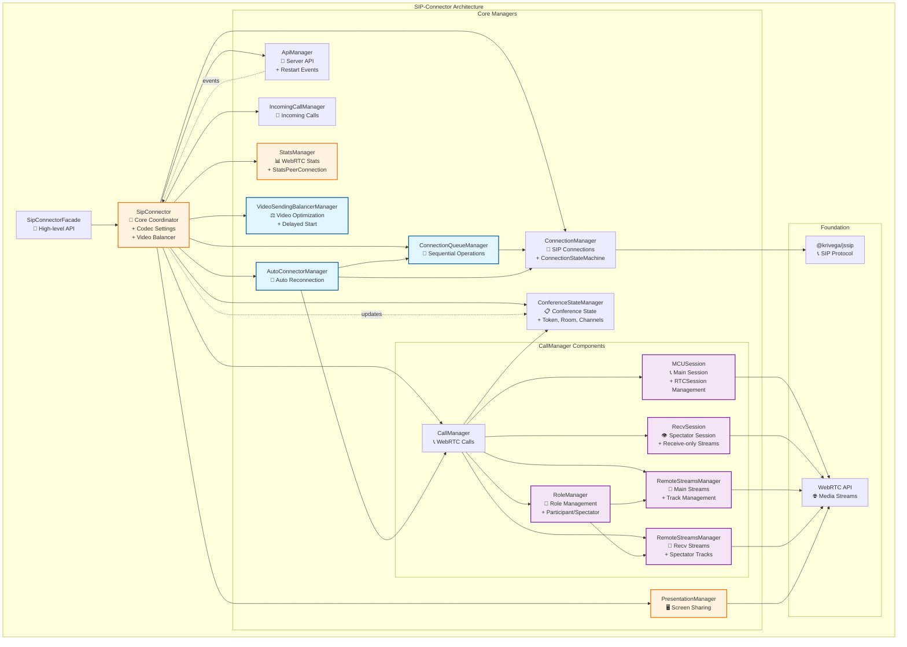
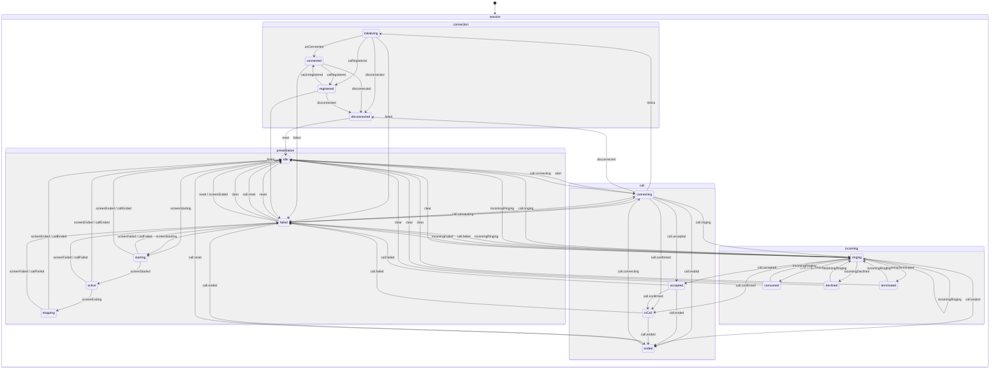

# Архитектура SIP Connector

## Обзор архитектуры

### 1. **SipConnectorFacade** (Высокоуровневый API)

**Назначение**: Упрощенный интерфейс для работы с SIP-соединениями и видеозвонками.

**Ключевые возможности**:

- Подключение к серверу и управление сессиями
- Исходящие и входящие звонки
- Управление презентациями (screen sharing)
- Работа с медиа-потоками
- Обработка событий и уведомлений

**Основные методы**:

- `connectToServer()` / `disconnectFromServer()` - управление соединением
- `callToServer()` / `answerToIncomingCall()` - управление звонками
- `startPresentation()` / `stopShareSipConnector()` - управление презентациями
- `updatePresentation()` - обновление презентации
- `getRemoteStreams()` - получение удаленных потоков
- `sendMediaState()` - отправка состояния медиа
- `sendRefusalToTurnOnMic()` / `sendRefusalToTurnOnCam()` - отправка отказов
- `replaceMediaStream()` - замена медиа-потока
- `askPermissionToEnableCam()` - запрос разрешений

---

### 2. **SipConnector** (Центральный координатор)

**Назначение**: Координирует работу всех менеджеров и предоставляет единый API.

**Ключевые возможности**:

- Управление настройками кодеков
- Координация между всеми менеджерами
- Событийная система с префиксами (auto-connect:, connection:, call:, api:, incoming-call:, presentation:, stats:, video-balancer:)
- Автоматическая балансировка видео
- Обработка событий restart от сервера
- Проксирование методов менеджеров

**Событийная система**:

- `auto-connect:*` - события автоматического переподключения
- `connection:*` - события SIP соединения
- `call:*` - события WebRTC звонков (включая `remote-streams-changed`)
- `api:*` - события серверного API (включая `participant:move-request-to-spectators`)
- `incoming-call:*` - события входящих звонков
- `presentation:*` - события презентаций
- `stats:*` - события статистики
- `video-balancer:*` - события балансировки видео

**Управляемые компоненты**:

- `ConnectionManager` - SIP-соединения (включает ConnectionStateMachine)
- `ConferenceStateManager` - состояние конференции и звонка
- `CallManager` - WebRTC-звонки
- `ApiManager` - серверное API
- `PresentationManager` - презентации
- `StatsManager` - статистика
- `VideoSendingBalancerManager` - балансировка видео
- `ConnectionQueueManager` - очередь операций
- `AutoConnectorManager` - автоматическое переподключение
- `IncomingCallManager` - входящие звонки

---

### 3. **ConnectionManager** (SIP-соединения)

**Назначение**: Управление SIP-соединениями и регистрацией на сервере.

**Ключевые возможности**:

- Создание и управление SIP User Agent
- Регистрация/отмена регистрации на сервере
- Управление состояниями соединения через ConnectionStateMachine (XState)
- WebSocket соединения
- SIP-операции (OPTIONS, PING)
- Валидация переходов состояний с логированием

**Основные методы**:

- `connect()` / `disconnect()` - управление соединением
- `register()` / `unregister()` - регистрация на сервере
- `sendOptions()` / `ping()` - SIP-операции
- `checkTelephony()` - проверка телефонии

**Внутренние компоненты**:

- **ConnectionStateMachine** - управление состояниями SIP-соединения (XState)
  - Валидация переходов между состояниями
  - Публичный API с геттерами: `isIdle`, `isConnecting`, `isInitializing`, `isConnected`, `isRegistered`, `isDisconnected`, `isFailed`, `isPending`, `isPendingConnect`, `isPendingInitUa`, `isActiveConnection`
  - Типобезопасная обработка ошибок (error: Error | undefined)
  - Детальная информация об ошибках регистрации с status_code и reason_phrase
  - Методы: `reset()`, `startConnect()`, `startInitUa()`, `onStateChange()`, `canTransition()`, `getValidEvents()`
  - События: `START_CONNECT`, `START_INIT_UA`, `UA_CONNECTED`, `UA_REGISTERED`, `UA_UNREGISTERED`, `UA_DISCONNECTED`, `CONNECTION_FAILED`, `RESET`
  - Автоматическое логирование всех переходов состояний

---

### 4. **ConnectionQueueManager** (Очередь операций)

**Назначение**: Обеспечивает последовательное выполнение операций подключения.

**Ключевые возможности**:

- Предотвращение конфликтов между операциями
- Последовательное выполнение connect/disconnect
- Управление очередью через stack-promises

**Основные методы**:

- `connect()` / `disconnect()` - проксирование методов ConnectionManager
- `stop()` - остановка всех операций в очереди

**Принцип работы**: Все операции выполняются последовательно в очереди для предотвращения гонки условий.

---

### 5. **AutoConnectorManager** (Автоматическое переподключение)

**Назначение**: Обеспечивает автоматическое переподключение.

**Ключевые возможности**:

- Автоматические попытки переподключения с задержками
- Проверка доступности телефонии
- Мониторинг состояния соединения
- Управление событиями попыток подключения

**Основные методы**:

- `start(parameters)` - запуск процесса автоподключения
- `stop()` - отмена текущей попытки автоподключения

---

### 6. **CallManager** (WebRTC-звонки)

**Назначение**: Управление WebRTC-звонками через паттерн Стратегия.

**Ключевые возможности**:

- Исходящие и входящие звонки
- Управление WebRTC соединениями
- Управление медиа-потоками
- Поддержка различных протоколов
- Отслеживание изменений удаленных потоков через события
- Управление ролями участников (participant/spectator)
- Валидация переходов состояний через CallStateMachine

**Основные методы**:

- `startCall()` / `endCall()` - управление звонками
- `replaceMediaStream()` - замена медиа-потоков
- `restartIce()` - перезапуск соединения

**События**:

- `call:remote-streams-changed` - уведомление об изменении удаленных потоков (заменяет callback `setRemoteStreams`)

**Внутренние компоненты**:

- **CallStateMachine** - управление состояниями звонка (XState)
  - Валидация переходов между состояниями
  - Публичный API с геттерами: `isIdle`, `isConnecting`, `isRinging`, `isAccepted`, `isInCall`, `isEnded`, `isFailed`, `isPending`, `isActive`
  - Типобезопасная обработка ошибок (lastError: Error)
  - Метод `reset()` для перехода в начальное состояние
  - События: `CALL.CONNECTING`, `CALL.RINGING`, `CALL.ACCEPTED`, `CALL.CONFIRMED`, `CALL.ENDED`, `CALL.FAILED`, `CALL.RESET`
  - Предотвращение недопустимых переходов с логированием

- **MCUSession** - управление основным RTCSession для участников конференции
  - Создание и управление SIP-звонками через @krivega/jssip
  - Обработка событий peerconnection и track
  - Управление жизненным циклом звонка

- **RecvSession** - управление receive-only сессией для зрителей
  - Создание отдельного RTCPeerConnection для приема потоков
  - Поддержка receive-only transceiver'ов
  - Используется при перемещении участника в режим spectator

- **RemoteStreamsManager** (два экземпляра: main и recv)
  - **MainRemoteStreamsManager** - управление потоками для участников
  - **RecvRemoteStreamsManager** - управление потоками для зрителей
  - Группировка треков по участникам и потокам
  - Генерация событий `remote-streams-changed` при изменениях
  - Отслеживание окончания треков и автоматическая очистка

- **RoleManager** - управление ролями участника
  - Переключение между ролями: `participant`, `spectator`, `spectator_synthetic`
  - Выбор активного RemoteStreamsManager (main или recv)
  - Управление жизненным циклом RecvSession при смене роли

**Зависимости**:
- `ConferenceStateManager` - для хранения состояния звонка (number, answer)

---

### 7. **ConferenceStateManager** (Состояние конференции)

**Назначение**: Централизованное хранение состояния конференции и звонка.

**Ключевые возможности**:

- Хранение данных конференции: room, participantName, channels, token (jwt), conference, participant
- Хранение данных звонка: number, answer (перенесены из callConfiguration)
- Реактивные обновления через систему событий
- Автоматическое обновление состояния при получении событий от ApiManager

**Основные методы**:

- `getState()` - получение readonly копии состояния
- `updateState(updates)` - обновление состояния с триггером события
- `reset()` - очистка состояния
- Геттеры для удобного доступа: `getToken()`, `getRoom()`, `getParticipantName()`, `getChannels()`, `getConference()`, `getParticipant()`, `getNumber()`, `getAnswer()`

**События**:

- `state-changed` - уведомление об изменении состояния (содержит previous, current, updates)
- `state-reset` - уведомление о сбросе состояния

**Интеграция**:

- Автоматически обновляется при получении событий от ApiManager:
  - `enterRoom` → обновляет `{ room, participantName }`
  - `conference:participant-token-issued` → обновляет `{ token: jwt, conference, participant }`
  - `channels` → обновляет `{ channels }`
- Используется CallManager для хранения данных звонка
- Используется SipConnector для передачи токена в API-запросы (sendOffer)

---

### 8. **ApiManager** (Серверное API)

**Назначение**: Обработка SIP INFO сообщений и взаимодействие с сервером.

**Ключевые возможности**:

- Обработка команд от сервера
- Отправка состояния медиа
- Управление DTMF-сигналами
- События restart для управления transceiver'ами
- Синхронизация каналов
- Обработка событий перемещения участников

**Основные методы**:

- `sendMediaState()` - отправка состояния медиа
- `sendDTMF()` - отправка DTMF-сигналов
- `waitChannels()` - ожидание каналов
- `askPermissionToEnableCam()` - запрос разрешений

**События участников**:

- `api:participant:move-request-to-spectators` - перемещение в зрители (новый формат с `isSynthetic` или `audioId`)
- `api:participant:move-request-to-spectators-synthetic` - перемещение в зрители (синтетическое событие для обратной совместимости)
- `api:participant:move-request-to-participants` - перемещение в участники

---

### 9. **PresentationManager** (Презентации)

**Назначение**: Управление демонстрацией экрана и презентациями.

**Ключевые возможности**:

- Запуск и остановка презентаций
- Обновление потоков презентации
- Управление битрейтом презентации
- Обработка дублированных вызовов
- Поддержка P2P и MCU режимов
- Валидация переходов состояний через PresentationStateMachine

**Основные методы**:

- `startPresentation()` / `stopPresentation()` - управление презентациями
- `updatePresentation()` - обновление потока
- `cancelSendPresentationWithRepeatedCalls()` - отмена операций

**Внутренние компоненты**:

- **PresentationStateMachine** - управление состояниями демонстрации экрана (XState)
  - Валидация переходов между состояниями
  - Публичный API с геттерами: `isIdle`, `isStarting`, `isActive`, `isStopping`, `isFailed`, `isPending`, `isActiveOrPending`
  - Типобезопасная обработка ошибок (lastError: Error | undefined)
  - Методы: `reset()`, события: `SCREEN.STARTING`, `SCREEN.STARTED`, `SCREEN.ENDING`, `SCREEN.ENDED`, `SCREEN.FAILED`, `CALL.ENDED`, `CALL.FAILED`, `PRESENTATION.RESET`
  - Полное логирование всех переходов состояний

---

### 10. **IncomingCallManager** (Входящие звонки)

**Назначение**: Обработка входящих SIP-звонков.

**Ключевые возможности**:

- Обнаружение входящих звонков
- Управление данными вызывающего
- Принятие и отклонение звонков
- Извлечение RTCSession для CallManager
- Валидация переходов состояний через IncomingCallStateMachine

**Основные методы**:

- `getIncomingRTCSession()` - получение сессии
- `declineToIncomingCall()` - отклонение звонка
- `busyIncomingCall()` - ответ "занято"

**Внутренние компоненты**:

- **IncomingCallStateMachine** - управление состояниями входящих SIP-звонков (XState)
  - Валидация переходов между состояниями
  - Публичный API с геттерами: `isIdle`, `isRinging`, `isConsumed`, `isDeclined`, `isTerminated`, `isFailed`, `isActive`, `isFinished`
  - Хранение данных вызывающего абонента (remoteCallerData)
  - Геттеры контекста: `remoteCallerData`, `lastReason`
  - Методы: `reset()`, `toConsumed()`, события: `INCOMING.RINGING`, `INCOMING.CONSUMED`, `INCOMING.DECLINED`, `INCOMING.TERMINATED`, `INCOMING.FAILED`, `INCOMING.CLEAR`
  - Полное логирование всех переходов состояний

---

## Диаграмма архитектуры



## Взаимодействие компонентов

**Основные зависимости**:

- `SipConnectorFacade` → `SipConnector` (фасад)
- `SipConnector` → все менеджеры (координация)
- `SipConnector` → `ConferenceStateManager` (создание и управление состоянием конференции)
- `CallManager` → `ConferenceStateManager` (хранение данных звонка: number, answer)
- `CallManager` → `MCUSession` (управление основным RTCSession для участников)
- `CallManager` → `RecvSession` (управление receive-only сессией для зрителей)
- `CallManager` → `RemoteStreamsManager` (два экземпляра: main и recv для организации входящих потоков)
- `CallManager` → `RoleManager` (управление ролями: participant, spectator, spectator_synthetic)
- `RoleManager` → `RemoteStreamsManager` (переключение между main и recv менеджерами)
- `ApiManager` → `SipConnector` (события: enterRoom, conference:participant-token-issued, channels)
- `SipConnector` → `ConferenceStateManager` (обновление состояния при получении событий от ApiManager)
- `SipConnector` → `sendOffer` (передача токена из ConferenceStateManager в API-запросы)
- `MCUSession` → WebRTC API (основные звонки)
- `RecvSession` → WebRTC API (receive-only потоки для зрителей)
- `RemoteStreamsManager` → WebRTC API (отслеживание треков, события `remote-streams-changed`)
- `ConnectionQueueManager` → `ConnectionManager` (последовательность операций)
- `AutoConnectorManager` → `ConnectionQueueManager`, `ConnectionManager`, `CallManager`
- `VideoSendingBalancerManager` → `CallManager`, `ApiManager`

---

Данный модуль инкапсулирует логику SIP-соединений и видеозвонков. Архитектура модуля построена с использованием принципов **SOLID** и нескольких **паттернов проектирования**, что делает её гибкой, расширяемой и легко поддерживаемой.

---

## Ключевые архитектурные принципы

### Разделение ответственности

**Каждый компонент имеет четкую зону ответственности**:

| Компонент                  | Ответственность                             |
| -------------------------- | ------------------------------------------- |
| **SipConnectorFacade**     | Упрощенный API и обработка ошибок           |
| **SipConnector**           | Координация менеджеров и событийная система |
| **ConferenceStateManager** | Хранение состояния конференции и звонка     |
| **CallManager**            | WebRTC звонки и transceiver'ы               |
| **ConnectionManager**      | SIP соединения и регистрация                |
| **AutoConnectorManager**   | Автоматическое переподключение              |
| **ApiManager**             | Серверное API и события restart             |

### Паттерны проектирования

- **Фасад**: SipConnectorFacade упрощает сложный API
- **Стратегия**: CallManager поддерживает разные типы звонков
- **Наблюдатель**: Событийная система для связи компонентов
- **Композиция**: SipConnector объединяет специализированные менеджеры

---

### Специализированные компоненты

#### **StatsManager** (Статистика)

- Сбор WebRTC статистики через StatsPeerConnection
- Мониторинг качества соединения
- Отслеживание доступной входящей пропускной способности

#### **VideoSendingBalancerManager** (Балансировка видео)

- Автоматическая оптимизация видеопотоков с задержкой запуска (10 секунд)
- Адаптивное опрашивание изменений треков
- Управление параметрами кодирования
- Планирование и остановка балансировки

#### **ConnectionStateMachine** (Состояния соединения)

- Внутренний компонент ConnectionManager
- Управление состояниями SIP соединения через XState
- Валидация допустимых операций с предотвращением некорректных переходов
- Типобезопасная обработка ошибок (error: Error | undefined)
- Детальная информация об ошибках регистрации (status_code + reason_phrase)
- Публичный API:
  - Геттеры состояний: `isIdle`, `isConnecting`, `isInitializing`, `isConnected`, `isRegistered`, `isDisconnected`, `isFailed`
  - Комбинированные геттеры: `isPending` (connecting/initializing), `isPendingConnect`, `isPendingInitUa`, `isActiveConnection` (connected/registered)
  - Геттер ошибки: `error`
  - Методы управления: `startConnect()`, `startInitUa()`, `reset()`
  - Методы валидации: `canTransition()`, `getValidEvents()`
  - Подписка на изменения: `onStateChange(listener)`
- Корректный граф переходов:
  - IDLE → CONNECTING → INITIALIZING → CONNECTED → REGISTERED
  - Переходы в DISCONNECTED из CONNECTING/INITIALIZING/CONNECTED/REGISTERED
  - Переходы в FAILED из CONNECTING/INITIALIZING/CONNECTED/REGISTERED
  - Переходы RESET: DISCONNECTED→IDLE, FAILED→IDLE
  - Прямой переход INITIALIZING → REGISTERED (для быстрой регистрации без явного connected)
- Автоматическое создание Error из ошибок регистрации с форматом: "Registration failed: {status_code} {reason_phrase}"
- Логирование всех переходов и недопустимых операций

#### **CallStateMachine** (Состояния звонка)

- Внутренний компонент CallManager
- Управление состояниями звонка через XState
- Валидация переходов с предотвращением недопустимых операций
- Типобезопасная обработка ошибок (lastError: Error вместо unknown)
- Публичный API:
  - Геттеры состояний: `isIdle`, `isConnecting`, `isRinging`, `isAccepted`, `isInCall`, `isEnded`, `isFailed`
  - Комбинированные геттеры: `isPending` (connecting/ringing), `isActive` (accepted/inCall)
  - Геттер ошибки: `lastError`
  - Метод сброса: `reset()` для перехода в IDLE
- Корректный граф переходов:
  - Удалены недопустимые переходы: RINGING→CONNECTING, self-переход CONNECTING→CONNECTING, IDLE→ACCEPTED/IN_CALL, ENDED→ACCEPTED/IN_CALL
  - Добавлены переходы RESET: ENDED→IDLE, FAILED→IDLE
- Автоматическая конвертация ошибок из unknown в Error
- Логирование недопустимых переходов через console.warn

#### **PresentationStateMachine** (Состояния демонстрации экрана)

- Внутренний компонент PresentationManager
- Управление состояниями демонстрации экрана через XState
- Валидация допустимых операций с предотвращением некорректных переходов
- Типобезопасная обработка ошибок (lastError: Error | undefined)
- Публичный API:
  - Геттеры состояний: `isIdle`, `isStarting`, `isActive`, `isStopping`, `isFailed`
  - Комбинированные геттеры: `isPending` (starting/stopping), `isActiveOrPending` (active/starting/stopping)
  - Геттер ошибки: `lastError`
  - Методы управления: `reset()`
- Корректный граф переходов:
  - IDLE → STARTING → ACTIVE → STOPPING → IDLE
  - Переходы в FAILED из STARTING/ACTIVE/STOPPING (через SCREEN.FAILED или CALL.FAILED)
  - Переход RESET: FAILED → IDLE
  - Убран нелогичный переход IDLE → FAILED (презентация не может зафейлиться до старта)
  - Прерывание через CALL.ENDED из любого активного состояния (STARTING/ACTIVE/STOPPING)
  - Фейл звонка (CALL.FAILED) обрабатывается во всех активных состояниях
- Автоматическое создание Error из не-Error значений (JSON.stringify для объектов)
- Полное логирование всех переходов состояний и недопустимых операций через console.warn

#### **IncomingCallStateMachine** (Состояния входящих звонков)

- Внутренний компонент IncomingCallManager
- Управление состояниями входящих SIP-звонков через XState
- Валидация допустимых операций с предотвращением некорректных переходов
- Хранение данных вызывающего абонента (remoteCallerData)
- Публичный API:
  - Геттеры состояний: `isIdle`, `isRinging`, `isConsumed`, `isDeclined`, `isTerminated`, `isFailed`
  - Комбинированные геттеры: `isActive` (ringing), `isFinished` (consumed/declined/terminated/failed)
  - Геттеры контекста: `remoteCallerData`, `lastReason`
  - Методы управления: `reset()`, `toConsumed()`
- Корректный граф переходов:
  - IDLE → RINGING (новый входящий звонок)
  - RINGING → CONSUMED (принят) / DECLINED (отклонен) / TERMINATED (обрыв) / FAILED (ошибка)
  - Все финальные состояния → IDLE (через CLEAR)
  - Все финальные состояния → RINGING (новый входящий звонок)
  - Self-transition: RINGING → RINGING (повторный входящий звонок)
- Автоматическая очистка при потере соединения (через ConnectionManager events: disconnected, registrationFailed, connect-failed)
- Полное логирование всех переходов состояний и недопустимых операций через console.warn

---

## Модель состояний сеанса (XState)

Sip-connector публикует единый XState-актор сеанса, агрегирующий параллельные машины по доменам: соединение, звонок, входящий звонок, шаринг экрана. Клиент получает только подписку на их статусы, бизнес-логика остаётся внутри sip-connector.



### Слои

- Каждая машина поднимается внутри своего менеджера: `connectionActor`, `callActor`, `incomingActor`, `presentationActor`.
- Session больше не маршрутизирует события (нет broadcast/`forwardTo`): менеджеры сами отправляют доменные события в свои акторы.
- Агрегатор: `createSession()` / `sipConnector.session` подписывается на `.subscribe` акторов менеджеров и отдает объединённый снапшот + типобезопасные селекторы.
- Нет отдельного eventAdapter: адаптация событий находится в менеджерах (`ConnectionManager`/`CallManager`/`IncomingCallManager`/`PresentationManager`).

### Доменные статусы и события

| Домен        | Статусы                                                                                   | Источники событий                                                                                                                                                                                     | Доменные события                                                                                                                                                                      |
| ------------ | ----------------------------------------------------------------------------------------- | ----------------------------------------------------------------------------------------------------------------------------------------------------------------------------------------------------- | ------------------------------------------------------------------------------------------------------------------------------------------------------------------------------------- |
| Connection   | `idle`, `connecting`, `initializing`, `connected`, `registered`, `disconnected`, `failed` | `ConnectionManager.events` (`connect-started`, `connecting`, `connect-parameters-resolve-success`, `connected`, `registered`, `unregistered`, `disconnected`, `registrationFailed`, `connect-failed`) | `START_CONNECT`, `START_INIT_UA`, `UA_CONNECTED`, `UA_REGISTERED`, `UA_UNREGISTERED`, `UA_DISCONNECTED`, `CONNECTION_FAILED`, `RESET` |
| Call         | `idle`, `connecting`, `ringing`, `accepted`, `inCall`, `ended`, `failed`                  | `CallManager.events` (`connecting`, `progress`, `accepted`, `confirmed`, `ended`, `failed`)                                                                                                           | `CALL.CONNECTING`, `CALL.RINGING`, `CALL.ACCEPTED`, `CALL.CONFIRMED`, `CALL.ENDED`, `CALL.FAILED`, `CALL.RESET`                                                                       |
| Incoming     | `idle`, `ringing`, `consumed`, `declined`, `terminated`, `failed`                         | `IncomingCallManager.events` (`incomingCall`, `declinedIncomingCall`, `terminatedIncomingCall`, `failedIncomingCall`) + синтетика при ответе на входящий                                              | `INCOMING.RINGING`, `INCOMING.CONSUMED`, `INCOMING.DECLINED`, `INCOMING.TERMINATED`, `INCOMING.FAILED`, `INCOMING.CLEAR`                                                              |
| Presentation | `idle`, `starting`, `active`, `stopping`, `failed`                                        | `CallManager.events` (`presentation:start\|started\|end\|ended\|failed`), `ConnectionManager.events` (`disconnected`, `registrationFailed`, `connect-failed`)                                         | `SCREEN.STARTING`, `SCREEN.STARTED`, `SCREEN.ENDING`, `SCREEN.ENDED`, `SCREEN.FAILED`, `CALL.ENDED`, `CALL.FAILED`, `PRESENTATION.RESET`                    |

### API для клиентов

- `createSipSession(deps)` / `sipConnector.session`: агрегатор снапшотов акторов менеджеров и утилиты подписки.
- `getSnapshot()` — текущее состояние всех доменов.
- `subscribe(selector, listener)` — типобезопасная подписка на срез состояния (например, `selectConnectionStatus`).
- `stop()` — очистка подписок на акторы менеджеров.

### Инварианты и гварды

- `presentation` может быть `active` только если `call` в `inCall`.
- `incoming` сбрасывается в `idle` при `call.ended` или `call.failed`.
- `connection` `failed` / `disconnected` приводит к `call` → `ended`, `presentation` → `idle`.

### Тестирование

- Табличные тесты для переходов каждой машины.
- Контрактный тест адаптера событий: события менеджеров → доменные события → ожидаемые статусы.
- Smoke-тест фасада `createSipSession`: подписка, снапшоты, очистка.

---

### Принципы проектирования

**SOLID принципы**:

- **S** - каждый компонент имеет единую ответственность
- **O** - открыт для расширения (новые стратегии, менеджеры)
- **L** - стратегии взаимозаменяемы через интерфейс
- **I** - интерфейсы разделены по назначению
- **D** - зависимость от абстракций, не от реализаций

**Слабая связанность**:

- Взаимодействие через события и интерфейсы
- Минимальные зависимости между компонентами
- Возможность замены компонентов без влияния на систему

---

### Ключевые особенности архитектуры

**Автоматизация**:

- Автоматическое управление transceiver'ами
- Умное добавление презентационных потоков
- Адаптивная балансировка видео
- Последовательное выполнение операций
- Автоматическое отслеживание изменений удаленных потоков через события

**Расширяемость**:

- Паттерн Стратегия для новых типов звонков
- Событийная система для интеграции
- Модульная архитектура менеджеров

**Надежность**:

- Машина состояний для SIP соединений
- Обработка ошибок на всех уровнях
- Очереди для предотвращения конфликтов

---

### Преимущества архитектуры

**Простота использования**:

- Высокоуровневый API через SipConnectorFacade
- Автоматическое управление сложными процессами
- Минимальная конфигурация для начала работы

**Гибкость и расширяемость**:

- Паттерн Стратегия для разных типов соединений
- Модульная архитектура менеджеров
- Событийная система для интеграции

**Надежность**:

- Машина состояний для предсказуемого поведения
- Автоматическая обработка ошибок
- Последовательное выполнение критических операций

**Производительность**:

- Адаптивное опрашивание для снижения CPU нагрузки
- Автоматическая балансировка видеопотоков
- Интеллектуальное управление transceiver'ами

---

### Пример использования

```typescript
// 1. Создание и настройка
const sipConnector = new SipConnector(
  { JsSIP },
  {
    preferredMimeTypesVideoCodecs: ['video/AV1', 'video/VP9'],
    videoBalancerOptions: { ignoreForCodec: 'H264' },
  },
);
const facade = new SipConnectorFacade(sipConnector);

// 2. Подключение
await facade.connectToServer({
  sipServerUrl: 'example.com', // Путь /webrtc/wss/ добавляется автоматически
  sipServerIp: 'sip.example.com',
  user: 'user123',
  password: 'secret',
  register: true,
});

// 3. Подписка на изменения удаленных потоков
const unsubscribeRemoteStreams = sipConnector.on('call:remote-streams-changed', (event) => {
  console.log('Изменение удаленных потоков:', {
    participantId: event.participantId,
    changeType: event.changeType, // 'added' | 'removed'
    trackId: event.trackId,
  });
  displayStreams(event.streams);
});

// 4. Звонок
const mediaStream = await navigator.mediaDevices.getUserMedia({
  video: true,
  audio: true,
});

await facade.callToServer({
  conference: 'room123',
  mediaStream,
});

// 5. Презентация
await facade.startPresentation({
  mediaStream: presentationStream,
  isP2P: false,
  contentHint: 'detail',
});

// 6. Управление медиа
await facade.sendMediaState({
  isEnabledCam: true,
  isEnabledMic: false,
});

// 7. Очистка при завершении
unsubscribeRemoteStreams();
```

---

## Итог

SIP Connector построен на принципах **чистой архитектуры** с использованием современных паттернов проектирования.

### Архитектурные слои

1. **Фасад** → Упрощенный API для разработчиков
2. **Координатор** → Управление всеми компонентами
3. **Менеджеры** → Специализированная функциональность
4. **Основа** → SIP протокол и WebRTC API
