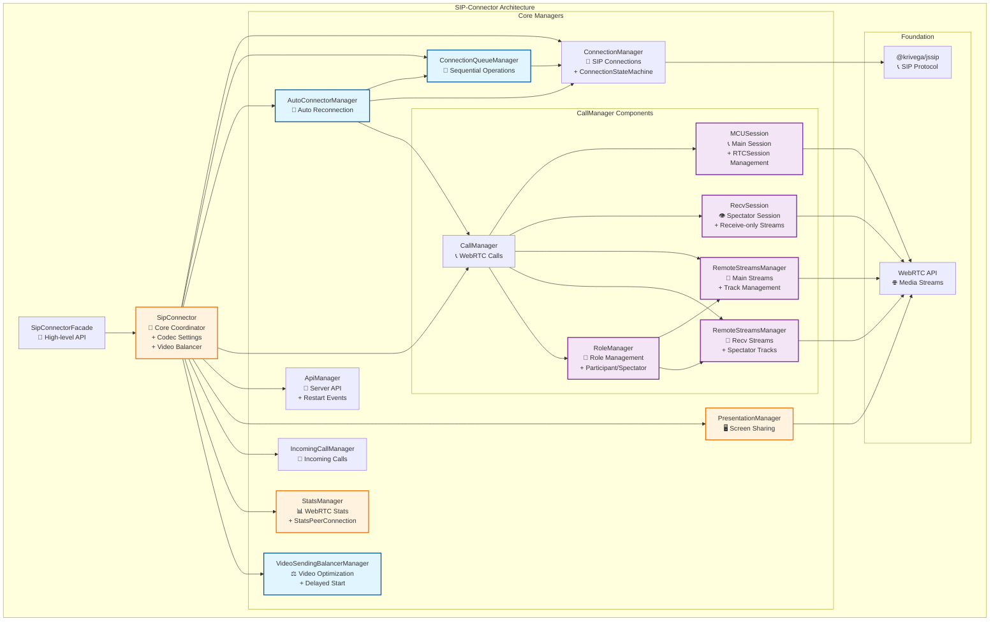

# Архитектура SIP Connector

## Обзор архитектуры

### 1. **SipConnectorFacade** (Высокоуровневый API)

**Назначение**: Упрощенный интерфейс для работы с SIP-соединениями и видеозвонками.

**Ключевые возможности**:

- Подключение к серверу и управление сессиями
- Исходящие и входящие звонки
- Управление презентациями (screen sharing)
- Работа с медиа-потоками
- Обработка событий и уведомлений

**Основные методы**:

- `connectToServer()` / `disconnectFromServer()` - управление соединением
- `callToServer()` / `answerToIncomingCall()` - управление звонками
- `startPresentation()` / `stopShareSipConnector()` - управление презентациями
- `updatePresentation()` - обновление презентации
- `getRemoteStreams()` - получение удаленных потоков
- `sendMediaState()` - отправка состояния медиа
- `sendRefusalToTurnOnMic()` / `sendRefusalToTurnOnCam()` - отправка отказов
- `replaceMediaStream()` - замена медиа-потока
- `askPermissionToEnableCam()` - запрос разрешений

---

### 2. **SipConnector** (Центральный координатор)

**Назначение**: Координирует работу всех менеджеров и предоставляет единый API.

**Ключевые возможности**:

- Управление настройками кодеков
- Координация между всеми менеджерами
- Событийная система с префиксами (auto-connect:, connection:, call:, api:, incoming-call:, presentation:, stats:, video-balancer:)
- Автоматическая балансировка видео
- Обработка событий restart от сервера
- Проксирование методов менеджеров

**Событийная система**:

- `auto-connect:*` - события автоматического переподключения
- `connection:*` - события SIP соединения
- `call:*` - события WebRTC звонков (включая `remote-streams-changed`)
- `api:*` - события серверного API (включая `participant:move-request-to-spectators`)
- `incoming-call:*` - события входящих звонков
- `presentation:*` - события презентаций
- `stats:*` - события статистики
- `video-balancer:*` - события балансировки видео

**Управляемые компоненты**:

- `ConnectionManager` - SIP-соединения (включает ConnectionStateMachine)
- `CallManager` - WebRTC-звонки
- `ApiManager` - серверное API
- `PresentationManager` - презентации
- `StatsManager` - статистика
- `VideoSendingBalancerManager` - балансировка видео
- `ConnectionQueueManager` - очередь операций
- `AutoConnectorManager` - автоматическое переподключение
- `IncomingCallManager` - входящие звонки

---

### 3. **ConnectionManager** (SIP-соединения)

**Назначение**: Управление SIP-соединениями и регистрацией на сервере.

**Ключевые возможности**:

- Создание и управление SIP User Agent
- Регистрация/отмена регистрации на сервере
- Управление состояниями соединения (XState)
- WebSocket соединения
- SIP-операции (OPTIONS, PING)

**Основные методы**:

- `connect()` / `disconnect()` - управление соединением
- `register()` / `unregister()` - регистрация на сервере
- `sendOptions()` / `ping()` - SIP-операции
- `checkTelephony()` - проверка телефонии

---

### 4. **ConnectionQueueManager** (Очередь операций)

**Назначение**: Обеспечивает последовательное выполнение операций подключения.

**Ключевые возможности**:

- Предотвращение конфликтов между операциями
- Последовательное выполнение connect/disconnect
- Управление очередью через stack-promises

**Основные методы**:

- `connect()` / `disconnect()` - проксирование методов ConnectionManager
- `stop()` - остановка всех операций в очереди

**Принцип работы**: Все операции выполняются последовательно в очереди для предотвращения гонки условий.

---

### 5. **AutoConnectorManager** (Автоматическое переподключение)

**Назначение**: Обеспечивает автоматическое переподключение.

**Ключевые возможности**:

- Автоматические попытки переподключения с задержками
- Проверка доступности телефонии
- Мониторинг состояния соединения
- Управление событиями попыток подключения

**Основные методы**:

- `start(parameters)` - запуск процесса автоподключения
- `stop()` - отмена текущей попытки автоподключения

---

### 6. **CallManager** (WebRTC-звонки)

**Назначение**: Управление WebRTC-звонками через паттерн Стратегия.

**Ключевые возможности**:

- Исходящие и входящие звонки
- Управление WebRTC соединениями
- Управление медиа-потоками
- Поддержка различных протоколов
- Отслеживание изменений удаленных потоков через события
- Управление ролями участников (participant/spectator)

**Основные методы**:

- `startCall()` / `endCall()` - управление звонками
- `replaceMediaStream()` - замена медиа-потоков
- `restartIce()` - перезапуск соединения

**События**:

- `call:remote-streams-changed` - уведомление об изменении удаленных потоков (заменяет callback `setRemoteStreams`)

**Внутренние компоненты**:

- **MCUSession** - управление основным RTCSession для участников конференции
  - Создание и управление SIP-звонками через @krivega/jssip
  - Обработка событий peerconnection и track
  - Управление жизненным циклом звонка

- **RecvSession** - управление receive-only сессией для зрителей
  - Создание отдельного RTCPeerConnection для приема потоков
  - Поддержка receive-only transceiver'ов
  - Используется при перемещении участника в режим spectator

- **RemoteStreamsManager** (два экземпляра: main и recv)
  - **MainRemoteStreamsManager** - управление потоками для участников
  - **RecvRemoteStreamsManager** - управление потоками для зрителей
  - Группировка треков по участникам и потокам
  - Генерация событий `remote-streams-changed` при изменениях
  - Отслеживание окончания треков и автоматическая очистка

- **RoleManager** - управление ролями участника
  - Переключение между ролями: `participant`, `spectator`, `spectator_synthetic`
  - Выбор активного RemoteStreamsManager (main или recv)
  - Управление жизненным циклом RecvSession при смене роли

---

### 7. **ApiManager** (Серверное API)

**Назначение**: Обработка SIP INFO сообщений и взаимодействие с сервером.

**Ключевые возможности**:

- Обработка команд от сервера
- Отправка состояния медиа
- Управление DTMF-сигналами
- События restart для управления transceiver'ами
- Синхронизация каналов
- Обработка событий перемещения участников

**Основные методы**:

- `sendMediaState()` - отправка состояния медиа
- `sendDTMF()` - отправка DTMF-сигналов
- `waitChannels()` - ожидание каналов
- `askPermissionToEnableCam()` - запрос разрешений

**События участников**:

- `api:participant:move-request-to-spectators` - перемещение в зрители (новый формат с `isSynthetic` или `audioId`)
- `api:participant:move-request-to-spectators-synthetic` - перемещение в зрители (синтетическое событие для обратной совместимости)
- `api:participant:move-request-to-participants` - перемещение в участники

---

### 8. **PresentationManager** (Презентации)

**Назначение**: Управление демонстрацией экрана и презентациями.

**Ключевые возможности**:

- Запуск и остановка презентаций
- Обновление потоков презентации
- Управление битрейтом презентации
- Обработка дублированных вызовов
- Поддержка P2P и MCU режимов

**Основные методы**:

- `startPresentation()` / `stopPresentation()` - управление презентациями
- `updatePresentation()` - обновление потока
- `cancelSendPresentationWithRepeatedCalls()` - отмена операций

---

### 9. **IncomingCallManager** (Входящие звонки)

**Назначение**: Обработка входящих SIP-звонков.

**Ключевые возможности**:

- Обнаружение входящих звонков
- Управление данными вызывающего
- Принятие и отклонение звонков
- Извлечение RTCSession для CallManager

**Основные методы**:

- `getIncomingRTCSession()` - получение сессии
- `declineToIncomingCall()` - отклонение звонка
- `busyIncomingCall()` - ответ "занято"

---

## Диаграмма архитектуры



## Взаимодействие компонентов

**Основные зависимости**:

- `SipConnectorFacade` → `SipConnector` (фасад)
- `SipConnector` → все менеджеры (координация)
- `CallManager` → `MCUSession` (управление основным RTCSession для участников)
- `CallManager` → `RecvSession` (управление receive-only сессией для зрителей)
- `CallManager` → `RemoteStreamsManager` (два экземпляра: main и recv для организации входящих потоков)
- `CallManager` → `RoleManager` (управление ролями: participant, spectator, spectator_synthetic)
- `RoleManager` → `RemoteStreamsManager` (переключение между main и recv менеджерами)
- `MCUSession` → WebRTC API (основные звонки)
- `RecvSession` → WebRTC API (receive-only потоки для зрителей)
- `RemoteStreamsManager` → WebRTC API (отслеживание треков, события `remote-streams-changed`)
- `ConnectionQueueManager` → `ConnectionManager` (последовательность операций)
- `AutoConnectorManager` → `ConnectionQueueManager`, `ConnectionManager`, `CallManager`
- `VideoSendingBalancerManager` → `CallManager`, `ApiManager`

---

Данный модуль инкапсулирует логику SIP-соединений и видеозвонков. Архитектура модуля построена с использованием принципов **SOLID** и нескольких **паттернов проектирования**, что делает её гибкой, расширяемой и легко поддерживаемой.

---

## Ключевые архитектурные принципы

### Разделение ответственности

**Каждый компонент имеет четкую зону ответственности**:

| Компонент                | Ответственность                             |
| ------------------------ | ------------------------------------------- |
| **SipConnectorFacade**   | Упрощенный API и обработка ошибок           |
| **SipConnector**         | Координация менеджеров и событийная система |
| **CallManager**          | WebRTC звонки и transceiver'ы               |
| **ConnectionManager**    | SIP соединения и регистрация                |
| **AutoConnectorManager** | Автоматическое переподключение              |
| **ApiManager**           | Серверное API и события restart             |

### Паттерны проектирования

- **Фасад**: SipConnectorFacade упрощает сложный API
- **Стратегия**: CallManager поддерживает разные типы звонков
- **Наблюдатель**: Событийная система для связи компонентов
- **Композиция**: SipConnector объединяет специализированные менеджеры

---

### Специализированные компоненты

#### **StatsManager** (Статистика)

- Сбор WebRTC статистики через StatsPeerConnection
- Мониторинг качества соединения
- Отслеживание доступной входящей пропускной способности

#### **VideoSendingBalancerManager** (Балансировка видео)

- Автоматическая оптимизация видеопотоков с задержкой запуска (10 секунд)
- Адаптивное опрашивание изменений треков
- Управление параметрами кодирования
- Планирование и остановка балансировки

#### **ConnectionStateMachine** (Состояния соединения)

- Внутренний компонент ConnectionManager
- Управление состояниями SIP соединения (XState)
- Валидация допустимых операций
- Предотвращение некорректных переходов

---

### Принципы проектирования

**SOLID принципы**:

- **S** - каждый компонент имеет единую ответственность
- **O** - открыт для расширения (новые стратегии, менеджеры)
- **L** - стратегии взаимозаменяемы через интерфейс
- **I** - интерфейсы разделены по назначению
- **D** - зависимость от абстракций, не от реализаций

**Слабая связанность**:

- Взаимодействие через события и интерфейсы
- Минимальные зависимости между компонентами
- Возможность замены компонентов без влияния на систему

---

### Ключевые особенности архитектуры

**Автоматизация**:

- Автоматическое управление transceiver'ами
- Умное добавление презентационных потоков
- Адаптивная балансировка видео
- Последовательное выполнение операций
- Автоматическое отслеживание изменений удаленных потоков через события

**Расширяемость**:

- Паттерн Стратегия для новых типов звонков
- Событийная система для интеграции
- Модульная архитектура менеджеров

**Надежность**:

- Машина состояний для SIP соединений
- Обработка ошибок на всех уровнях
- Очереди для предотвращения конфликтов

---

### Преимущества архитектуры

**Простота использования**:

- Высокоуровневый API через SipConnectorFacade
- Автоматическое управление сложными процессами
- Минимальная конфигурация для начала работы

**Гибкость и расширяемость**:

- Паттерн Стратегия для разных типов соединений
- Модульная архитектура менеджеров
- Событийная система для интеграции

**Надежность**:

- Машина состояний для предсказуемого поведения
- Автоматическая обработка ошибок
- Последовательное выполнение критических операций

**Производительность**:

- Адаптивное опрашивание для снижения CPU нагрузки
- Автоматическая балансировка видеопотоков
- Интеллектуальное управление transceiver'ами

---

### Пример использования

```typescript
// 1. Создание и настройка
const sipConnector = new SipConnector(
  { JsSIP },
  {
    preferredMimeTypesVideoCodecs: ['video/AV1', 'video/VP9'],
    videoBalancerOptions: { ignoreForCodec: 'H264' },
  },
);
const facade = new SipConnectorFacade(sipConnector);

// 2. Подключение
await facade.connectToServer({
  sipServerUrl: 'example.com', // Путь /webrtc/wss/ добавляется автоматически
  sipServerIp: 'sip.example.com',
  user: 'user123',
  password: 'secret',
  register: true,
});

// 3. Подписка на изменения удаленных потоков
const unsubscribeRemoteStreams = sipConnector.on('call:remote-streams-changed', (event) => {
  console.log('Изменение удаленных потоков:', {
    participantId: event.participantId,
    changeType: event.changeType, // 'added' | 'removed'
    trackId: event.trackId,
  });
  displayStreams(event.streams);
});

// 4. Звонок
const mediaStream = await navigator.mediaDevices.getUserMedia({
  video: true,
  audio: true,
});

await facade.callToServer({
  conference: 'room123',
  mediaStream,
});

// 5. Презентация
await facade.startPresentation({
  mediaStream: presentationStream,
  isP2P: false,
  contentHint: 'detail',
});

// 6. Управление медиа
await facade.sendMediaState({
  isEnabledCam: true,
  isEnabledMic: false,
});

// 7. Очистка при завершении
unsubscribeRemoteStreams();
```

---

## Итог

SIP Connector построен на принципах **чистой архитектуры** с использованием современных паттернов проектирования.

### Архитектурные слои

1. **Фасад** → Упрощенный API для разработчиков
2. **Координатор** → Управление всеми компонентами
3. **Менеджеры** → Специализированная функциональность
4. **Основа** → SIP протокол и WebRTC API
