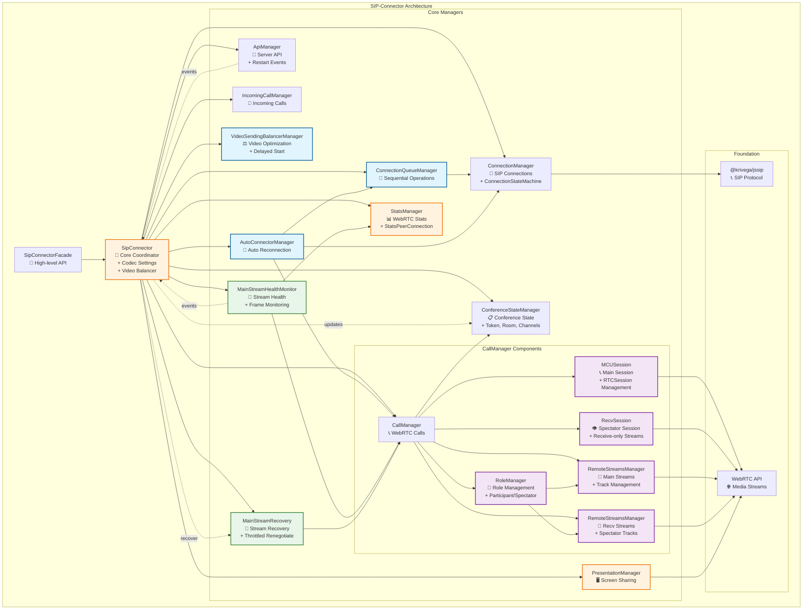

# Обзор архитектуры SIP Connector

## Архитектурные слои

1. **Фасад** → Упрощенный API для разработчиков
2. **Координатор** → Управление всеми компонентами
3. **Менеджеры** → Специализированная функциональность
4. **Основа** → SIP протокол и WebRTC API

## Основные компоненты

### SipConnectorFacade (Высокоуровневый API)

**Назначение**: Упрощенный интерфейс для работы с SIP-соединениями и видеозвонками.

**Ключевые возможности**:

- Подключение к серверу и управление сессиями
- Исходящие и входящие звонки
- Управление презентациями (screen sharing)
- Работа с медиа-потоками
- Обработка событий и уведомлений

**Основные методы**:

- `connectToServer()` / `disconnectFromServer()` - управление соединением
- `callToServer()` / `answerToIncomingCall()` - управление звонками
- `startPresentation()` / `stopShareSipConnector()` - управление презентациями
- `updatePresentation()` - обновление презентации
- `getRemoteStreams()` - получение удаленных потоков
- `sendMediaState()` - отправка состояния медиа
- `sendRefusalToTurnOnMic()` / `sendRefusalToTurnOnCam()` - отправка отказов
- `replaceMediaStream()` - замена медиа-потока
- `askPermissionToEnableCam()` - запрос разрешений

### SipConnector (Центральный координатор)

**Назначение**: Координирует работу всех менеджеров и предоставляет единый API.

**Ключевые возможности**:

- Управление настройками кодеков
- Координация между всеми менеджерами
- Событийная система с префиксами (auto-connect:, connection:, call:, api:, incoming-call:, presentation:, stats:, video-balancer:)
- Автоматическая балансировка видео
- Обработка событий restart от сервера
- Проксирование методов менеджеров

**Событийная система**:

- `auto-connect:*` - события автоматического переподключения
- `connection:*` - события SIP соединения
- `call:*` - события WebRTC звонков (включая `remote-streams-changed`)
- `api:*` - события серверного API (включая `participant:move-request-to-spectators`)
- `incoming-call:*` - события входящих звонков
- `presentation:*` - события презентаций
- `stats:*` - события статистики
- `video-balancer:*` - события балансировки видео

**Управляемые компоненты**:

- `ConnectionManager` - SIP-соединения (включает ConnectionStateMachine)
- `ConferenceStateManager` - состояние конференции и звонка
- `CallManager` - WebRTC-звонки
- `ApiManager` - серверное API
- `PresentationManager` - презентации
- `StatsManager` - статистика
- `VideoSendingBalancerManager` - балансировка видео
- `ConnectionQueueManager` - очередь операций
- `AutoConnectorManager` - автоматическое переподключение
- `IncomingCallManager` - входящие звонки
- `MainStreamHealthMonitor` - мониторинг здоровья потока
- `MainStreamRecovery` - восстановление потока

## Диаграмма архитектуры

## Взаимодействие компонентов

**Основные зависимости**:

- `SipConnectorFacade` → `SipConnector` (фасад)
- `SipConnector` → все менеджеры (координация)
- `SipConnector` → `ConferenceStateManager` (создание и управление состоянием конференции)
- `CallManager` → `ConferenceStateManager` (хранение данных звонка: number, answer)
- `CallManager` → `MCUSession` (управление основным RTCSession для участников)
- `CallManager` → `RecvSession` (управление receive-only сессией для зрителей)
- `CallManager` → `RemoteStreamsManager` (два экземпляра: main и recv для организации входящих потоков)
- `CallManager` → `RoleManager` (управление ролями: participant, spectator, spectator_synthetic)
- `RoleManager` → `RemoteStreamsManager` (переключение между main и recv менеджерами)
- `ApiManager` → `SipConnector` (события: enterRoom, conference:participant-token-issued, channels)
- `SipConnector` → `ConferenceStateManager` (обновление состояния при получении событий от ApiManager)
- `SipConnector` → `sendOffer` (передача токена из ConferenceStateManager в API-запросы)
- `MCUSession` → WebRTC API (основные звонки)
- `RecvSession` → WebRTC API (receive-only потоки для зрителей)
- `RemoteStreamsManager` → WebRTC API (отслеживание треков, события `remote-streams-changed`)
- `ConnectionQueueManager` → `ConnectionManager` (последовательность операций)
- `AutoConnectorManager` → `ConnectionQueueManager`, `ConnectionManager`, `CallManager`
- `VideoSendingBalancerManager` → `CallManager`, `ApiManager`
- `MainStreamHealthMonitor` → `StatsManager` (отслеживание состояния входящих фреймов)
- `MainStreamHealthMonitor` → `CallManager` (отслеживание состояния основного входящего видео-трека)
- `MainStreamRecovery` → `CallManager` (пересогласование настроек основного потока)
- `SipConnector` → `MainStreamHealthMonitor` (отслеживание состояния основного потока; событие: `no-inbound-frames`)
- `SipConnector` → `MainStreamRecovery` (восстановление основного входящего потока при стоп-кадре)

---

Данный модуль инкапсулирует логику SIP-соединений и видеозвонков. Архитектура модуля построена с использованием принципов **SOLID** и нескольких **паттернов проектирования**, что делает её гибкой, расширяемой и легко поддерживаемой.
