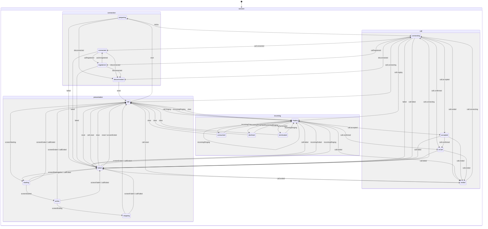

# Модель состояний сеанса (XState)

Sip-connector публикует единый XState-актор сеанса, агрегирующий параллельные машины по доменам: соединение, звонок, входящий звонок, шаринг экрана. Клиент получает только подписку на их статусы, бизнес-логика остаётся внутри sip-connector.

## Диаграмма состояний

## Слои

- Каждая машина поднимается внутри своего менеджера: `connectionActor`, `callActor`, `incomingActor`, `presentationActor`.
- Менеджеры сами отправляют доменные события в свои акторы.
- Агрегатор: `createSession()` / `sipConnector.session` подписывается на `.subscribe` акторов менеджеров и отдает объединённый снапшот + типобезопасные селекторы.

## Доменные статусы и события

| Домен        | Статусы                                                                                | Источники событий                                                                                                                                                                                     | Доменные события                                                                                                                         |
| :----------- | :------------------------------------------------------------------------------------- | :---------------------------------------------------------------------------------------------------------------------------------------------------------------------------------------------------- | :--------------------------------------------------------------------------------------------------------------------------------------- |
| Connection   | `idle`, `preparing`, `connecting`, `connected`, `registered`, `disconnected`, `failed` | `ConnectionManager.events` (`connect-started`, `connecting`, `connect-parameters-resolve-success`, `connected`, `registered`, `unregistered`, `disconnected`, `registrationFailed`, `connect-failed`) | `START_CONNECT`, `START_INIT_UA`, `UA_CONNECTED`, `UA_REGISTERED`, `UA_UNREGISTERED`, `UA_DISCONNECTED`, `CONNECTION_FAILED`, `RESET`    |
| Call         | `idle`, `connecting`, `ringing`, `accepted`, `inCall`, `ended`, `failed`               | `CallManager.events` (`connecting`, `progress`, `accepted`, `confirmed`, `ended`, `failed`)                                                                                                           | `CALL.CONNECTING`, `CALL.RINGING`, `CALL.ACCEPTED`, `CALL.CONFIRMED`, `CALL.ENDED`, `CALL.FAILED`, `CALL.RESET`                          |
| Incoming     | `idle`, `ringing`, `consumed`, `declined`, `terminated`, `failed`                      | `IncomingCallManager.events` (`incomingCall`, `declinedIncomingCall`, `terminatedIncomingCall`, `failedIncomingCall`) + синтетика при ответе на входящий                                              | `INCOMING.RINGING`, `INCOMING.CONSUMED`, `INCOMING.DECLINED`, `INCOMING.TERMINATED`, `INCOMING.FAILED`, `INCOMING.CLEAR`                 |
| Presentation | `idle`, `starting`, `active`, `stopping`, `failed`                                     | `CallManager.events` (`presentation:start\|started\|end\|ended\|failed`), `ConnectionManager.events` (`disconnected`, `registrationFailed`, `connect-failed`)                                         | `SCREEN.STARTING`, `SCREEN.STARTED`, `SCREEN.ENDING`, `SCREEN.ENDED`, `SCREEN.FAILED`, `CALL.ENDED`, `CALL.FAILED`, `PRESENTATION.RESET` |

## API для клиентов

- `createSipSession(deps)` / `sipConnector.session`: агрегатор снапшотов акторов менеджеров и утилиты подписки.
- `getSnapshot()` — текущее состояние всех доменов.
- `subscribe(selector, listener)` — типобезопасная подписка на срез состояния (например, `selectConnectionStatus`).
- `stop()` — очистка подписок на акторы менеджеров.

## Инварианты и гварды

- `presentation` может быть `active` только если `call` в `inCall`.
- `incoming` сбрасывается в `idle` при `call.ended` или `call.failed`.
- `connection` `failed` / `disconnected` приводит к `call` → `ended`, `presentation` → `idle`.

## Детальное описание машин состояний

### ConnectionStateMachine (Состояния соединения)

- Внутренний компонент ConnectionManager
- Управление состояниями SIP соединения через XState
- Валидация допустимых операций с предотвращением некорректных переходов
- Типобезопасная обработка ошибок (error: Error | undefined)
- Детальная информация об ошибках регистрации (status_code + reason_phrase)
- **Логика состояний:**
  - `PREPARING` — подготовка к подключению (до инициализации UA, до вызова `ua.start()`)
  - `CONNECTING` — UA запущен, идет подключение (после `ua.start()`, когда приходят события `connecting`, `connected`, `registered`)
  - Состояния переименованы для соответствия реальной последовательности операций: сначала подготовка, затем подключение UA
- Публичный API:
  - Геттеры состояний: `isIdle`, `isPreparing`, `isConnecting`, `isConnected`, `isRegistered`, `isDisconnected`, `isFailed`
  - Комбинированные геттеры: `isPending` (preparing/connecting), `isPendingConnect`, `isPendingInitUa`, `isActiveConnection` (connected/registered)
  - Геттер ошибки: `error`
  - Методы управления: `startConnect()`, `startInitUa()`, `reset()`
  - Методы валидации: `canTransition()`, `getValidEvents()`
  - Подписка на изменения: `onStateChange(listener)`
- Корректный граф переходов:
  - IDLE → PREPARING → CONNECTING → CONNECTED → REGISTERED
  - Переходы в DISCONNECTED из PREPARING/CONNECTING/CONNECTED/REGISTERED
  - Переходы в FAILED из PREPARING/CONNECTING/CONNECTED/REGISTERED
  - Переходы RESET: DISCONNECTED→IDLE, FAILED→IDLE
  - Прямой переход CONNECTING → REGISTERED (для быстрой регистрации без явного connected)
- Автоматическое создание Error из ошибок регистрации с форматом: "Registration failed: {status_code} {reason_phrase}"
- Логирование всех переходов и недопустимых операций

### CallStateMachine (Состояния звонка)

- Внутренний компонент CallManager
- Управление состояниями звонка через XState
- Валидация переходов с предотвращением недопустимых операций
- Типобезопасная обработка ошибок (lastError: Error вместо unknown)
- Публичный API:
  - Геттеры состояний: `isIdle`, `isConnecting`, `isRinging`, `isAccepted`, `isInCall`, `isEnded`, `isFailed`
  - Комбинированные геттеры: `isPending` (connecting/ringing), `isActive` (accepted/inCall)
  - Геттер ошибки: `lastError`
  - Метод сброса: `reset()` для перехода в IDLE
- Корректный граф переходов:
  - Удалены недопустимые переходы: RINGING→CONNECTING, self-переход CONNECTING→CONNECTING, IDLE→ACCEPTED/IN_CALL, ENDED→ACCEPTED/IN_CALL
  - Добавлены переходы RESET: ENDED→IDLE, FAILED→IDLE
- Автоматическая конвертация ошибок из unknown в Error
- Логирование недопустимых переходов через console.warn

### PresentationStateMachine (Состояния демонстрации экрана)

- Внутренний компонент PresentationManager
- Управление состояниями демонстрации экрана через XState
- Валидация допустимых операций с предотвращением некорректных переходов
- Типобезопасная обработка ошибок (lastError: Error | undefined)
- Публичный API:
  - Геттеры состояний: `isIdle`, `isStarting`, `isActive`, `isStopping`, `isFailed`
  - Комбинированные геттеры: `isPending` (starting/stopping), `isActiveOrPending` (active/starting/stopping)
  - Геттер ошибки: `lastError`
  - Методы управления: `reset()`
- Корректный граф переходов:
  - IDLE → STARTING → ACTIVE → STOPPING → IDLE
  - Переходы в FAILED из STARTING/ACTIVE/STOPPING (через SCREEN.FAILED или CALL.FAILED)
  - Переход RESET: FAILED → IDLE
  - Убран нелогичный переход IDLE → FAILED (презентация не может зафейлиться до старта)
  - Прерывание через CALL.ENDED из любого активного состояния (STARTING/ACTIVE/STOPPING)
  - Фейл звонка (CALL.FAILED) обрабатывается во всех активных состояниях
- Автоматическое создание Error из не-Error значений (JSON.stringify для объектов)
- Полное логирование всех переходов состояний и недопустимых операций через console.warn

### IncomingCallStateMachine (Состояния входящих звонков)

- Внутренний компонент IncomingCallManager
- Управление состояниями входящих SIP-звонков через XState
- Валидация допустимых операций с предотвращением некорректных переходов
- Хранение данных вызывающего абонента (remoteCallerData)
- Публичный API:
  - Геттеры состояний: `isIdle`, `isRinging`, `isConsumed`, `isDeclined`, `isTerminated`, `isFailed`
  - Комбинированные геттеры: `isActive` (ringing), `isFinished` (consumed/declined/terminated/failed)
  - Геттеры контекста: `remoteCallerData`, `lastReason`
  - Методы управления: `reset()`, `toConsumed()`
- Корректный граф переходов:
  - IDLE → RINGING (новый входящий звонок)
  - RINGING → CONSUMED (принят) / DECLINED (отклонен) / TERMINATED (обрыв) / FAILED (ошибка)
  - Все финальные состояния → IDLE (через CLEAR)
  - Все финальные состояния → RINGING (новый входящий звонок)
  - Self-transition: RINGING → RINGING (повторный входящий звонок)
- Автоматическая очистка при потере соединения (через ConnectionManager events: disconnected, registrationFailed, connect-failed)
- Полное логирование всех переходов состояний и недопустимых операций через console.warn

## Тестирование

- Табличные тесты для переходов каждой машины.
- Контрактный тест адаптера событий: события менеджеров → доменные события → ожидаемые статусы.
- Smoke-тест фасада `createSipSession`: подписка, снапшоты, очистка.
