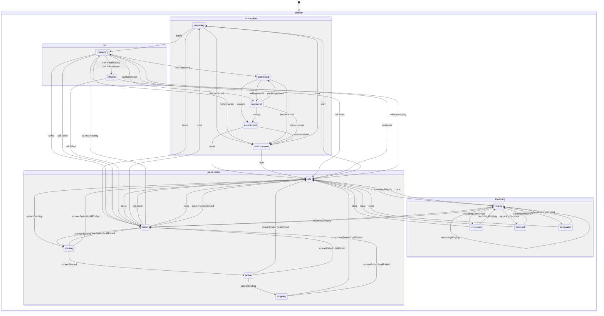

# Модель состояний сеанса (XState)

Sip-connector публикует единый XState-актор сеанса, агрегирующий параллельные машины по доменам: соединение, звонок, входящий звонок, шаринг экрана. Клиент получает только подписку на их статусы, бизнес-логика остаётся внутри sip-connector.

## Диаграмма состояний



## Слои

- Каждая машина состояний поднимается внутри своего менеджера: `connectionManager.stateMachine`, `callManager.stateMachine`, `incomingCallManager.stateMachine`, `presentationManager.stateMachine`.
- Менеджеры сами отправляют доменные события в свои машины.
- Агрегатор: `sipConnector.session` подписывается на `.subscribe` машин менеджеров и отдаёт объединённый снапшот + типобезопасные селекторы.

## Доменные статусы и события

| Домен        | Статусы                                                                                               | Источники событий                                                                                                                                                                                     | Доменные события                                                                                                                         |
| :----------- | :---------------------------------------------------------------------------------------------------- | :---------------------------------------------------------------------------------------------------------------------------------------------------------------------------------------------------- | :--------------------------------------------------------------------------------------------------------------------------------------- |
| Connection   | `idle`, `preparing`, `connecting`, `connected`, `registered`, `established`, `disconnected`, `failed` | `ConnectionManager.events` (`connect-started`, `connecting`, `connect-parameters-resolve-success`, `connected`, `registered`, `unregistered`, `disconnected`, `registrationFailed`, `connect-failed`) | `START_CONNECT`, `START_INIT_UA`, `UA_CONNECTED`, `UA_REGISTERED`, `UA_UNREGISTERED`, `UA_DISCONNECTED`, `CONNECTION_FAILED`, `RESET`    |
| Call         | `idle`, `connecting`, `inRoom`, `failed`                                                              | `CallManager.events` (`start-call`, `enter-room`, `conference:participant-token-issued`, `ended`, `failed`)                                                                                           | `CALL.CONNECTING`, `CALL.ENTER_ROOM`, `CALL.TOKEN_ISSUED`, `CALL.FAILED`, `CALL.RESET`                                                   |
| Incoming     | `idle`, `ringing`, `consumed`, `declined`, `terminated`, `failed`                                     | `IncomingCallManager.events` (`incomingCall`, `declinedIncomingCall`, `terminatedIncomingCall`, `failedIncomingCall`) + синтетика при ответе на входящий                                              | `INCOMING.RINGING`, `INCOMING.CONSUMED`, `INCOMING.DECLINED`, `INCOMING.TERMINATED`, `INCOMING.FAILED`, `INCOMING.CLEAR`                 |
| Presentation | `idle`, `starting`, `active`, `stopping`, `failed`                                                    | `CallManager.events` (`presentation:start\|started\|end\|ended\|failed`), `ConnectionManager.events` (`disconnected`, `registrationFailed`, `connect-failed`)                                         | `SCREEN.STARTING`, `SCREEN.STARTED`, `SCREEN.ENDING`, `SCREEN.ENDED`, `SCREEN.FAILED`, `CALL.ENDED`, `CALL.FAILED`, `PRESENTATION.RESET` |

## API для клиентов

- `sipConnector.session`: агрегатор снапшотов машин менеджеров и утилиты подписки.
- `getSnapshot()` — текущее состояние всех доменов.
- `subscribe(selector, listener)` — типобезопасная подписка на срез состояния (например, `selectConnectionStatus`).
- `stop()` — очистка подписок на машины менеджеров.
- Доступ к машинам: `sipConnector.session.machines` (connection, call, incoming, presentation).

## Инварианты и гварды

- `presentation` может быть `active` только если `call` в `inRoom`.
- `incoming` сбрасывается в `idle` при сбросе/завершении звонка (`CALL.RESET`, `CALL.FAILED`).
- `connection` `failed` / `disconnected` приводит к сбросу `call` и `presentation` → `idle`.

## Детальное описание машин состояний

### ConnectionStateMachine (Состояния соединения)

- Внутренний компонент ConnectionManager
- Управление состояниями SIP соединения через XState
- Валидация допустимых операций с предотвращением некорректных переходов
- Типобезопасная обработка ошибок (error: Error | undefined)
- Детальная информация об ошибках регистрации (status_code + reason_phrase)
- **Логика состояний:**
  - `PREPARING` — подготовка к подключению (до инициализации UA, до вызова `ua.start()`)
  - `CONNECTING` — UA запущен, идет подключение (после `ua.start()`, когда приходят события `connecting`, `connected`, `registered`)
  - `CONNECTED` — UA подключен к серверу (промежуточное состояние, автоматически переходит в `ESTABLISHED`)
  - `REGISTERED` — UA зарегистрирован на сервере (промежуточное состояние, автоматически переходит в `ESTABLISHED`)
  - `ESTABLISHED` — соединение установлено и готово к работе (финальное активное состояние, автоматически достигается из `CONNECTED` или `REGISTERED`)
  - Состояния переименованы для соответствия реальной последовательности операций: сначала подготовка, затем подключение UA
- Публичный API:
  - Геттеры состояний: `isIdle`, `isPreparing`, `isConnecting`, `isConnected`, `isRegistered`, `isEstablished`, `isDisconnected`, `isFailed`
  - Комбинированные геттеры: `isPending` (preparing/connecting), `isPendingConnect`, `isPendingInitUa`, `isActiveConnection` (connected/registered/established)
  - Геттер ошибки: `error`
  - Методы управления: `startConnect()`, `startInitUa()`, `reset()`
  - Методы валидации: `canTransition()`, `getValidEvents()`
  - Подписка на изменения: `onStateChange(listener)`
- Корректный граф переходов:
  - IDLE → PREPARING → CONNECTING → CONNECTED → ESTABLISHED (автоматически)
  - IDLE → PREPARING → CONNECTING → REGISTERED → ESTABLISHED (автоматически)
  - Прямой переход CONNECTING → REGISTERED (для быстрой регистрации без явного connected)
  - Переход REGISTERED → CONNECTED → ESTABLISHED (через `UA_UNREGISTERED`, затем автоматически)
  - Переходы в DISCONNECTED из PREPARING/CONNECTING/CONNECTED/REGISTERED/ESTABLISHED
  - Переходы в FAILED из PREPARING/CONNECTING
  - Переходы RESET: ESTABLISHED→IDLE, DISCONNECTED→IDLE, FAILED→IDLE
  - Переходы из DISCONNECTED/FAILED: → PREPARING (повторное подключение через `START_CONNECT`)
  - Автоматические переходы через `always`: CONNECTED → ESTABLISHED, REGISTERED → ESTABLISHED
  - В состоянии ESTABLISHED события `UA_REGISTERED` и `UA_UNREGISTERED` игнорируются (нет обработчиков)
- Автоматическое создание Error из ошибок регистрации с форматом: "Registration failed: {status_code} {reason_phrase}"
- Логирование всех переходов и недопустимых операций

### CallStateMachine (Состояния звонка)

- Внутренний компонент CallManager
- Управление состояниями звонка через XState
- Валидация переходов с предотвращением недопустимых операций (проверка `snapshot.can(event)` перед отправкой)
- Типобезопасная обработка ошибок (error: Error в контексте FAILED)
- События: `CALL.CONNECTING`, `CALL.ENTER_ROOM`, `CALL.TOKEN_ISSUED`, `CALL.FAILED`, `CALL.RESET`
- Публичный API:
  - Геттеры состояний: `isIdle`, `isConnecting`, `isInRoom`, `isFailed`
  - Комбинированные геттеры: `isPending` (connecting), `isActive` (inRoom)
  - Геттер ошибки: `error`
  - Методы: `reset()`, `send(event)`, `subscribeToApiEvents(apiManager)` для привязки к API (enter-room, conference:participant-token-issued)
- Корректный граф переходов:
  - IDLE → CONNECTING (CALL.CONNECTING)
  - CONNECTING → IN_ROOM (при получении room + participantName и token/conference/participant через CALL.ENTER_ROOM и CALL.TOKEN_ISSUED)
  - CONNECTING → FAILED (CALL.FAILED), CONNECTING → IDLE (CALL.RESET)
  - IN_ROOM → IDLE (CALL.RESET), IN_ROOM → FAILED (CALL.FAILED)
  - FAILED → IDLE (CALL.RESET), FAILED → CONNECTING (CALL.CONNECTING)
- Внутреннее состояние EVALUATE: переход в IN_ROOM/CONNECTING/FAILED/IDLE по контексту после действий
- Логирование недопустимых переходов через console.warn

### PresentationStateMachine (Состояния демонстрации экрана)

- Внутренний компонент PresentationManager
- Управление состояниями демонстрации экрана через XState
- Валидация допустимых операций с предотвращением некорректных переходов
- Типобезопасная обработка ошибок (lastError: Error | undefined)
- Публичный API:
  - Геттеры состояний: `isIdle`, `isStarting`, `isActive`, `isStopping`, `isFailed`
  - Комбинированные геттеры: `isPending` (starting/stopping), `isActiveOrPending` (active/starting/stopping)
  - Геттер ошибки: `lastError`
  - Методы управления: `reset()`
- Корректный граф переходов:
  - IDLE → STARTING → ACTIVE → STOPPING → IDLE
  - Переходы в FAILED из STARTING/ACTIVE/STOPPING (через SCREEN.FAILED или CALL.FAILED)
  - Переход RESET: FAILED → IDLE
  - Убран нелогичный переход IDLE → FAILED (презентация не может зафейлиться до старта)
  - Прерывание через CALL.ENDED из любого активного состояния (STARTING/ACTIVE/STOPPING)
  - Фейл звонка (CALL.FAILED) обрабатывается во всех активных состояниях
- Автоматическое создание Error из не-Error значений (JSON.stringify для объектов)
- Полное логирование всех переходов состояний и недопустимых операций через console.warn

### IncomingCallStateMachine (Состояния входящих звонков)

- Внутренний компонент IncomingCallManager
- Управление состояниями входящих SIP-звонков через XState
- Валидация допустимых операций с предотвращением некорректных переходов
- Хранение данных вызывающего абонента (remoteCallerData)
- Публичный API:
  - Геттеры состояний: `isIdle`, `isRinging`, `isConsumed`, `isDeclined`, `isTerminated`, `isFailed`
  - Комбинированные геттеры: `isActive` (ringing), `isFinished` (consumed/declined/terminated/failed)
  - Геттеры контекста: `remoteCallerData`, `lastReason`
  - Методы управления: `reset()`, `toConsumed()`
- Корректный граф переходов:
  - IDLE → RINGING (новый входящий звонок)
  - RINGING → CONSUMED (принят) / DECLINED (отклонен) / TERMINATED (обрыв) / FAILED (ошибка)
  - Все финальные состояния → IDLE (через CLEAR)
  - Все финальные состояния → RINGING (новый входящий звонок)
  - Self-transition: RINGING → RINGING (повторный входящий звонок)
- Автоматическая очистка при потере соединения (через ConnectionManager events: disconnected, registrationFailed, connect-failed)
- Полное логирование всех переходов состояний и недопустимых операций через console.warn

## Комбинированное состояние системы (ESystemStatus)

Для упрощения работы клиентов с состоянием системы создан механизм комбинирования состояний Connection и Call машин в единое состояние `ESystemStatus`. Это позволяет клиенту однозначно определить текущее состояние системы без необходимости анализировать комбинации состояний вручную.

### Логика приоритетов

При определении комбинированного состояния применяется следующая логика приоритетов:

1. **Состояние соединения имеет приоритет** — если соединение не установлено, звонок невозможен
2. **Если connection IDLE/DISCONNECTED** → `DISCONNECTED`
3. **Если connection FAILED** → `CONNECTION_FAILED`
4. **Если connection PREPARING/CONNECTING/CONNECTED/REGISTERED** → `CONNECTING` (независимо от состояния call)
5. **Если connection ESTABLISHED**:
   - call IDLE → `READY_TO_CALL`
   - call CONNECTING → `CALL_CONNECTING`
   - call IN_ROOM → `CALL_ACTIVE`
   - call FAILED → `CALL_FAILED`

### Состояния ESystemStatus

| Состояние           | Описание                                 | Условия                                                     |
| :------------------ | :--------------------------------------- | :---------------------------------------------------------- |
| `DISCONNECTED`      | Система не подключена                    | connection: IDLE или DISCONNECTED                           |
| `CONNECTING`        | Идет процесс подключения                 | connection: PREPARING, CONNECTING, CONNECTED или REGISTERED |
| `READY_TO_CALL`     | Соединение установлено, готово к звонкам | connection: ESTABLISHED, call: IDLE                         |
| `CALL_CONNECTING`   | Идет установка звонка                    | connection: ESTABLISHED, call: CONNECTING                   |
| `CALL_ACTIVE`       | Звонок активен                           | connection: ESTABLISHED, call: IN_ROOM                      |
| `CONNECTION_FAILED` | Ошибка соединения                        | connection: FAILED                                          |
| `CALL_FAILED`       | Ошибка звонка                            | connection: ESTABLISHED, call: FAILED                       |

### Использование

```typescript
import { sessionSelectors, ESystemStatus } from '@krivega/sip-connector';

// Подписка на комбинированное состояние
sipConnector.session.subscribe(sessionSelectors.selectSystemStatus, (status) => {
  switch (status) {
    case ESystemStatus.READY_TO_CALL:
      // Система готова к звонкам
      break;
    case ESystemStatus.CALL_ACTIVE:
      // Звонок активен
      break;
    // ... другие состояния
  }
});
```

### Преимущества

- **Однозначность**: клиент получает одно значение вместо необходимости анализировать комбинацию двух состояний
- **Приоритет соединения**: состояние соединения автоматически учитывается при определении состояния системы
- **Типобезопасность**: enum обеспечивает проверку типов на этапе компиляции
- **Простота использования**: один селектор вместо комбинации двух

## Тестирование

- Табличные тесты для переходов каждой машины.
- Контрактный тест адаптера событий: события менеджеров → доменные события → ожидаемые статусы.
- Smoke-тест фасада `sipConnector.session`: подписка, снапшоты, доступ к машинам, очистка.
