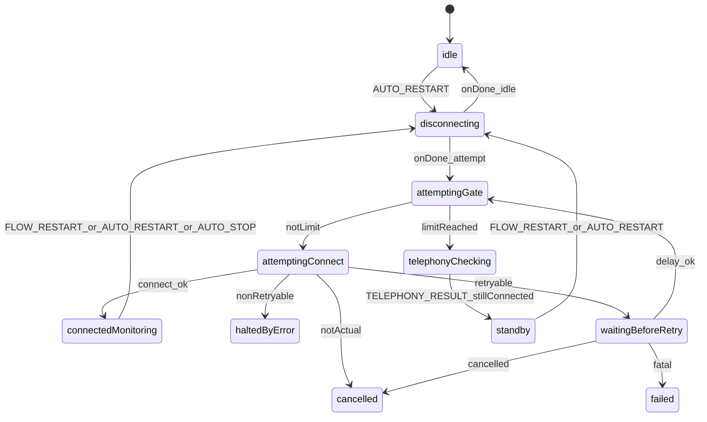

# AutoConnectorManager: машина состояний (XState)

Документ описывает оркестрацию автоподключения в [`AutoConnectorManager`](../../src/AutoConnectorManager/@AutoConnectorManager.ts) через модуль [`AutoConnectorStateMachine`](../../src/AutoConnectorManager/AutoConnectorStateMachine/AutoConnectorStateMachine.ts) и фабрику [`createAutoConnectorMachine`](../../src/AutoConnectorManager/AutoConnectorStateMachine/createAutoConnectorMachine.ts).

## Назначение

- Явно задать допустимые фазы реконнекта, ретраев, проверки телефонии и остановки.
- Сохранить прежние публичные события (`before-attempt`, `success`, `limit-reached-attempts`, и т.д.) через действия и колбэки `deps`.
- Отклонять недопустимые события в текущей фазе (см. `send` в `AutoConnectorStateMachine`).

## Состояния

| Состояние             | Смысл                                                                                               |
| --------------------- | --------------------------------------------------------------------------------------------------- |
| `idle`                | Автоконнектор не выполняет флоу подключения.                                                        |
| `disconnecting`       | Выполняется `stopConnectionFlow` (остановка попыток, триггеров, `disconnect`).                      |
| `attemptingGate`      | Перед попыткой: `before-attempt`, остановка триггеров; проверка лимита попыток.                     |
| `attemptingConnect`   | Вызов `connectionQueueManager.connect`.                                                             |
| `waitingBeforeRetry`  | Задержка `timeoutBetweenAttempts` и `onBeforeRetry` перед следующей попыткой.                       |
| `connectedMonitoring` | Успешное подключение; активны ping и подписка на регистрацию.                                       |
| `telephonyChecking`   | Лимит попыток; работает `CheckTelephonyRequester`.                                                  |
| `standby`             | После успешной проверки телефонии при уже установленном соединении (`success` без нового коннекта). |
| `haltedByError`       | Ошибка без ретрая (`not ready`, `canRetryOnError` = false).                                         |
| `cancelled`           | Отмена (неактуальный промис, отмена задержки/колбэка).                                              |
| `failed`              | Исчерпаны попытки после ошибки в цепочке ретрая.                                                    |

## События

- `AUTO.RESTART` — начать цикл: остановить текущий флоу и попытаться подключиться (используется из `start` и `restartConnectionAttempts`).
- `AUTO.STOP` — остановить флоу (`afterDisconnect: idle`). В `idle` обрабатывается как безопасный no-op (остаёмся в `idle`).
- `FLOW.RESTART` — перезапуск из мониторинга (ping / внутренние триггеры), параметры берутся из контекста.
- `TELEPHONY.RESULT` с `stillConnected` — переход в `standby` после успешной проверки телефонии при уже подключённом клиенте. Если нужен полный рестарт, менеджер вызывает `restartConnectionAttempts` (как в исходной логике `connectIfDisconnected`).

## Диаграмма потока

## Как расширять

1. Добавить новое событие в [`types.ts`](../../src/AutoConnectorManager/AutoConnectorStateMachine/types.ts) и обработать переходы в `createAutoConnectorMachine.ts`.
2. Побочные эффекты выносить в `TAutoConnectorMachineDeps`, а не в сами переходы, чтобы сохранить тестируемость.
3. При изменении переходов обновляйте эту диаграмму и прогоняйте `yarn test src/AutoConnectorManager` и контрактные тесты событий.

## Связанные файлы

- Реализация машины: [`createAutoConnectorMachine.ts`](../../src/AutoConnectorManager/AutoConnectorStateMachine/createAutoConnectorMachine.ts)
- Обёртка актора: [`AutoConnectorStateMachine.ts`](../../src/AutoConnectorManager/AutoConnectorStateMachine/AutoConnectorStateMachine.ts)
