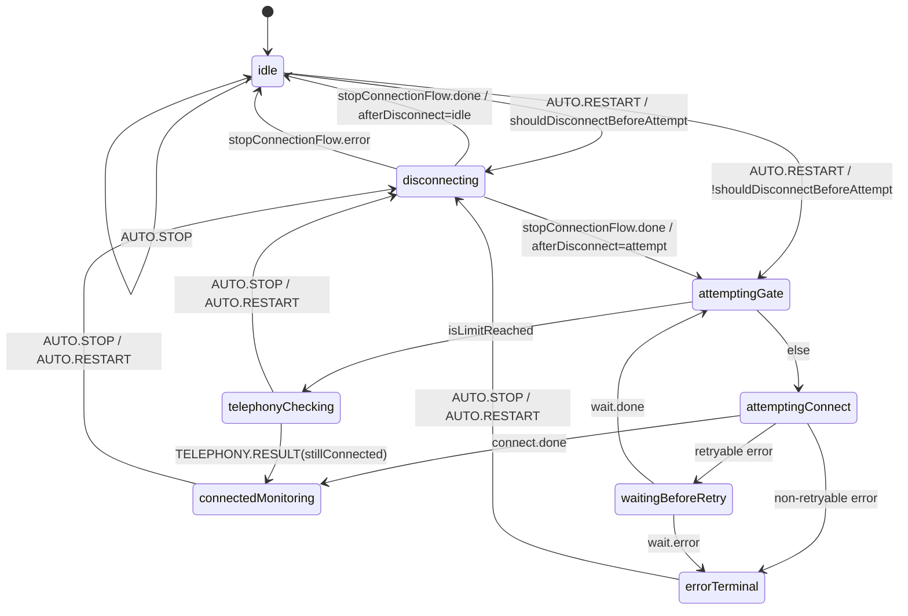

# AutoConnectorManager: машина состояний (XState)

`AutoConnectorStateMachine` оркестрирует цикл автоподключения в `AutoConnectorManager` и валидирует допустимые переходы.

## Публичный API

| Категория                 | Элементы                                                                                                                                                                                                       |
| ------------------------- | -------------------------------------------------------------------------------------------------------------------------------------------------------------------------------------------------------------- |
| Методы менеджера          | `start(parameters)`, `restart()`, `stop()`, `cancelPendingRetry()`                                                                                                                                             |
| Внутренние события машины | `AUTO.RESTART`, `AUTO.STOP`, `TELEPHONY.RESULT(stillConnected)`                                                                                                                                                |
| Публичные эмиты менеджера | `before-attempt`, `success`, `limit-reached-attempts`, `stop-attempts-by-error`, `cancelled-attempts`, `failed-all-attempts`, `telephony-check-failure`, `telephony-check-escalated`, `changed-attempt-status` |
| Сервисные точки           | `requestReconnect(...)` с coalescing и приоритетами причин                                                                                                                                                     |

## Состояния

| Состояние             | Назначение                                                           |
| --------------------- | -------------------------------------------------------------------- |
| `idle`                | Автоконнектор не выполняет цикл подключения.                         |
| `disconnecting`       | Запущен `stopConnectionFlow` (стоп попыток/триггеров, `disconnect`). |
| `attemptingGate`      | Шлюз перед попыткой: `before-attempt`, проверка лимита.              |
| `attemptingConnect`   | Вызов `connectionQueueManager.connect`.                              |
| `waitingBeforeRetry`  | Ожидание `timeoutBetweenAttempts` до следующей попытки.              |
| `connectedMonitoring` | Успешное подключение, активен мониторинг/триггеры.                   |
| `telephonyChecking`   | Периодические проверки телефонии после лимита попыток.               |
| `errorTerminal`       | Терминальное состояние остановленных попыток.                        |

## Контекст и инварианты

| Инвариант                | Описание                                                                                                 |
| ------------------------ | -------------------------------------------------------------------------------------------------------- |
| Базовые поля             | Контекст хранит `afterDisconnect`, `parameters`, `stopReason`, `lastError`.                              |
| Параметры подключения    | В `idle`/`disconnecting` `parameters` может быть `undefined`, в attempt-flow состояниях обязателен.      |
| Терминальная диагностика | В `errorTerminal` сохраняются `stopReason` (`halted/cancelled/failed`) и `lastError`.                    |
| Рестарт                  | `assignRestart` сохраняет параметры нового цикла и очищает терминальную диагностику.                     |
| Стоп                     | `assignStop` переводит сценарий в `afterDisconnect: idle` и очищает диагностику.                         |
| Error-нормализация       | Для веток `cancelled`/`failed` ошибки нормализуются через `wrapReconnectError` в `createMachineDeps.ts`. |

## Диаграмма переходов (Mermaid)

Граф соответствует [`createAutoConnectorMachine.ts`](../../../../src/AutoConnectorManager/AutoConnectorStateMachine/createAutoConnectorMachine.ts).

## Ключевые правила переходов

- `AUTO.RESTART` на cold start может идти сразу в `attemptingGate` без предварительного disconnect.
- В `disconnecting` событие `AUTO.RESTART` не делает re-enter invoke: обновляется только контекст, текущий `stopConnectionFlow` продолжается.
- Порядок guard в `attemptingConnect.onError` критичен: сначала non-retry/cancel cases, затем retry path.
- `telephonyChecking -> connectedMonitoring` означает возврат к мониторингу без нового `connect`.
- Сбой ping в мониторинге не инициирует `AUTO.RESTART`, чтобы не дублировать reconnect-механику транспорта JsSIP.
- Coalescing рестартов (`ReconnectRequestCoalescer`) подавляет дубли в окне и пропускает более приоритетные причины.

## Интеграция и события

- Внутренние события: `AUTO.RESTART`, `AUTO.STOP`, `TELEPHONY.RESULT`.
- Источники событий:
  - `AUTO.RESTART` — из `requestReconnect(...)` (`start`, `restart`, runtime-триггеры);
  - `AUTO.STOP` — из `stop()` (`stateMachine.toStop()`);
  - `TELEPHONY.RESULT(stillConnected)` — из runtime (`notifyTelephonyStillConnected()`).
- Runtime делегирует в машину побочные сценарии (`stopConnectionFlow`, `connect`, `delayBetweenAttempts`, telephony-check policy), а публичные события эмитятся снаружи через `AutoConnectorRuntime`.

## Логирование

- Переходы, диагностические ветки и подавленные рестарты логируются через `resolveDebug` в слое машины/менеджера/runtime.
