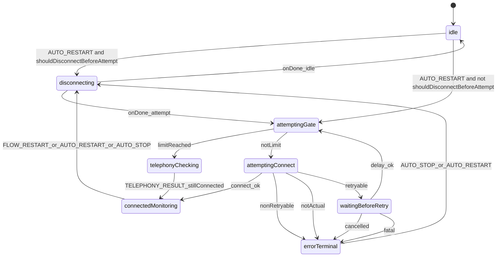

# AutoConnectorManager: машина состояний (XState)

Документ описывает оркестрацию автоподключения в [`AutoConnectorManager`](../../../../src/AutoConnectorManager/@AutoConnectorManager.ts) через модуль [`AutoConnectorStateMachine`](../../../../src/AutoConnectorManager/AutoConnectorStateMachine/AutoConnectorStateMachine.ts), runtime-слой [`AutoConnectorRuntime`](../../../../src/AutoConnectorManager/AutoConnectorRuntime.ts) и фабрику [`createAutoConnectorMachine`](../../../../src/AutoConnectorManager/AutoConnectorStateMachine/createAutoConnectorMachine.ts).

## Назначение

- Явно задать допустимые фазы реконнекта, ретраев, проверки телефонии и остановки.
- Сохранить прежние публичные события (`before-attempt`, `success`, `limit-reached-attempts`, и т.д.) через действия и колбэки `deps`, которые делегируют в `AutoConnectorRuntime`.
- Отклонять недопустимые события в текущей фазе (см. `send` в `AutoConnectorStateMachine`).

## Состояния

| Состояние             | Смысл                                                                                        |
| --------------------- | -------------------------------------------------------------------------------------------- |
| `idle`                | Автоконнектор не выполняет флоу подключения.                                                 |
| `disconnecting`       | Выполняется `stopConnectionFlow` (остановка попыток, триггеров, `disconnect`).               |
| `attemptingGate`      | Перед попыткой: `before-attempt`, остановка триггеров; проверка лимита попыток.              |
| `attemptingConnect`   | Вызов `connectionQueueManager.connect`.                                                      |
| `waitingBeforeRetry`  | Задержка `timeoutBetweenAttempts` перед следующей попыткой.                                  |
| `connectedMonitoring` | Успешное подключение; активны ping и подписка на регистрацию.                                |
| `telephonyChecking`   | Лимит попыток; работает `CheckTelephonyRequester`.                                           |
| `errorTerminal`       | Общий терминальный режим для остановленных попыток; причина хранится в `context.stopReason`. |

## События

События ниже — **внутренний контракт машины**; снаружи `AutoConnectorManager` по-прежнему эмитит прежние публичные события через runtime и колбэки `deps`.

- `AUTO.RESTART` — начать цикл реконнекта/подключения (используется из `start` и единой точки `requestReconnect`).
  - Если `shouldDisconnectBeforeAttempt === true`, сначала переход в `disconnecting`.
  - Если `shouldDisconnectBeforeAttempt === false` (cold start: `isDisconnected || isIdle` и нет `requested/isDisconnecting`), переход сразу в `attemptingGate`.
- `AUTO.STOP` — остановить флоу (`afterDisconnect: idle`). В `idle` обрабатывается как безопасный no-op (остаёмся в `idle`).
- `FLOW.RESTART` — перезапуск из мониторинга (ping / внутренние триггеры), параметры берутся из контекста.
- `TELEPHONY.RESULT` с `stillConnected` — возврат в `connectedMonitoring` после успешной проверки телефонии при уже подключённом клиенте. Если нужен полный рестарт, менеджер вызывает `requestReconnect` с причиной `telephony-disconnected`.

## Диаграмма потока

## Что упростили

- Убрано промежуточное состояние `standby`: после `check-telephony` машина возвращается в тот же режим `connectedMonitoring`, в котором уже живёт успешный `connect`.
- Три терминальных состояния (`haltedByError`, `cancelled`, `failed`) объединены в одно `errorTerminal`.
- Диагностика причины остановки не потеряна: машина сохраняет её в `context.stopReason` (`halted`, `cancelled`, `failed`), а наружу по-прежнему эмитит прежние события (`stop-attempts-by-error`, `cancelled-attempts`, `failed-all-attempts`).
- Убрана скрытая связка с `stateMachine.context` из адаптера: `createMachineDeps` больше не вытягивает параметры из контекста, а получает их явно из machine actions.

## Комментарии к логике

- В `attemptingConnect.onError` порядок guard'ов важен: сначала отсекаются ошибки без права на retry, потом отменённые/неактуальные попытки, и только после этого машина идёт в `waitingBeforeRetry`.
- В `attemptingConnect.invoke.input` добавлена явная проверка `context.parameters`: вместо `non-null assertion` машина выбрасывает явную ошибку инварианта.
- В `waitingBeforeRetry.onError` отдельно различаются управляемая отмена цепочки (`cancelled-attempts`) и фатальная ошибка подготовки ретрая (`failed-all-attempts`).
- Переход `telephonyChecking -> connectedMonitoring` означает: соединение уже восстановилось без нового `connect`, поэтому нужен только возврат в режим мониторинга и событие `success`.
- Ошибка в `CheckTelephonyRequester.onFailRequest` не переводит машину в другое состояние: политика «только логирование и продолжение периодических проверок».
- `requestReconnect` использует «умный coalescing» в коротком окне: запрос с той же или меньшей важностью подавляется, а более приоритетная причина допускается. Карта приоритетов вынесена в [`types.ts`](../../../../src/AutoConnectorManager/types.ts) (`RECONNECT_REASON_PRIORITY`).
- Ошибки `check-telephony` обрабатываются отдельной policy-моделью [`TelephonyFailPolicy.ts`](../../../../src/AutoConnectorManager/TelephonyFailPolicy.ts): считает fail-цепочку, применяет retry/backoff, поднимает escalation (`warning`/`critical`) и эмитит метрики-события.
- Сложные побочные эффекты (`stopConnectionFlow`, `onLimitReached`, терминальные эмиты, connect triggers) вынесены в `AutoConnectorRuntime`, а machine actions сведены к вызову одного runtime-сценария.
- Условие захода в `disconnecting` инкапсулировано в `AutoConnectorRuntime.shouldDisconnectBeforeAttempt()`:
  - `true`, если `connectionManager.requested || connectionManager.isDisconnecting`;
  - иначе `true`, когда состояние не `isDisconnected` и не `isIdle`;
  - `false` на cold start, когда безопасно идти сразу в `attemptingGate`.

## Coalescing-компонент

- За coalescing и `generation` отвечает отдельный класс [`ReconnectRequestCoalescer.ts`](../../../../src/AutoConnectorManager/ReconnectRequestCoalescer.ts).
- Контракт метода `register(reason)`:
  - `shouldRequest: true` — менеджер отправляет `AUTO.RESTART` в машину;
  - `shouldRequest: false` — запрос считается схлопнутым, в лог попадают `coalescedBy` и приоритеты.
- Метод `reset()` очищает coalescing-состояние при `stop()`, чтобы новая сессия стартовала без «истории» предыдущих рестартов.

## Как расширять

1. Добавить новое событие в [`types.ts`](../../../../src/AutoConnectorManager/AutoConnectorStateMachine/types.ts) и обработать переходы в `createAutoConnectorMachine.ts`.
2. Побочные эффекты выносить в `AutoConnectorRuntime`, а в `TAutoConnectorMachineDeps` оставлять только тонкую адаптацию вызовов машины к runtime.
3. При изменении переходов обновляйте эту диаграмму и прогоняйте `yarn test src/AutoConnectorManager` и контрактные тесты событий.

## Связанные файлы

- Реализация машины: [`createAutoConnectorMachine.ts`](../../../../src/AutoConnectorManager/AutoConnectorStateMachine/createAutoConnectorMachine.ts)
- Обёртка актора: [`AutoConnectorStateMachine.ts`](../../../../src/AutoConnectorManager/AutoConnectorStateMachine/AutoConnectorStateMachine.ts)
- Runtime-побочные эффекты: [`AutoConnectorRuntime.ts`](../../../../src/AutoConnectorManager/AutoConnectorRuntime.ts)
- Адаптер зависимостей машины: [`createMachineDeps.ts`](../../../../src/AutoConnectorManager/createMachineDeps.ts)
- Operational-профили policy: [auto-reconnection.md](../../recipes/auto-reconnection.md#базовые-operational-профили-telephonyfailpolicy)
