# CallStateMachine (Состояния звонка)

`CallStateMachine` — внутренний XState-автомат `CallManager`, который управляет состояниями звонка и валидирует допустимые переходы (`snapshot.can(event)`).

## Публичный API

| Категория               | Элементы                                                                                                                                                            |
| ----------------------- | ------------------------------------------------------------------------------------------------------------------------------------------------------------------- |
| Геттеры состояния       | `isIdle`, `isConnecting`, `isPresentationCall`, `isRoomPendingAuth`, `isInPurgatory`, `isP2PRoom`, `isDirectP2PRoom`, `isInRoom`, `isDisconnecting`                 |
| Комбинированные геттеры | `isActive`                                                                                                                                                          |
| Typed-геттеры контекста | `idleContext`, `connectingContext`, `roomPendingAuthContext`, `purgatoryContext`, `p2pRoomContext`, `directP2pRoomContext`, `inRoomContext`, `disconnectingContext` |
| Время начала сессии     | `startedTimestamp` — момент (Unix ms) **первого** входа в «активную» фазу звонка; см. ниже                                                                          |
| Геттеры/утилиты         | `number`, `token`, `isCallInitiator`, `isCallAnswerer`, `getInRoomCredentials()`, `onInRoomCredentialsChange(listener)`                                             |
| Методы управления       | `reset()`, `send(event)`, `subscribeToApiEvents(apiManagerEvents)`                                                                                                  |

## Состояния

| Состояние               | Назначение                                                                                                                      |
| ----------------------- | ------------------------------------------------------------------------------------------------------------------------------- |
| `call:idle`             | Звонок не активен, контекст очищен.                                                                                             |
| `call:connecting`       | Идёт установка звонка, есть базовые данные (`number`, `answer`).                                                                |
| `call:presentationCall` | Режим presentation-call после `confirmed` и спец-заголовка.                                                                     |
| `call:roomPendingAuth`  | Известны `room` и `participantName`, но нет валидного room-согласованного JWT; вход в «активную» фазу (см. `startedTimestamp`). |
| `call:purgatory`        | Режим purgatory (no-token state).                                                                                               |
| `call:p2pRoom`          | P2P-режим по имени комнаты (no-token state).                                                                                    |
| `call:directP2pRoom`    | Direct P2P-режим по флагу/паттерну (no-token state).                                                                            |
| `call:inRoom`           | Комната готова к JWT-зависимым операциям (`conferenceForToken === room`).                                                       |
| `call:disconnecting`    | Идёт завершение звонка до финального `CALL.RESET`.                                                                              |
| `evaluate`              | Внутренний transient state выбора целевого доменного состояния.                                                                 |

## Контекст и инварианты

| Инвариант             | Описание                                                                                                                                                                                                                                                    |
| --------------------- | ----------------------------------------------------------------------------------------------------------------------------------------------------------------------------------------------------------------------------------------------------------- |
| Формы контекста       | `context.raw` хранит рабочие данные, `context.state` — нормализованный контекст текущего состояния.                                                                                                                                                         |
| Валидность `inRoom`   | `inRoomContext` доступен только при `state = call:inRoom` и `conferenceForToken === room`.                                                                                                                                                                  |
| Presentation-контекст | В `call:presentationCall` в типизированном контексте: `number`, `answer`, `startedTimestamp`.                                                                                                                                                               |
| Комнатные контексты   | Для `call:roomPendingAuth`, `call:purgatory`, `call:p2pRoom`, `call:directP2pRoom`, `call:inRoom` к полям комнаты (`number`, `answer`, `room`, `participantName`, …) добавляется `startedTimestamp` (у `call:inRoom` также `token` и `conferenceForToken`). |
| Disconnect-контекст   | В `call:disconnecting` `state`-контекст пустой (`{}`), в `raw` временно может быть `pendingDisconnect: true`.                                                                                                                                               |
| Сброс                 | `CALL.RESET` очищает `raw` и возвращает машину в `call:idle`.                                                                                                                                                                                               |

### Активная фаза и `startedTimestamp`

- **Активная фаза** — любое из состояний: `call:roomPendingAuth`, `call:presentationCall`, `call:purgatory`, `call:p2pRoom`, `call:directP2pRoom`, `call:inRoom`.
- **`startedTimestamp`** — число (момент времени через `Date.now()` в мс) **первого** входа в активную фазу. При последующих переходах между перечисленными состояниями значение в `raw` **не перезаписывается**; в нормализованном `state` поле есть у каждого из этих состояний.
- Сброс: при `CALL.RESET` и при `CALL.START_DISCONNECT` (очистка `raw` перед `disconnecting`).
- Публичный геттер `startedTimestamp` возвращает `undefined` в `call:idle`, `call:connecting` и `call:disconnecting`.

## Диаграмма переходов (Mermaid)

Реализация: [`createCallMachine.ts`](../../../../src/CallManager/CallStateMachine/createCallMachine.ts). Все доменные состояния переводят события в `evaluate`, затем цепочка `always`-guard выбирает следующее состояние.

```mermaid
stateDiagram-v2
  [*] --> idle
  state "call:idle" as idle
  state "call:connecting" as connecting
  state "call:presentationCall" as presentationCall
  state "call:roomPendingAuth" as roomPendingAuth
  state "call:purgatory" as purgatory
  state "call:p2pRoom" as p2pRoom
  state "call:directP2pRoom" as directP2p
  state "call:inRoom" as inRoom
  state "call:disconnecting" as disconnecting
  state "evaluate" as ev

  idle --> ev: CALL.CONNECTING
  connecting --> ev: CALL.PRESENTATION_CALL / CALL.ENTER_ROOM / CALL.TOKEN_ISSUED / CALL.START_DISCONNECT / CALL.RESET
  roomPendingAuth --> ev: CALL.ENTER_ROOM / CALL.TOKEN_ISSUED / CALL.START_DISCONNECT / CALL.RESET
  purgatory --> ev: CALL.ENTER_ROOM / CALL.TOKEN_ISSUED / CALL.START_DISCONNECT / CALL.RESET
  p2pRoom --> ev: CALL.ENTER_ROOM / CALL.TOKEN_ISSUED / CALL.START_DISCONNECT / CALL.RESET
  directP2p --> ev: CALL.ENTER_ROOM / CALL.TOKEN_ISSUED / CALL.START_DISCONNECT / CALL.RESET
  inRoom --> ev: CALL.ENTER_ROOM / CALL.TOKEN_ISSUED / CALL.START_DISCONNECT / CALL.RESET
  presentationCall --> ev: CALL.START_DISCONNECT / CALL.RESET
  disconnecting --> ev: CALL.RESET

  ev --> disconnecting: guard DISCONNECTING
  ev --> presentationCall: guard PRESENTATION_CALL
  ev --> inRoom: guard IN_ROOM
  ev --> directP2p: guard DIRECT_P2P_ROOM
  ev --> p2pRoom: guard P2P_ROOM
  ev --> purgatory: guard PURGATORY
  ev --> roomPendingAuth: guard ROOM_PENDING_AUTH
  ev --> connecting: guard CONNECTING
  ev --> idle: default
```

## Ключевые правила переходов

- `idle -> connecting` по `CALL.CONNECTING`.
- `connecting -> presentationCall` только при связке: presentation-заголовок в `extraHeaders` + `CALL.PRESENTATION_CALL`.
- `roomPendingAuth` — обычная комната без согласованного JWT.
- `purgatory`, `p2pRoom`, `directP2pRoom` — no-token режимы; `CALL.TOKEN_ISSUED` сам по себе не переводит их в `inRoom`.
- `inRoom` достигается только при валидной связке комнаты и токена (`conferenceForToken === room`) или при `enter-room` с `bearerToken` (он кладётся как `token`, `conferenceForToken = room`).
- `CALL.START_DISCONNECT` из активных состояний переводит в `disconnecting` через `prepareDisconnect` (`pendingDisconnect` в `raw`, вместе с этим сбрасывается накопленный `raw`, включая `startedTimestamp`).
- `CALL.RESET` очищает контекст и возвращает в `idle`.
- `RecvSession` может стартовать только при достижении `call:inRoom`; при раннем запросе spectator-режима используется отложенный запуск через `DeferredCommandRunner`.

## Интеграция и события

- Внутренние события: `CALL.CONNECTING`, `CALL.ENTER_ROOM`, `CALL.TOKEN_ISSUED`, `CALL.PRESENTATION_CALL`, `CALL.START_DISCONNECT`, `CALL.RESET`.
- Маппинг `CallManager.events`: `start-call -> CALL.CONNECTING`, `confirmed -> CALL.PRESENTATION_CALL`, `end-call -> CALL.START_DISCONNECT`, `ended/failed -> CALL.RESET`.
- Маппинг `ApiManager.events`: `enter-room -> CALL.ENTER_ROOM`, `conference:participant-token-issued -> CALL.TOKEN_ISSUED`.

## Логирование

- Недопустимые переходы и служебные сообщения логируются через `resolveDebug('CallStateMachine')`.
