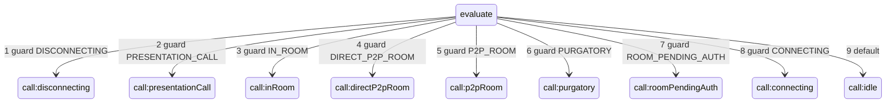

# CallStateMachine (Состояния звонка)

Внутренний компонент `CallManager`, управляющий состояниями звонка через XState с валидацией переходов и предотвращением недопустимых операций (проверка `snapshot.can(event)` перед отправкой).

## События

- `CALL.CONNECTING` — начало установки звонка
- `CALL.ENTER_ROOM` — вход в комнату
- `CALL.TOKEN_ISSUED` — получение токена участника
- `CALL.PRESENTATION_CALL` — подтверждение SIP-сессии для режима presentation-call (внутренне выставляет `isConfirmed` в сыром контексте; снаружи приходит как событие `confirmed` от `CallManager.events`)
- `CALL.START_DISCONNECT` — начало отключения звонка
- `CALL.RESET` — сброс состояния звонка

События `end-call`, `ended`, `failed` от `CallManager.events` приводят к соответствующим переходам.

**Источники событий менеджера:** `CallManager.events` — `start-call`, `confirmed`, `end-call`, `enter-room`, `conference:participant-token-issued`, `ended`, `failed`.

**Значения в снимке сеанса:** `EState` в `CallStateMachine/types.ts` — `call:idle`, `call:connecting`, `call:presentationCall`, `call:roomPendingAuth`, `call:purgatory`, `call:p2pRoom`, `call:directP2pRoom`, `call:inRoom`, `call:disconnecting`.

## Диаграмма переходов (Mermaid)

Реализация: [`createCallMachine.ts`](../../../../src/CallManager/CallStateMachine/createCallMachine.ts). Доменные состояния переводят события во внутренний узел `evaluate`, откуда **цепочка `always`-гвардов** (в указанном порядке) выбирает следующее состояние.

### 1. Вход в `evaluate` по событиям

```mermaid
stateDiagram-v2
    state "call:idle" as idle
    state "call:connecting" as connecting
    state "call:roomPendingAuth" as roomPendingAuth
    state "call:inRoom" as inRoom
    state "call:purgatory" as purgatory
    state "call:p2pRoom" as p2pRoom
    state "call:directP2pRoom" as directP2p
    state "call:presentationCall" as presentationCall
    state "call:disconnecting" as disconnecting
    state "evaluate" as ev

    [*] --> idle
    idle --> ev: CALL.CONNECTING
    connecting --> ev: CALL.PRESENTATION_CALL
    connecting --> ev: CALL.ENTER_ROOM
    connecting --> ev: CALL.TOKEN_ISSUED
    connecting --> ev: CALL.START_DISCONNECT
    connecting --> ev: CALL.RESET
    roomPendingAuth --> ev: CALL.ENTER_ROOM
    roomPendingAuth --> ev: CALL.TOKEN_ISSUED
    roomPendingAuth --> ev: CALL.START_DISCONNECT
    roomPendingAuth --> ev: CALL.RESET
    inRoom --> ev: CALL.ENTER_ROOM
    inRoom --> ev: CALL.TOKEN_ISSUED
    inRoom --> ev: CALL.START_DISCONNECT
    inRoom --> ev: CALL.RESET
    purgatory --> ev: CALL.ENTER_ROOM
    purgatory --> ev: CALL.TOKEN_ISSUED
    purgatory --> ev: CALL.START_DISCONNECT
    purgatory --> ev: CALL.RESET
    p2pRoom --> ev: CALL.ENTER_ROOM
    p2pRoom --> ev: CALL.TOKEN_ISSUED
    p2pRoom --> ev: CALL.START_DISCONNECT
    p2pRoom --> ev: CALL.RESET
    directP2p --> ev: CALL.ENTER_ROOM
    directP2p --> ev: CALL.TOKEN_ISSUED
    directP2p --> ev: CALL.START_DISCONNECT
    directP2p --> ev: CALL.RESET
    presentationCall --> ev: CALL.START_DISCONNECT
    presentationCall --> ev: CALL.RESET
    disconnecting --> ev: CALL.RESET
```

### 2. Выход из `evaluate` (порядок гвардов)

## Публичный API

### Геттеры состояний

- `isIdle` — проверка состояния IDLE
- `isConnecting` — проверка состояния CONNECTING
- `isPresentationCall` — проверка состояния PRESENTATION_CALL
- `isRoomPendingAuth` — проверка состояния ROOM_PENDING_AUTH
- `isInPurgatory` — проверка состояния PURGATORY
- `isP2PRoom` — проверка состояния P2P_ROOM
- `isDirectP2PRoom` — проверка состояния DIRECT_P2P_ROOM
- `isInRoom` — проверка состояния IN_ROOM
- `isDisconnecting` — проверка состояния DISCONNECTING

### Комбинированные геттеры

- `isPending` — проверка состояний connecting/disconnecting
- `isActive` — проверка активных состояний (presentationCall, roomPendingAuth, inRoom, purgatory, p2pRoom или directP2pRoom)

### Геттер контекста

- `inRoomContext` — возвращает контекст только в состоянии IN_ROOM

### Методы управления

- `reset()` — сброс состояния
- `send(event)` — отправка события в машину
- `subscribeToApiEvents(apiManager)` — привязка к API событиям (enter-room, conference:participant-token-issued)

## Граф переходов

### Из IDLE

- **IDLE → CONNECTING** — при `CALL.CONNECTING`

### Из CONNECTING

- **CONNECTING → PRESENTATION_CALL** — при `CALL.PRESENTATION_CALL` (событие `confirmed`), если при старте звонка в `CALL.CONNECTING` были переданы `extraHeaders`, содержащие заголовок `x-vinteo-presentation-call: yes` (без учёта регистра и пробелов по краям строки заголовка). Это работает как для `startCall`, так и для `answerToIncomingCall`. В типизированном контексте остаются только `number` и `answer`
- **CONNECTING → PURGATORY** — при `CALL.ENTER_ROOM` с room=purgatory без token
- **CONNECTING → P2P_ROOM** — при `CALL.ENTER_ROOM` с room, соответствующим паттерну `/^p2p.+to.+$/i`, без token
- **CONNECTING → DIRECT_P2P_ROOM** — при `CALL.ENTER_ROOM` с `isDirectPeerToPeer=true` или room, соответствующим паттерну `/^directP2P.+to.+$/i`, без token
- **CONNECTING → ROOM_PENDING_AUTH** — при `CALL.ENTER_ROOM` для обычной комнаты без token
- **CONNECTING → IN_ROOM** — при получении room + participantName и token через `CALL.ENTER_ROOM` и `CALL.TOKEN_ISSUED`
- **CONNECTING → DISCONNECTING** — при `CALL.START_DISCONNECT` или событии `end-call`
- **CONNECTING → IDLE** — при `CALL.RESET` (в т.ч. при событии `ended` или `failed`)

Если `confirmed` пришёл без presentation-заголовка в `extraHeaders`, после `CALL.PRESENTATION_CALL` повторная оценка контекста обычно оставляет состояние **CONNECTING** (guard `PRESENTATION_CALL` не выполняется).

### Из PRESENTATION_CALL

- **PRESENTATION_CALL → DISCONNECTING** — при `CALL.START_DISCONNECT` или событии `end-call`
- **PRESENTATION_CALL → IDLE** — при `CALL.RESET` (в т.ч. при событии `ended` или `failed`)

В состоянии PRESENTATION_CALL события `CALL.ENTER_ROOM` и `CALL.TOKEN_ISSUED` не обрабатываются — смена комнаты/токена для этого режима не предусмотрена графом машины.

### Из ROOM_PENDING_AUTH

- **ROOM_PENDING_AUTH → IN_ROOM** — при появлении token через `CALL.ENTER_ROOM` с bearerToken или `CALL.TOKEN_ISSUED`
- **ROOM_PENDING_AUTH → PURGATORY** — при `CALL.ENTER_ROOM` с room=purgatory без token
- **ROOM_PENDING_AUTH → P2P_ROOM** — при `CALL.ENTER_ROOM` с p2p-room без token
- **ROOM_PENDING_AUTH → DIRECT_P2P_ROOM** — при `CALL.ENTER_ROOM` с `isDirectPeerToPeer=true` или direct p2p-room без token
- **ROOM_PENDING_AUTH → DISCONNECTING** — при `CALL.START_DISCONNECT` или событии `end-call`
- **ROOM_PENDING_AUTH → IDLE** — при `CALL.RESET`

### Из PURGATORY

- **PURGATORY → IN_ROOM** — при появлении token: `CALL.ENTER_ROOM` с bearerToken (можно сменить комнату) или `CALL.TOKEN_ISSUED` (room остаётся purgatory)
- **PURGATORY → DISCONNECTING** — при `CALL.START_DISCONNECT` или событии `end-call`
- **PURGATORY → IDLE** — при `CALL.RESET`

### Из P2P_ROOM

- **P2P_ROOM → IN_ROOM** — при появлении token через `CALL.ENTER_ROOM` с bearerToken или `CALL.TOKEN_ISSUED`
- **P2P_ROOM → DISCONNECTING** — при `CALL.START_DISCONNECT` или событии `end-call`
- **P2P_ROOM → IDLE** — при `CALL.RESET`

### Из DIRECT_P2P_ROOM

- **DIRECT_P2P_ROOM → IN_ROOM** — при появлении token через `CALL.ENTER_ROOM` с bearerToken или `CALL.TOKEN_ISSUED`
- **DIRECT_P2P_ROOM → DISCONNECTING** — при `CALL.START_DISCONNECT` или событии `end-call`
- **DIRECT_P2P_ROOM → IDLE** — при `CALL.RESET`

### Из IN_ROOM

- **IN_ROOM → PURGATORY** — при `CALL.ENTER_ROOM` с room=purgatory без token (в setRoomInfo token сбрасывается только для room=purgatory)
- **IN_ROOM → P2P_ROOM** — при `CALL.ENTER_ROOM` с room, соответствующим паттерну `/^p2p.+to.+$/i`, без token
- **IN_ROOM → DIRECT_P2P_ROOM** — при `CALL.ENTER_ROOM` с `isDirectPeerToPeer=true` или room, соответствующим паттерну `/^directP2P.+to.+$/i`, без token
- **IN_ROOM → DISCONNECTING** — при `CALL.START_DISCONNECT` или событии `end-call`
- **IN_ROOM → IDLE** — при `CALL.RESET` (в т.ч. при событии `ended` или `failed` от `CallManager.events`, что мапится в `CALL.RESET`)

### Из DISCONNECTING

- **DISCONNECTING → IDLE** — при `CALL.RESET` (в т.ч. при событии `ended` или `failed`)

## Внутреннее состояние EVALUATE

Переход в DISCONNECTING идёт через EVALUATE:

- `CALL.START_DISCONNECT` → `EVALUATE` (action `prepareDisconnect`: очистка контекста + флаг `pendingDisconnect`) → `DISCONNECTING` (action `reset` для сброса флага)

EVALUATE также может перейти в PRESENTATION_CALL, IN_ROOM, DIRECT_P2P_ROOM, P2P_ROOM, PURGATORY, ROOM_PENDING_AUTH, CONNECTING или IDLE по контексту после действий (порядок проверки guard’ов: сначала DISCONNECTING, затем PRESENTATION_CALL, затем остальные целевые состояния).

## Логика определения состояний

### DIRECT_P2P_ROOM

Приоритет выше P2P_ROOM. Определяется по:

- Флагу `isDirectPeerToPeer=true` в событии `enter-room`
- Паттерну имени комнаты `/^directP2P.+to.+$/i`

### P2P_ROOM

Определяется по паттерну имени комнаты `/^p2p.+to.+$/i` (без префикса `direct`).

### PRESENTATION_CALL

Отдельное состояние звонка «presentation call»: переход из **CONNECTING** только при связке «заголовок `x-vinteo-presentation-call: yes` в `extraHeaders` при `CALL.CONNECTING`» + «`CALL.PRESENTATION_CALL` после установления сессии». Это применимо как к `startCall`, так и к `answerToIncomingCall`. Контекст машины — `number` и `answer`; полей комнаты и JWT в этом состоянии нет.

### ROOM_PENDING_AUTH

Определяется для обычной комнаты, когда `room` и `participantName` уже известны, но `token` ещё не выдан. Это валидное активное состояние звонка, но не состояние готовности для `RecvSession`.

### Общие правила для P2P состояний

Оба состояния P2P не требуют токена (как и PURGATORY), но могут перейти в IN_ROOM при получении токена.

## Зависимость для перевода в зрители

Запуск RecvSession (и вызов sendOffer) возможен только при наличии токена (состояние IN_ROOM). Состояния ROOM_PENDING_AUTH и PRESENTATION_CALL не считаются достаточными для JWT-зависимых операций.

При гонке событий (`participant:move-request-to-spectators-with-audio-id` приходит до `conference:participant-token-issued`) CallManager использует `DeferredCommandRunner`: команда откладывается и выполняется при переходе в IN_ROOM.

## Логирование

Недопустимые переходы логируются через `console.warn` для отладки.
