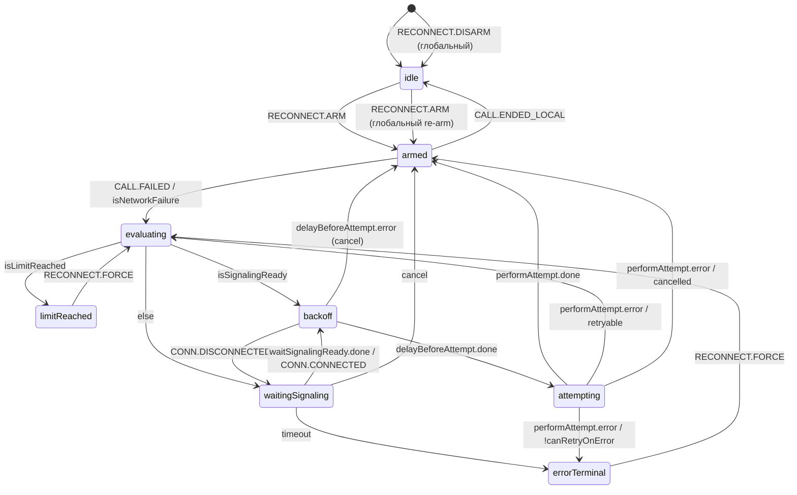

# CallReconnectStateMachine (автоматический редиал звонка)

Декларативный XState-автомат, описывающий цикл автоматического повтора звонка после сетевого обрыва. Все побочные эффекты инкапсулированы в `CallReconnectRuntime`; машина работает с узким slim-интерфейсом `TCallReconnectMachineDeps`.

## Публичный API

Доступ к машине получают два слоя:

- `CallReconnectManager.stateMachine` — обёртка с методами `send`, `subscribe`, `getSnapshot`, `start`, `stop` и полем `state`. Используется `SessionManager` для сбора агрегированного snapshot.
- `TCallReconnectMachineDeps` — тонкий контракт с `runtime/emitters`. Контракт намеренно узкий, чтобы машина не знала про типы событий фасада.

## Состояния

| Состояние          | Назначение                                                                                 |
| ------------------ | ------------------------------------------------------------------------------------------ |
| `idle`             | Не армирован, ждёт `RECONNECT.ARM`.                                                        |
| `armed`            | Активен, слушает `CALL.FAILED` (сетевые причины) и `CALL.ENDED_LOCAL` (локальный hang-up). |
| `evaluating`       | Транзитное состояние: лимит попыток → сигнализация → backoff.                              |
| `backoff`          | Таймаут перед попыткой (`DelayRequester`). Переход в `attempting` при завершении задержки. |
| `waitingSignaling` | Ожидание готовности UA (`connected`/`registered`) с таймаутом.                             |
| `attempting`       | `invoke: performAttempt` — реальный `startCall` внутри `CancelableRequest`.                |
| `limitReached`     | Исчерпан `maxAttempts`; выход только через `RECONNECT.FORCE` или `RECONNECT.DISARM`.       |
| `errorTerminal`    | Нефатальные ветки ретрая (`canRetryOnError = false` или timeout сигнализации).             |

## Контекст и инварианты

| Инвариант                | Описание                                                                                       |
| ------------------------ | ---------------------------------------------------------------------------------------------- |
| `parameters`             | В `idle` — `undefined`; во всех остальных attempt-flow состояниях — `TCallRedialParameters`.   |
| `attempt`, `nextDelayMs` | Обновляются `assignIncrementAttempt` / `assignNextDelay`. Сбрасываются в `assignResetAttempt`. |
| `lastError`              | Заполняется при `onError` invoke. Сбрасывается при повторном `arm`/`force`.                    |
| `lastFailureCause`       | Диагностика: JsSIP-cause последнего принятого `CALL.FAILED`.                                   |
| `cancelledReason`        | Причина `cancelled` (`disarm`, `local-hangup`, `spectator-role`, `manual`).                    |

## Диаграмма переходов (Mermaid)

## Ключевые правила переходов

- Порядок `always`-guard в `evaluating` важен: сначала `isLimitReached`, затем `isSignalingReady`, иначе `waitingSignaling`.
- Глобальный `RECONNECT.ARM` доступен из любого состояния: перед рестартом выполняется `cancelAll + resetAttemptsState`, что позволяет пользователю в любой момент «перепрошить» параметры звонка.
- Глобальный `RECONNECT.DISARM` выполняет полный сброс in-flight и эмитит `disarmed` и `cancelled(reason)` (при явно переданной причине).
- После удачной попытки (`attempting → armed` + `attempt-succeeded`) счётчик попыток сбрасывается, и менеджер продолжает следить за следующим `CALL.FAILED`.
- `canRetryOnError` вычисляется по ошибке из invoke: `startCall` с «человеческой» ошибкой (например `busy`) уходит в `errorTerminal`, дальше — только `forceReconnect()`.
- `isAttemptCancelled` учитывает оба возможных cancel-маркера: `@krivega/cancelable-promise` (`isCanceledError`) и `@krivega/timeout-requester` (`hasCanceledError`).

## Интеграция и события

| Событие             | Источник                                                                                     |
| ------------------- | -------------------------------------------------------------------------------------------- |
| `RECONNECT.ARM`     | `CallReconnectManager.arm` / SipConnector.`armCallAutoRedial` / `call({ autoRedial: true })` |
| `RECONNECT.DISARM`  | `CallReconnectManager.disarm` / SipConnector.`hangUp`                                        |
| `RECONNECT.FORCE`   | `CallReconnectManager.forceReconnect`                                                        |
| `CALL.FAILED`       | `CallManager.on('failed')`                                                                   |
| `CALL.ENDED_LOCAL`  | `CallManager.on('end-call')`                                                                 |
| `CONN.CONNECTED`    | `ConnectionManager.on('connected' \| 'registered')`                                          |
| `CONN.DISCONNECTED` | `ConnectionManager.on('disconnected')`                                                       |

Все side-эффекты (уведомление фасада, UI) реализованы через `emit*`-действия, вызывающие `events-constructor` триггеры внутри `CallReconnectManager`. Описание внешних событий — [docs/api/call-reconnect-events.md](../../../api/call-reconnect-events.md).

## Логирование

- Машина логирует активацию actors (`delayBeforeAttempt`, `waitSignalingReady`, `performAttempt`) через `resolveDebug('CallReconnectMachine')`.
- Runtime — через `resolveDebug('CallReconnectRuntime')`.
- Фасад — через `resolveDebug('CallReconnectManager')`.
