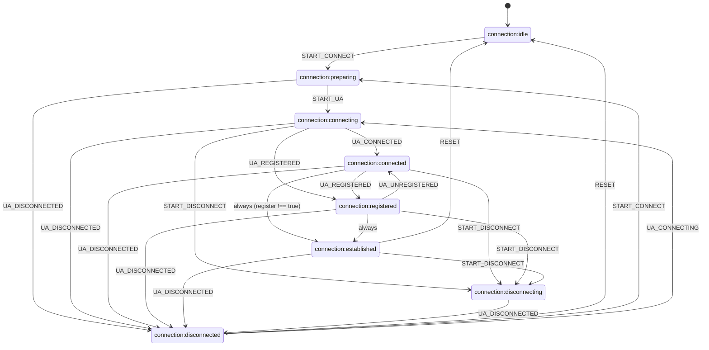

# ConnectionStateMachine (Состояния соединения)

`ConnectionStateMachine` — внутренний XState-автомат `ConnectionManager`, который фиксирует фазу SIP-подключения и валидирует допустимые переходы.

## Публичный API

| Категория               | Элементы                                                                                                                     |
| ----------------------- | ---------------------------------------------------------------------------------------------------------------------------- |
| Геттеры состояния       | `isIdle`, `isPreparing`, `isConnecting`, `isConnected`, `isRegistered`, `isEstablished`, `isDisconnecting`, `isDisconnected` |
| Комбинированные геттеры | `isPending`, `isPendingConnect`, `isPendingInitUa`, `isActiveConnection`                                                     |
| Методы управления       | `toStartConnect()`, `toStartUa(configuration)`, `reset()`, `destroy()`                                                       |
| Доп. методы             | `getConnectionConfiguration()`, `isRegisterEnabled()`                                                                        |
| Подписка                | `onStateChange(listener)` (через `BaseStateMachine`)                                                                         |

## Состояния

| Состояние                  | Назначение                                                           |
| -------------------------- | -------------------------------------------------------------------- |
| `connection:idle`          | Базовое состояние без активного подключения.                         |
| `connection:preparing`     | Старт цикла подключения до запуска UA.                               |
| `connection:connecting`    | UA запущен и устанавливает транспорт/сессию.                         |
| `connection:connected`     | Транспорт подключён, но регистрация может быть не завершена.         |
| `connection:registered`    | Получено событие регистрации, далее instant-переход в `established`. |
| `connection:established`   | Соединение готово к работе.                                          |
| `connection:disconnecting` | Идёт процесс отключения.                                             |
| `connection:disconnected`  | Подключение разорвано, возможны reset/reconnect.                     |

## Контекст и инварианты

| Инвариант                | Описание                                                                                                                                                 |
| ------------------------ | -------------------------------------------------------------------------------------------------------------------------------------------------------- |
| Поле контекста           | Контекст содержит `connectionConfiguration`.                                                                                                             |
| Пустая конфигурация      | В `connection:idle`, `connection:preparing`, `connection:disconnected` значение `connectionConfiguration = undefined`.                                   |
| Заполненная конфигурация | В `connection:connecting`, `connection:connected`, `connection:registered`, `connection:established`, `connection:disconnecting` конфигурация заполнена. |
| Установка                | `START_UA` сохраняет конфигурацию через action `setConnectionConfiguration`.                                                                             |
| Очистка                  | Вход в `idle` очищает конфигурацию через `clearConnectionConfiguration`.                                                                                 |
| Иммутабельность чтения   | `getConnectionConfiguration()` возвращает копию, а не ссылку из контекста.                                                                               |

## Диаграмма переходов (Mermaid)

Граф соответствует [`createConnectionMachine.ts`](../../../../src/ConnectionManager/ConnectionStateMachine/createConnectionMachine.ts).

## Ключевые правила переходов

- `idle -> preparing -> connecting -> connected -> established` при `register !== true`.
- `idle -> preparing -> connecting -> registered -> established` при раннем событии регистрации.
- При `register=true` возможна цепочка `connected -> registered -> established`.
- `registered` — транзиентное состояние с мгновенным переходом в `established`.
- `connected` также транзиентен, если guard `canAutoEstablish` истинный.
- `reset()` валиден только из `established` и `disconnected`; иначе событие игнорируется.
- В `disconnected` допустим `UA_CONNECTING` напрямую в `connecting` без нового `START_CONNECT`.

## Интеграция и события

- Доменные события машины: `START_CONNECT`, `START_UA`, `START_DISCONNECT`, `UA_CONNECTED`, `UA_CONNECTING`, `UA_REGISTERED`, `UA_UNREGISTERED`, `UA_DISCONNECTED`, `RESET`.
- Источники событий `ConnectionManager.events`:
  - `connected` -> `UA_CONNECTED`;
  - `connecting` -> `UA_CONNECTING`;
  - `registered` -> `UA_REGISTERED`;
  - `unregistered` -> `UA_UNREGISTERED`;
  - `disconnecting` -> `START_DISCONNECT`;
  - `disconnected`, `registrationFailed`, `connect-failed` -> `UA_DISCONNECTED`.
- Синтетика со стороны `ConnectionFlow`:
  - `toStartConnect()` отправляет `START_CONNECT` при начале `connect()`;
  - `toStartUa(configuration)` отправляет `START_UA` перед `ua.start()`;
  - `disconnect()` в конце вызывает `stateMachine.reset()` (возврат в `idle` после `disconnected`).
- Проверка допустимости перехода выполняется до `send`: при `snapshot.can(event) === false` событие игнорируется, состояние не меняется.

## Логирование

- Логи переходов и смены состояния пишутся через `resolveDebug('ConnectionStateMachine')`.
- Недопустимые события логируются через `resolveDebug` в `ConnectionStateMachine.sendEvent(...)`.
