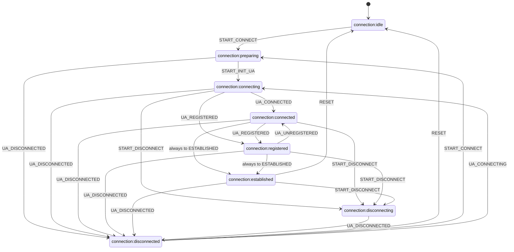

# ConnectionStateMachine (Состояния соединения)

Внутренний компонент `ConnectionManager`, управляющий состояниями SIP соединения через XState с валидацией допустимых операций и предотвращением некорректных переходов.

## Интеграция с менеджером

- **Доменные события машины:** `START_CONNECT`, `START_INIT_UA`, `START_DISCONNECT`, `UA_CONNECTED`, `UA_CONNECTING`, `UA_REGISTERED`, `UA_UNREGISTERED`, `UA_DISCONNECTED`, `RESET`.
- **Источники событий:** `ConnectionManager.events` — `connect-started`, `connecting` (→ `UA_CONNECTING`), `connect-parameters-resolve-success`, `connected`, `registered`, `unregistered`, `disconnecting`, `disconnected`, `registrationFailed`, `connect-failed`.

## Диаграмма переходов (Mermaid)

Граф соответствует [`ConnectionStateMachine.ts`](../../../../src/ConnectionManager/ConnectionStateMachine.ts).

## Логика состояний

- `PREPARING` — подготовка к подключению (до инициализации UA, до вызова `ua.start()`)
- `CONNECTING` — UA запущен, идет подключение (после `ua.start()`, когда приходят события `connecting`, `connected`, `registered`)
- `CONNECTED` — UA подключен к серверу (промежуточное состояние, автоматически переходит в `ESTABLISHED`)
- `REGISTERED` — UA зарегистрирован на сервере (промежуточное состояние, автоматически переходит в `ESTABLISHED`)
- `ESTABLISHED` — соединение установлено и готово к работе (финальное активное состояние, автоматически достигается из `CONNECTED` или `REGISTERED`)
- `DISCONNECTING` — процесс отключения (начат вызов `disconnect()`, ожидаем `disconnected` от UA)
- `DISCONNECTED` — соединение отключено (в т.ч. при ошибках: registrationFailed, connect-failed)

Состояния переименованы для соответствия реальной последовательности операций: сначала подготовка, затем подключение UA.

## Публичный API

### Геттеры состояний

- `isIdle` — проверка состояния IDLE
- `isPreparing` — проверка состояния PREPARING
- `isConnecting` — проверка состояния CONNECTING
- `isConnected` — проверка состояния CONNECTED
- `isRegistered` — проверка состояния REGISTERED
- `isEstablished` — проверка состояния ESTABLISHED
- `isDisconnecting` — проверка состояния DISCONNECTING
- `isDisconnected` — проверка состояния DISCONNECTED

### Комбинированные геттеры

- `isPending` — проверка состояний preparing/connecting
- `isPendingConnect` — проверка ожидания подключения
- `isPendingInitUa` — проверка ожидания инициализации UA
- `isActiveConnection` — проверка активных состояний (connected/registered/established)

### Методы управления

- `startConnect()` — начать процесс подключения
- `startInitUa()` — начать инициализацию UA
- `startDisconnect()` — начать процесс отключения
- `reset()` — сброс состояния в IDLE

### Методы валидации

- `canTransition()` — проверка возможности перехода
- `getValidEvents()` — получение списка допустимых событий

### Подписка на изменения

- `onStateChange(listener)` — подписка на изменения состояния

## Граф переходов

### Основные пути

- **IDLE → PREPARING → CONNECTING → CONNECTED → ESTABLISHED** (автоматически)
- **IDLE → PREPARING → CONNECTING → REGISTERED → ESTABLISHED** (автоматически)
- **CONNECTING → REGISTERED** — прямой переход для быстрой регистрации без явного connected
- **REGISTERED → CONNECTED → ESTABLISHED** — через `UA_UNREGISTERED`, затем автоматически

### Переходы в DISCONNECTING

Из состояний CONNECTING/CONNECTED/REGISTERED/ESTABLISHED при событии `disconnecting` / `START_DISCONNECT`.

### Переходы в DISCONNECTED

- **DISCONNECTING → DISCONNECTED** — при событии `disconnected` / `UA_DISCONNECTED`
- Из PREPARING/CONNECTING/CONNECTED/REGISTERED/ESTABLISHED (в т.ч. при registrationFailed, connect-failed)

### Переходы RESET

- **ESTABLISHED → IDLE**
- **DISCONNECTED → IDLE**

### Повторное подключение

- **DISCONNECTED → PREPARING** — через `START_CONNECT`
- **DISCONNECTED → CONNECTING** — через событие шины `connecting` (в машину уходит как `UA_CONNECTING`), когда UA снова входит в фазу подключения без нового цикла `START_CONNECT` / `PREPARING`

### Автоматические переходы

Через `always`:

- **CONNECTED → ESTABLISHED**
- **REGISTERED → ESTABLISHED**

### Игнорируемые события

В состоянии ESTABLISHED события `UA_REGISTERED` и `UA_UNREGISTERED` игнорируются (нет обработчиков).

## Логирование

Все переходы состояний и недопустимые операции логируются для отладки и мониторинга.
