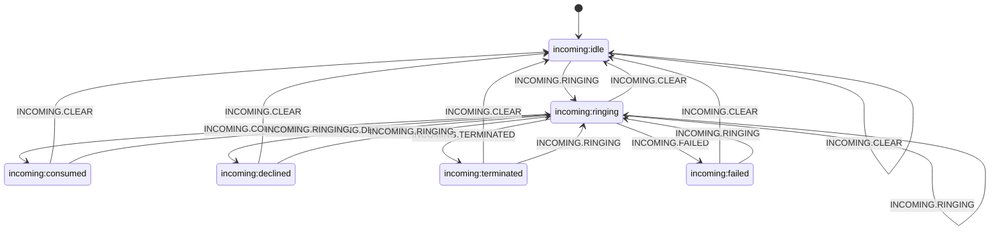

# IncomingCallStateMachine (Состояния входящих звонков)

Внутренний компонент `IncomingCallManager`, управляющий состояниями входящих SIP-звонков через XState с валидацией допустимых операций и предотвращением некорректных переходов.

## Интеграция с менеджером

- **Доменные события машины:** `INCOMING.RINGING`, `INCOMING.CONSUMED`, `INCOMING.DECLINED`, `INCOMING.TERMINATED`, `INCOMING.FAILED`, `INCOMING.CLEAR`.
- **Источники событий:** `IncomingCallManager.events` — `incomingCall`, `declinedIncomingCall`, `terminatedIncomingCall`, `failedIncomingCall`; дополнительная синтетика при ответе на входящий звонок.

## Диаграмма переходов (Mermaid)

Граф соответствует [`IncomingCallStateMachine.ts`](../../../../src/IncomingCallManager/IncomingCallStateMachine.ts).

## Хранение данных

Машина хранит данные вызывающего абонента (`remoteCallerData`) и причину завершения (`lastReason`).

## Публичный API

### Геттеры состояний

- `isIdle` — проверка состояния IDLE
- `isRinging` — проверка состояния RINGING
- `isConsumed` — проверка состояния CONSUMED
- `isDeclined` — проверка состояния DECLINED
- `isTerminated` — проверка состояния TERMINATED
- `isFailed` — проверка состояния FAILED

### Комбинированные геттеры

- `isActive` — проверка активного состояния (ringing)
- `isFinished` — проверка финальных состояний (consumed/declined/terminated/failed)

### Геттеры контекста

- `remoteCallerData` — данные вызывающего абонента
- `lastReason` — причина завершения звонка

### Методы управления

- `reset()` — сброс состояния в IDLE
- `toConsumed()` — переход в состояние CONSUMED (принят звонок)

## Граф переходов

### Из IDLE

- **IDLE → RINGING** — при новом входящем звонке (`INCOMING.RINGING`)

### Из RINGING

- **RINGING → CONSUMED** — звонок принят (`INCOMING.CONSUMED`)
- **RINGING → DECLINED** — звонок отклонен (`INCOMING.DECLINED`)
- **RINGING → TERMINATED** — обрыв звонка (`INCOMING.TERMINATED`)
- **RINGING → FAILED** — ошибка (`INCOMING.FAILED`)
- **RINGING → IDLE** — очистка (`INCOMING.CLEAR`)
- **RINGING → RINGING** — self-transition при повторном входящем звонке

### Из финальных состояний

Все финальные состояния (CONSUMED, DECLINED, TERMINATED, FAILED) могут перейти:

- **→ IDLE** — через `INCOMING.CLEAR`
- **→ RINGING** — при новом входящем звонке (`INCOMING.RINGING`)

## Автоматическая очистка

При потере соединения (через ConnectionManager events: disconnected, registrationFailed, connect-failed) происходит автоматическая очистка состояния в IDLE.

## Логирование

Все переходы состояний и недопустимые операции логируются через `console.warn` для отладки и мониторинга.
