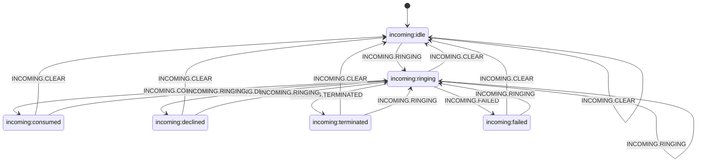

# IncomingCallStateMachine (Состояния входящих звонков)

`IncomingCallStateMachine` — внутренний XState-автомат `IncomingCallManager`, который управляет жизненным циклом входящего вызова и валидирует допустимые переходы.

## Публичный API

| Категория               | Элементы                                                                      |
| ----------------------- | ----------------------------------------------------------------------------- |
| Геттеры состояния       | `isIdle`, `isRinging`, `isConsumed`, `isDeclined`, `isTerminated`, `isFailed` |
| Комбинированные геттеры | `isActive`, `isFinished`                                                      |
| Геттеры контекста       | `remoteCallerData`, `lastReason`                                              |
| Методы управления       | `toConsumed()`, `reset()`, `send(event)`                                      |

## Состояния

| Состояние             | Назначение                                          |
| --------------------- | --------------------------------------------------- |
| `incoming:idle`       | Нет активного входящего звонка.                     |
| `incoming:ringing`    | Входящий звонок доступен для обработки.             |
| `incoming:consumed`   | Звонок принят (сессия извлечена потребителем).      |
| `incoming:declined`   | Звонок отклонён локально.                           |
| `incoming:terminated` | Звонок завершён локально/системно после старта.     |
| `incoming:failed`     | Звонок завершился ошибкой удалённой стороны/сессии. |

## Контекст и инварианты

| Инвариант            | Описание                                                                               |
| -------------------- | -------------------------------------------------------------------------------------- |
| Поля контекста       | Контекст содержит `remoteCallerData` и `lastReason`.                                   |
| Idle-контекст        | В `incoming:idle` оба поля равны `undefined`.                                          |
| Ringing-контекст     | В `incoming:ringing` заполнен `remoteCallerData`, `lastReason = undefined`.            |
| Финальные состояния  | В `consumed/declined/terminated/failed` заполнены `remoteCallerData` и `lastReason`.   |
| Обновление входящего | `rememberIncoming` на `INCOMING.RINGING` перезаписывает данные и очищает `lastReason`. |
| Очистка              | `clearIncoming` на `INCOMING.CLEAR` сбрасывает оба поля.                               |

## Диаграмма переходов (Mermaid)

Граф соответствует [`createIncomingCallMachine.ts`](../../../../src/IncomingCallManager/IncomingCallStateMachine/createIncomingCallMachine.ts).

## Ключевые правила переходов

- Базовый сценарий: `idle -> ringing -> consumed|declined|terminated|failed -> idle`.
- `INCOMING.RINGING` разрешён почти везде (включая `ringing` self-transition): новый вызов перезаписывает `remoteCallerData`.
- `INCOMING.CONSUMED` валиден только из `ringing`.
- В `idle` событие `INCOMING.CLEAR` — безопасный no-op переход `idle -> idle` со сбросом контекста.
- При событиях `ConnectionManager` (`disconnected`, `registrationFailed`, `connect-failed`) машина автоматически отправляет `INCOMING.CLEAR`.

## Интеграция и события

- Доменные события машины: `INCOMING.RINGING`, `INCOMING.CONSUMED`, `INCOMING.DECLINED`, `INCOMING.TERMINATED`, `INCOMING.FAILED`, `INCOMING.CLEAR`.
- Источники событий `IncomingCallManager.events`:
  - `ringing` -> `INCOMING.RINGING`;
  - `declinedIncomingCall` -> `INCOMING.DECLINED`;
  - `terminatedIncomingCall` -> `INCOMING.TERMINATED`;
  - `failedIncomingCall` -> `INCOMING.FAILED`.
- Синтетические события:
  - `INCOMING.CONSUMED` отправляется через `toConsumed()` (например, в `extractIncomingRTCSession()`).
  - `INCOMING.CLEAR` отправляется через `reset()` и из подписок на `ConnectionManager.events`.
- Проверка допустимости перехода выполняется до `send`: при `snapshot.can(event) === false` событие игнорируется и состояние не меняется.

## Логирование

- Логи переходов и смены состояния пишутся через `resolveDebug('IncomingCallStateMachine')` (actions `logTransition`, `logStateChange`).
- Недопустимые события также логируются через `resolveDebug` в `IncomingCallStateMachine.sendEvent(...)`.
