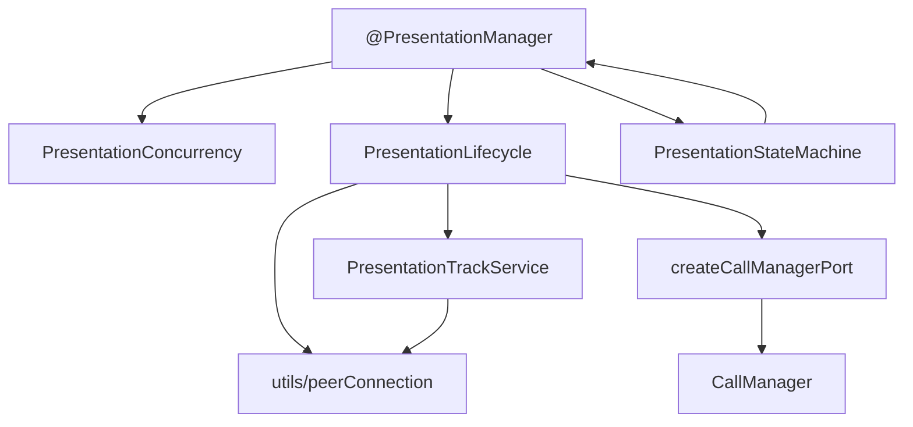

# PresentationManager (Презентации)

`PresentationManager` — тонкий фасад над оркестрацией презентации, WebRTC-слоем и `PresentationStateMachine`. Единый source of truth для состояния и активного трека — state machine; фасад делегирует start/stop/update в `PresentationLifecycle` и управляет конкурентностью через `PresentationConcurrency`.

## Назначение

- Запуск, остановка и обновление screen-sharing потока.
- Интеграция с активной RTC-сессией звонка через порт `TPresentationSessionPort`.
- Синхронизация жизненного цикла презентации с `CallManager` (renegotiate, завершение звонка).
- Публикация событий `presentation:*` в `SipConnector`.

## Ключевые возможности

- Запуск и остановка презентаций
- Обновление потока без полного stop/start (`updatePresentation`)
- Управление битрейтом презентации (`maxBitrate` в конструкторе)
- Ограничение разрешения через `maxResolution` и `@/tools/resolveSendEncodings`
- Обработка дублированных вызовов (`repeatedCallsAsync`)
- Поддержка P2P и MCU режимов
- Валидация переходов состояний через `PresentationStateMachine`
- Типизированные ошибки WebRTC-слоя (`PresentationReinviteError`, `PresentationTrackError`)

## Структура модуля

```shell
PresentationManager/
├── @PresentationManager.ts          # публичный фасад
├── orchestration/
│   ├── PresentationLifecycle.ts     # start / stop / update flow
│   ├── PresentationConcurrency.ts   # repeatedCalls, pending start/stop
│   ├── createCallManagerPort.ts     # TPresentationSessionPort, адаптер CallManager
│   └── index.ts
├── PresentationTrackService.ts      # registry senders, add/replace/stop track
├── PresentationStateMachine/        # XState, context.videoTrack + lastError
├── errors.ts                        # PresentationReinviteError, PresentationTrackError
├── events.ts                        # TypedEvents: start/started/updating/updated/end/ended/failed
└── index.ts                         # публичные экспорты
```

WebRTC-стратегии (`addTransceiver`, `replaceTrack`, `recvOnly`, `applyContentHint`, `setPresentationMaxBitrate`) вынесены в общий модуль [`src/utils/peerConnection`](../../../../src/utils/peerConnection/). `PresentationTrackService` использует их как тонкую обёртку с регистрацией presentation senders.

## Слои и поток данных



| Слой                       | Ответственность                                                          |
| -------------------------- | ------------------------------------------------------------------------ |
| `@PresentationManager`     | Публичный API, guards, делегирование в lifecycle/concurrency             |
| `PresentationConcurrency`  | `repeatedCallsAsync`, `promisePendingStart/Stop`, cancel/reset           |
| `PresentationLifecycle`    | Последовательность start/stop/update, события, renegotiate               |
| `createCallManagerPort`    | Изоляция от `CallManager`: connection, session, renegotiate, onCallEnded |
| `PresentationTrackService` | Выбор стратегии add/replace, registry senders, stop                      |
| `PresentationStateMachine` | Состояние + `context.videoTrack` + `context.lastError`                   |

## Основные методы

| Метод                                        | Назначение                                                 |
| -------------------------------------------- | ---------------------------------------------------------- |
| `startPresentation()` / `stopPresentation()` | Запуск и завершение демонстрации экрана.                   |
| `updatePresentation()`                       | Смена текущего presentation-потока без полного stop/start. |
| `cancelSendPresentationWithRepeatedCalls()`  | Отмена повторных попыток отправки презентации.             |
| `hasCanceledStartPresentationError()`        | Проверка, что ошибка старта связана с отменой операции.    |

`startPresentation` поддерживает `isNeedReinvite` (по умолчанию `true`). `updatePresentation` всегда выполняется без renegotiate.

## Доступ к состоянию (breaking change)

Публичные поля `promisePendingStartPresentation`, `promisePendingStopPresentation`, `videoTrackPresentationCurrent` **удалены**.

| Было                                                                 | Стало                                                                    |
| -------------------------------------------------------------------- | ------------------------------------------------------------------------ |
| `videoTrackPresentationCurrent`                                      | `presentationManager.stateMachine.activeVideoTrack`                      |
| `promisePendingStartPresentation` / `promisePendingStopPresentation` | `presentationManager.isPendingPresentation`                              |
| —                                                                    | `presentationManager.stateMachine.pendingVideoTrack` (во время STARTING) |
| —                                                                    | `presentationManager.stateMachine.lastError` (в `failed`)                |

Геттеры `isPendingPresentation` и `isPresentationInProcess` сохранены и делегируют в state machine + concurrency.

При завершении звонка (`ended` / `failed` на `CallManager`) фасад вызывает `reset()`: отмена repeated calls, очистка pending, сброс track registry и state machine.

## События

Внутренние события `PresentationManager` проксируются в `SipConnector` с префиксом `presentation:`.

| Внутреннее | Публичное (`SipConnector`) | Когда                     |
| ---------- | -------------------------- | ------------------------- |
| `start`    | `presentation:start`       | Начало запуска            |
| `started`  | `presentation:started`     | Успешный запуск           |
| `updating` | `presentation:updating`    | Начало обновления трека   |
| `updated`  | `presentation:updated`     | Успешное обновление трека |
| `end`      | `presentation:end`         | Начало остановки          |
| `ended`    | `presentation:ended`       | Успешная остановка        |
| `failed`   | `presentation:failed`      | Ошибка start/stop/update  |

Полное API-описание: [presentation-events.md](../../../api/presentation-events.md).

## Ошибки

| Класс                       | Когда возникает                                    |
| --------------------------- | -------------------------------------------------- |
| `PresentationReinviteError` | Ошибка renegotiate после attach трека (start flow) |
| `PresentationTrackError`    | Ошибка add/replace трека в peer connection         |

Оба класса экспортируются из `sip-connector` и содержат исходную причину в поле `cause`.

## Внутренние компоненты

| Компонент                      | Роль                                                             |
| ------------------------------ | ---------------------------------------------------------------- |
| `PresentationStateMachine`     | Состояние + `context.videoTrack` + `context.lastError`           |
| `PresentationTrackService`     | WebRTC add/replace/stop с атомарной регистрацией senders         |
| `PresentationLifecycle`        | Бизнес-последовательность start/stop/update, нормализация ошибок |
| `PresentationConcurrency`      | `repeatedCallsAsync`, pending start/stop, cancel/reset           |
| `createCallManagerPort`        | Порт к `CallManager` без прямой зависимости lifecycle от его API |
| `@/tools/resolveSendEncodings` | Общая утилита ограничения `sendEncodings` по `maxResolution`     |

`maxResolution` для презентации передаёт `SipConnector` из `connectionConfiguration.maxAvailableResolution`
при `startPresentation()` и `updatePresentation()`.

## Связанная state machine

- [PresentationStateMachine](./state-machine.md)
