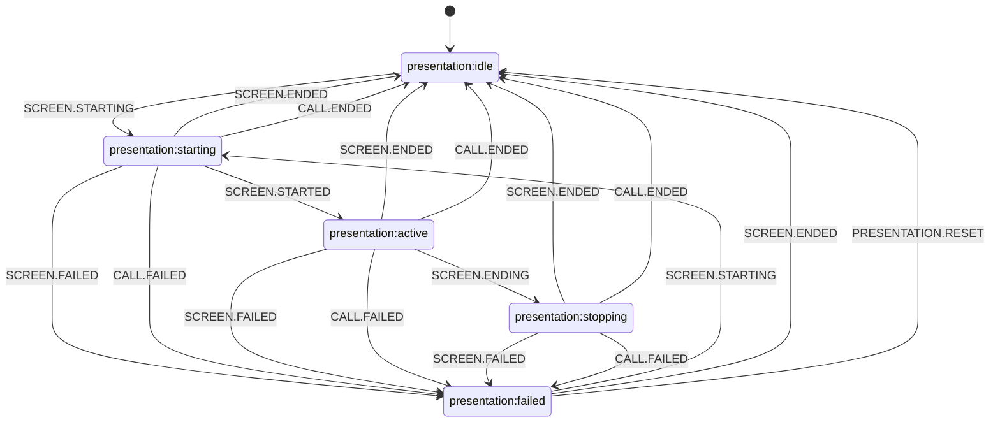

# PresentationStateMachine (Состояния демонстрации экрана)

Внутренний компонент `PresentationManager`, управляющий состояниями демонстрации экрана через XState с валидацией допустимых операций и предотвращением некорректных переходов.

## Интеграция с менеджером

- **Доменные события машины:** `SCREEN.STARTING`, `SCREEN.STARTED`, `SCREEN.ENDING`, `SCREEN.ENDED`, `SCREEN.FAILED`, `CALL.ENDED`, `CALL.FAILED`, `PRESENTATION.RESET`.
- **Источники событий:** `CallManager.events` — `presentation:start`, `presentation:started`, `presentation:end`, `presentation:ended`, `presentation:failed`, `ended`, `failed`; сброс при потере соединения обрабатывается на уровне менеджера (не отдельными переходами в этой машине).

## Диаграмма переходов (Mermaid)

Граф соответствует [`PresentationStateMachine.ts`](../../../../src/PresentationManager/PresentationStateMachine.ts).

## Типобезопасная обработка ошибок

Машина использует типобезопасную обработку ошибок: `lastError: Error | undefined`.

## Публичный API

### Геттеры состояний

- `isIdle` — проверка состояния IDLE
- `isStarting` — проверка состояния STARTING
- `isActive` — проверка состояния ACTIVE
- `isStopping` — проверка состояния STOPPING
- `isFailed` — проверка состояния FAILED

### Комбинированные геттеры

- `isPending` — проверка состояний starting/stopping
- `isActiveOrPending` — проверка состояний active/starting/stopping

### Геттер ошибки

- `lastError` — последняя ошибка (если есть)

### Методы управления

- `reset()` — сброс состояния в IDLE

## Граф переходов

### Основной путь

- **IDLE → STARTING → ACTIVE → STOPPING → IDLE**

### Переходы в FAILED

Из состояний STARTING/ACTIVE/STOPPING:

- Через `SCREEN.FAILED`
- При ошибке звонка — `CALL.FAILED`

### Переход RESET

- **FAILED → IDLE** — через `PRESENTATION.RESET`

### Прерывание при сбросе звонка

При завершении звонка (`ended` → `CALL.ENDED`, ошибка `failed` → `CALL.FAILED`) из состояний STARTING/ACTIVE/STOPPING происходит переход в IDLE или FAILED по графу выше.

### Убранные переходы

Убран нелогичный переход **IDLE → FAILED** (презентация не может зафейлиться до старта).

### Переходы из FAILED

- **FAILED → STARTING** — повторная попытка через `SCREEN.STARTING`
- **FAILED → IDLE** — через `PRESENTATION.RESET` или `SCREEN.ENDED`

## Обработка ошибок

Автоматическое создание Error из не-Error значений: для объектов используется `JSON.stringify` для преобразования в строку перед созданием Error.

## Логирование

Все переходы состояний и недопустимые операции логируются через `console.warn` для отладки и мониторинга.
