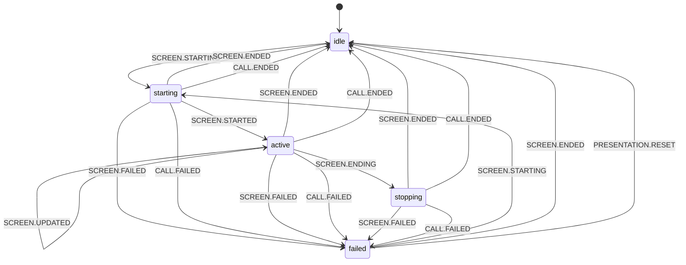

# PresentationStateMachine (Состояния демонстрации экрана)

`PresentationStateMachine` — внутренний XState-автомат `PresentationManager`, который валидирует допустимые переходы для сценария screen sharing, хранит активный трек и terminal-ошибку в контексте.

## Публичный API

| Категория               | Элементы                                                     |
| ----------------------- | ------------------------------------------------------------ |
| Геттеры состояния       | `isIdle`, `isStarting`, `isActive`, `isStopping`, `isFailed` |
| Комбинированные геттеры | `isPending`, `isActiveOrPending`                             |
| Геттеры контекста       | `lastError`, `activeVideoTrack`, `pendingVideoTrack`         |
| Методы управления       | `reset()`, `send(event)`                                     |

`activeVideoTrack` возвращает `context.videoTrack` в любом состоянии, где трек уже записан (`starting`, `active`). `pendingVideoTrack` доступен только в `starting` и отражает трек, который ещё не перешёл в `active`.

## Состояния

| Состояние  | Назначение                        |
| ---------- | --------------------------------- |
| `idle`     | Презентация не запущена.          |
| `starting` | Идёт запуск демонстрации экрана.  |
| `active`   | Демонстрация экрана активна.      |
| `stopping` | Идёт остановка демонстрации.      |
| `failed`   | Демонстрация завершилась ошибкой. |

## Контекст и инварианты

| Инвариант            | Описание                                                                                        |
| -------------------- | ----------------------------------------------------------------------------------------------- |
| Поля контекста       | `lastError`, `videoTrack` — единая форма для всех состояний.                                    |
| Состояния без ошибки | В `idle`, `starting`, `active`, `stopping` значение `lastError = undefined`.                    |
| Failed-состояние     | В `failed` допустим `lastError: Error \| undefined`.                                            |
| Трек презентации     | `setVideoTrack` записывает `videoTrack` из события; `clearVideoTrack` сбрасывает в `undefined`. |
| Нормализация ошибки  | `setError` сохраняет `Error` как есть, иначе создаёт `new Error(JSON.stringify(error))`.        |
| Очистка              | `clearError` и `clearVideoTrack` срабатывают при переходах в `idle` и на `failed -> starting`.  |

### Жизненный цикл `videoTrack`

- `SCREEN.STARTING` / `SCREEN.STARTED` — запись трека при старте (`idle -> starting -> active`).
- `SCREEN.UPDATING` / `SCREEN.UPDATED` — обновление трека **без смены состояния** (остаётся `active`).
- Переходы в `idle` и `failed` — `clearVideoTrack`.
- Повторный старт из `failed` — `clearError` + `setVideoTrack` на `SCREEN.STARTING`.

## Диаграмма переходов (Mermaid)

Граф соответствует [`createPresentationMachine.ts`](../../../../src/PresentationManager/PresentationStateMachine/createPresentationMachine.ts).

## Ключевые правила переходов

- Основной успешный сценарий: `idle -> starting -> active -> stopping -> idle`.
- Обновление потока в `active`: `SCREEN.UPDATING` и `SCREEN.UPDATED` не меняют состояние, только `context.videoTrack`.
- Переход в `failed` возможен только из `starting`, `active`, `stopping` по `SCREEN.FAILED` или `CALL.FAILED`.
- Переход `idle -> failed` отсутствует намеренно (презентация не может «упасть» до старта).
- `PRESENTATION.RESET` обрабатывается только в `failed` и переводит в `idle`; в остальных состояниях событие игнорируется (`snapshot.can(...) === false`).
- При завершении звонка (`CALL.ENDED`) из `starting`, `active` или `stopping` машина возвращается в `idle` с очисткой ошибки и трека.

## Интеграция и события

- Доменные события машины: `SCREEN.STARTING`, `SCREEN.STARTED`, `SCREEN.UPDATING`, `SCREEN.UPDATED`, `SCREEN.ENDING`, `SCREEN.ENDED`, `SCREEN.FAILED`, `CALL.ENDED`, `CALL.FAILED`, `PRESENTATION.RESET`.
- Источник событий:
  - `PresentationManager.events` (`start`, `started`, `updating`, `updated`, `end`, `ended`, `failed`) — через `subscribePresentationEvents(...)`;
  - `CallManager.events` (`ended`, `failed`) — через `subscribeCallEvents(...)`.
- Маппинг presentation-событий:

| Событие менеджера | Событие state machine | Payload      |
| ----------------- | --------------------- | ------------ |
| `start`           | `SCREEN.STARTING`     | `videoTrack` |
| `started`         | `SCREEN.STARTED`      | `videoTrack` |
| `updating`        | `SCREEN.UPDATING`     | `videoTrack` |
| `updated`         | `SCREEN.UPDATED`      | `videoTrack` |
| `end`             | `SCREEN.ENDING`       | —            |
| `ended`           | `SCREEN.ENDED`        | —            |
| `failed`          | `SCREEN.FAILED`       | `error`      |

- Проверка допустимости перехода делается до `send`: при недопустимом событии (`snapshot.can(event) === false`) переход игнорируется, а состояние не меняется.

## Логирование

- Логи переходов и смены состояния пишутся через `resolveDebug('PresentationStateMachine')` (actions `logTransition`, `logStateChange`).
- Недопустимые события также логируются через `resolveDebug` в `PresentationStateMachine.sendEvent(...)`.
