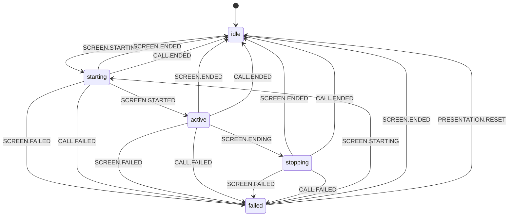

# PresentationStateMachine (Состояния демонстрации экрана)

`PresentationStateMachine` — внутренний XState-автомат `PresentationManager`, который валидирует допустимые переходы для сценария screen sharing и хранит terminal-ошибку в контексте.

## Публичный API

| Категория               | Элементы                                                     |
| ----------------------- | ------------------------------------------------------------ |
| Геттеры состояния       | `isIdle`, `isStarting`, `isActive`, `isStopping`, `isFailed` |
| Комбинированные геттеры | `isPending`, `isActiveOrPending`                             |
| Геттеры контекста       | `lastError`                                                  |
| Методы управления       | `reset()`, `send(event)`                                     |

## Состояния

| Состояние  | Назначение                        |
| ---------- | --------------------------------- |
| `idle`     | Презентация не запущена.          |
| `starting` | Идёт запуск демонстрации экрана.  |
| `active`   | Демонстрация экрана активна.      |
| `stopping` | Идёт остановка демонстрации.      |
| `failed`   | Демонстрация завершилась ошибкой. |

## Контекст и инварианты

| Инвариант            | Описание                                                                                 |
| -------------------- | ---------------------------------------------------------------------------------------- |
| Поле контекста       | Контекст содержит только `lastError`.                                                    |
| Состояния без ошибки | В `idle`, `starting`, `active`, `stopping` значение `lastError = undefined`.             |
| Failed-состояние     | В `failed` допустим `lastError: Error \| undefined`.                                     |
| Нормализация         | `setError` сохраняет `Error` как есть, иначе создаёт `new Error(JSON.stringify(error))`. |
| Очистка              | `clearError` срабатывает на переходах в `idle` и `failed -> starting`.                   |

## Диаграмма переходов (Mermaid)

Граф соответствует [`createPresentationMachine.ts`](../../../../src/PresentationManager/PresentationStateMachine/createPresentationMachine.ts).

## Ключевые правила переходов

- Основной успешный сценарий: `idle -> starting -> active -> stopping -> idle`.
- Переход в `failed` возможен только из `starting`, `active`, `stopping` по `SCREEN.FAILED` или `CALL.FAILED`.
- Переход `idle -> failed` отсутствует намеренно (презентация не может «упасть» до старта).
- `PRESENTATION.RESET` не универсальный «global reset»: в невалидных состояниях событие игнорируется механизмом `snapshot.can(...)`.

## Интеграция и события

- Доменные события машины: `SCREEN.STARTING`, `SCREEN.STARTED`, `SCREEN.ENDING`, `SCREEN.ENDED`, `SCREEN.FAILED`, `CALL.ENDED`, `CALL.FAILED`, `PRESENTATION.RESET`.
- Источник событий:
  - `PresentationManager.events` (`start`, `started`, `end`, `ended`, `failed`) — через `subscribePresentationEvents(...)`;
  - `CallManager.events` (`ended`, `failed`) — через `subscribeCallEvents(...)`.
- Проверка допустимости перехода делается до `send`: при недопустимом событии (`snapshot.can(event) === false`) переход игнорируется, а состояние не меняется.

## Логирование

- Логи переходов и смены состояния пишутся через `resolveDebug('PresentationStateMachine')` (actions `logTransition`, `logStateChange`).
- Недопустимые события также логируются через `resolveDebug` в `PresentationStateMachine.sendEvent(...)`.
