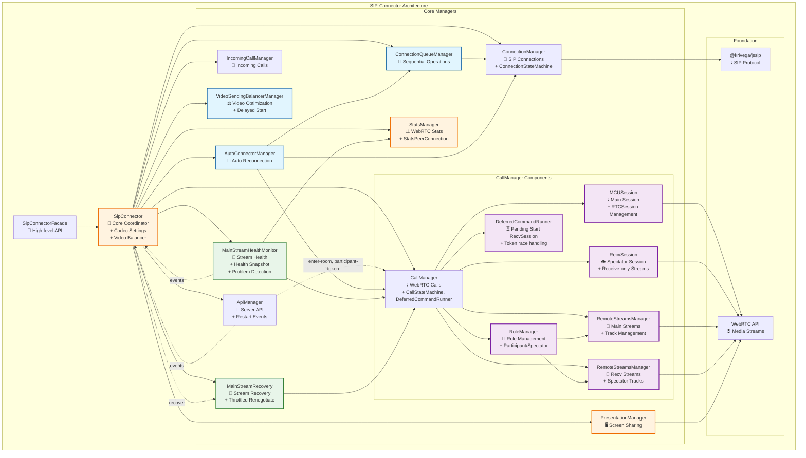

# Обзор архитектуры SIP Connector

## Архитектурные слои

1. **Фасад** → Упрощенный API для разработчиков
2. **Координатор** → Управление всеми компонентами
3. **Менеджеры** → Специализированная функциональность
4. **Основа** → SIP протокол и WebRTC API

## Основные компоненты

### SipConnectorFacade (Высокоуровневый API)

**Назначение**: Упрощенный интерфейс для работы с SIP-соединениями и видеозвонками.

**Ключевые возможности**:

- Подключение к серверу и управление сессиями
- Исходящие и входящие звонки
- Управление презентациями (screen sharing)
- Работа с медиа-потоками
- Обработка событий и уведомлений

**Основные методы**:

- `connectToServer()` / `disconnectFromServer()` - управление соединением
- `callToServer()` / `answerToIncomingCall()` - управление звонками
- `startPresentation()` / `stopPresentation()` - управление презентациями
- `updatePresentation()` - обновление презентации
- `getRemoteStreams()` - получение удаленных потоков
- `sendMediaState()` - отправка состояния медиа
- `sendRefusalToTurnOnMic()` / `sendRefusalToTurnOnCam()` - отправка отказов
- `replaceMediaStream()` - замена медиа-потока
- `askPermissionToEnableCam()` - запрос разрешений

### SipConnector (Центральный координатор)

**Назначение**: Координирует работу всех менеджеров и предоставляет единый API.

**Ключевые возможности**:

- Управление настройками кодеков
- Координация между всеми менеджерами
- Событийная система с префиксами (auto-connect:, connection:, call:, api:, incoming-call:, presentation:, stats:, video-balancer:, main-stream-health:, session:)
- Автоматическая балансировка видео
- Обработка событий restart от сервера
- Проксирование методов менеджеров

**Событийная система**:

- `auto-connect:*` - события автоматического переподключения
- `connection:*` - события SIP соединения
- `call:*` - события WebRTC звонков
- `api:*` - события серверного API
- `incoming-call:*` - события входящих звонков
- `presentation:*` - события презентаций
- `stats:*` - события статистики
- `video-balancer:*` - события балансировки видео
- `main-stream-health:*` - события мониторинга и восстановления основного входящего видеопотока
- `session:*` - события управления серверной сессией

**Управляемые компоненты**:

- `ConnectionManager` - SIP-соединения (включает ConnectionStateMachine)
- `CallManager` - WebRTC-звонки (включает CallStateMachine, DeferredCommandRunner для отложенного старта RecvSession при гонке событий с сервером)
- `CallSessionState` - read-model состояния роли/лицензии (`role`, `derived`, `license`), доступный как `sipConnector.callSessionState`
- `ApiManager` - серверное API
- `PresentationManager` - презентации
- `StatsManager` - статистика
- `VideoSendingBalancerManager` - балансировка видео
- `ConnectionQueueManager` - очередь операций
- `AutoConnectorManager` - автоматическое переподключение
- `IncomingCallManager` - входящие звонки
- `MainStreamHealthMonitor` - мониторинг здоровья потока и детекция устойчивых проблем
- `MainStreamRecovery` - восстановление потока через throttled renegotiate

## Диаграмма архитектуры

## Взаимодействие компонентов

**Основные зависимости**:

- `SipConnectorFacade` → `SipConnector` (фасад)
- `SipConnector` → все менеджеры (координация)
- `CallManager` → `CallStateMachine` (состояние звонка и конференции: number, answer, room, participantName, token, conference, participant; режим presentation-call — отдельное состояние `PRESENTATION_CALL` после `confirmed` при заголовке `x-vinteo-presentation-call`; обычная комната без token — `ROOM_PENDING_AUTH`; подписка на ApiManager: enter-room, conference:participant-token-issued)
- `CallManager` → `MCUSession` (управление основным RTCSession для участников)
- `CallManager` → `RecvSession` (управление receive-only сессией для зрителей)
- `CallManager` → `DeferredCommandRunner` (отложенная команда запуска RecvSession: при приходе `participant:move-request-to-spectators-with-audio-id` до `conference:participant-token-issued` команда сохраняется и выполняется после перехода CallStateMachine в IN_ROOM; `ROOM_PENDING_AUTH` и `PRESENTATION_CALL` сами по себе недостаточны для JWT-зависимых операций)
- `CallManager` → `RemoteStreamsManager` (два экземпляра: main и recv для организации входящих потоков)
- `SipConnector` → `CallSessionState` (создание экземпляра и DI в `CallManager`)
- `CallSessionState` → `RoleManager` (управление ролями: participant, spectator, spectator_synthetic)
- `CallManager` → `CallSessionState` (role orchestration)
- `ApiManager` → `SipConnector` (события: enter-room, conference:participant-token-issued, channels)
- `ApiManager` → `CallManager.stateMachine` (события enter-room и conference:participant-token-issued передаются в CallStateMachine)
- `SipConnector.sendOffer` → `CallManager.getToken()` (токен для API-запросов берётся из контекста CallStateMachine)
- `MCUSession` → WebRTC API (основные звонки)
- `RecvSession` → WebRTC API (receive-only потоки для зрителей)
- `RemoteStreamsManager` → WebRTC API (отслеживание треков)
- `ConnectionQueueManager` → `ConnectionManager` (последовательность операций)
- `AutoConnectorManager` → `ConnectionQueueManager`, `ConnectionManager`, `CallManager`
- `VideoSendingBalancerManager` → `CallManager`, `ApiManager`
- `MainStreamHealthMonitor` → `StatsManager` (построение health snapshot по WebRTC stats)
- `MainStreamHealthMonitor` → `CallManager` (отслеживание состояния основного входящего видео-трека)
- `MainStreamRecovery` → `CallManager` (пересогласование настроек основного потока)
- `SipConnector` → `MainStreamHealthMonitor` (реакция на события `health-snapshot`, `inbound-video-problem-detected`, `inbound-video-problem-resolved` и `inbound-video-problem-reset`)
- `SipConnector` → `MainStreamRecovery` (восстановление основного входящего потока через `recover()` -> `renegotiate()`)

---

Данный модуль инкапсулирует логику SIP-соединений и видеозвонков. Архитектура модуля построена с использованием принципов **SOLID** и нескольких **паттернов проектирования**, что делает её гибкой, расширяемой и легко поддерживаемой.
