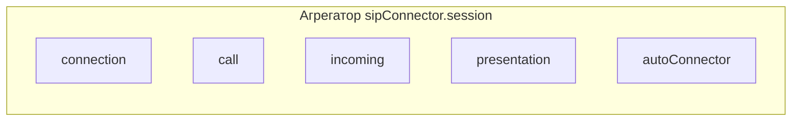

# Модель состояний сеанса (XState)

Sip-connector публикует единый XState-актор сеанса, агрегирующий параллельные машины по доменам: соединение, звонок, входящий звонок, шаринг экрана и auto-connector. Клиент получает только подписку на их статусы, бизнес-логика остаётся внутри sip-connector.

## Состав сеанса

Полные графы переходов, смысл состояний и связь с событиями менеджеров описаны в документации **конкретного домена** (ссылки ниже). Здесь — только обзор взаимодействия регионов.

## Слои

- Каждая машина состояний поднимается внутри своего менеджера: `connectionManager.stateMachine`, `callManager.stateMachine`, `incomingCallManager.stateMachine`, `presentationManager.stateMachine`, `autoConnectorManager.stateMachine`.
- Менеджеры сами отправляют доменные события в свои машины.
- Агрегатор: `sipConnector.session` подписывается на `.subscribe` машин менеджеров и отдаёт объединённый снапшот + типобезопасные селекторы.

## Документация по доменам

| Домен         | Файл                                                                                         |
| :------------ | :------------------------------------------------------------------------------------------- |
| Connection    | [ConnectionStateMachine](./components/ConnectionManager/state-machine.md)                    |
| Call          | [CallStateMachine](./components/CallManager/state-machine.md)                                |
| Incoming      | [IncomingCallStateMachine](./components/IncomingCallManager/state-machine.md)                |
| Presentation  | [PresentationStateMachine](./components/PresentationManager/state-machine.md)                |
| AutoConnector | [AutoConnectorManager: машина состояний](./components/AutoConnectorManager/state-machine.md) |

## API для клиентов

- `sipConnector.session`: агрегатор снапшотов машин менеджеров и утилиты подписки.
- `getSnapshot()` — текущее состояние всех доменов.
- `subscribe(selector, listener)` — типобезопасная подписка на срез состояния (например, `selectConnectionStatus`).
- `stop()` — очистка подписок на машины менеджеров.
- Доступ к машинам: `sipConnector.session.machines` (connection, call, incoming, presentation, autoConnector).

## Инварианты и гварды

- `presentation` может быть `active` только если `call` в активном состоянии (в т.ч. `presentationCall` или room-состояния); JWT-зависимые операции по-прежнему требуют `inRoom`.
- `incoming` сбрасывается в `idle` при сбросе/завершении звонка (`CALL.RESET`; событие `ended` или `failed` приводит к CALL.RESET).
- `connection` `disconnecting` / `disconnected` приводит к сбросу `call` и `presentation` → `idle`.

## Комбинированное состояние системы

См. [ESystemStatus](./components/SessionManager/system-status.md) — механизм комбинирования состояний Connection, Call и AutoConnector машин в единое состояние для упрощения работы клиентов.
Статус `DISCONNECTING` выставляется как при `connection=disconnecting`, так и при `autoConnector=disconnecting` (если call не находится в активном состоянии).
Статус `CONNECTING` также выставляется при `autoConnector=connectedMonitoring`, если `connection` ещё не `established` (например `idle`); при `connection=established` дальше действует обычная логика по `call`.

## Тестирование

См. [Тестирование машин состояний](./state-machines-testing.md) — описание подходов к тестированию машин состояний.
