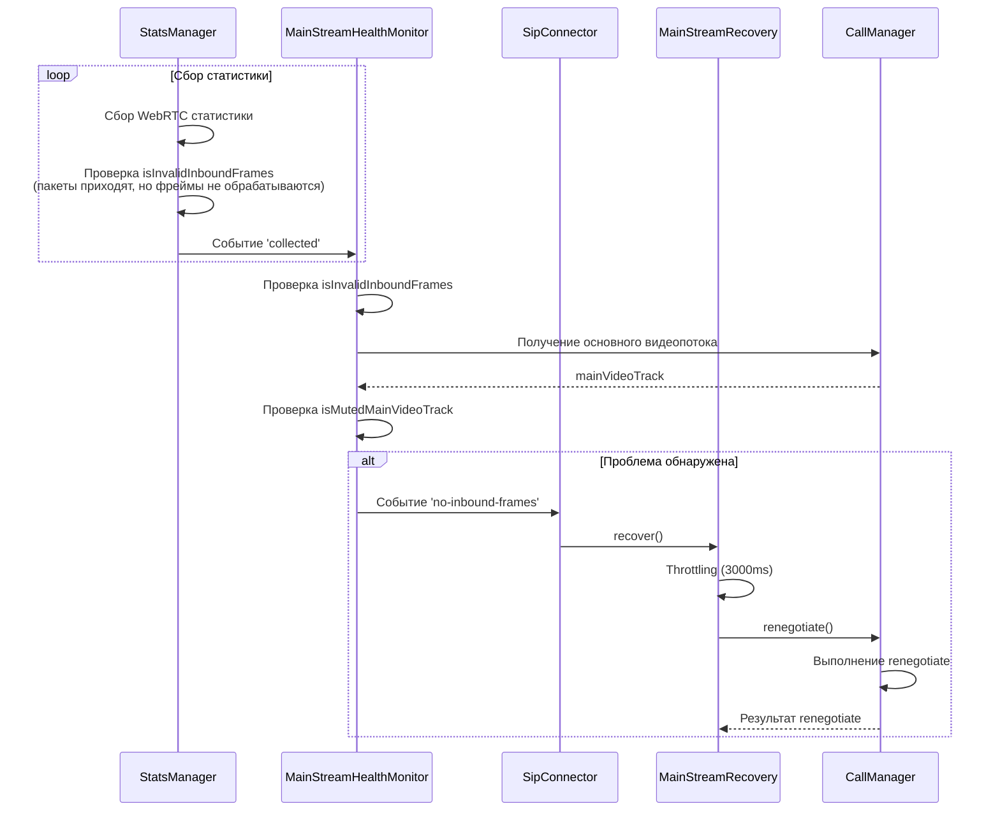

# Диаграмма мониторинга и восстановления основного входящего видеопотока

Следующая диаграмма показывает взаимодействие компонентов при мониторинге здоровья основного видеопотока и его автоматическом восстановлении:

