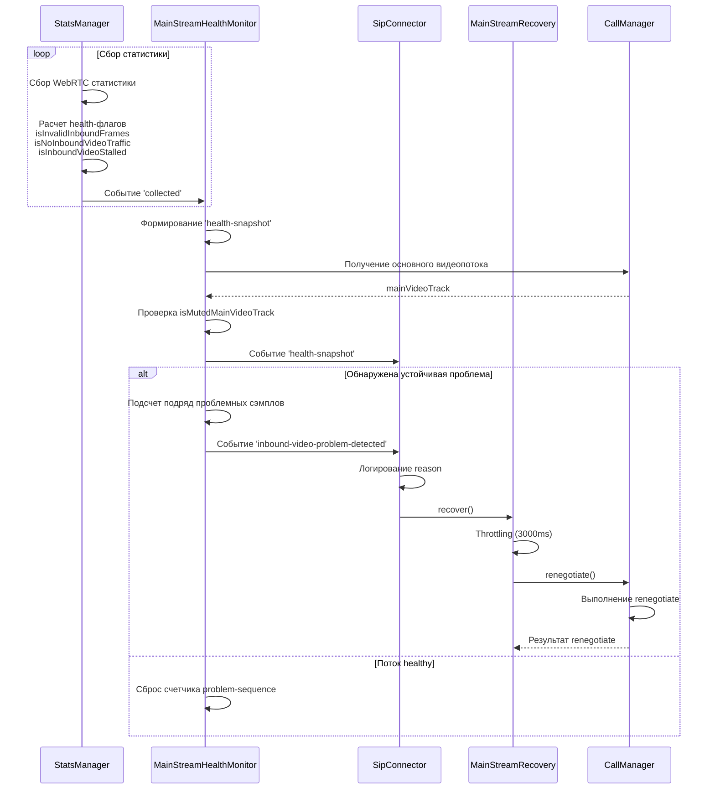

# Диаграмма мониторинга и восстановления основного входящего видеопотока

Следующая диаграмма показывает взаимодействие компонентов при мониторинге здоровья основного видеопотока и его автоматическом восстановлении:

```mermaid
sequenceDiagram
    participant StatsManager
    participant MainStreamHealthMonitor
    participant SipConnector
    participant MainStreamRecovery
    participant CallManager

    loop Сбор статистики
        StatsManager->>StatsManager: Сбор WebRTC статистики
        StatsManager->>StatsManager: Расчет health-флагов<br/>isInvalidInboundFrames<br/>isNoInboundVideoTraffic<br/>isInboundVideoStalled
        StatsManager->>MainStreamHealthMonitor: Событие 'collected'
    end

    MainStreamHealthMonitor->>MainStreamHealthMonitor: Формирование 'health-snapshot'
    MainStreamHealthMonitor->>CallManager: Получение основного видеопотока
    CallManager-->>MainStreamHealthMonitor: mainVideoTrack
    MainStreamHealthMonitor->>MainStreamHealthMonitor: Проверка isMutedMainVideoTrack
    MainStreamHealthMonitor->>SipConnector: Событие 'health-snapshot'

    alt Обнаружена устойчивая проблема
        MainStreamHealthMonitor->>MainStreamHealthMonitor: Подсчет подряд проблемных сэмплов
        MainStreamHealthMonitor->>SipConnector: Событие 'inbound-video-problem-detected'
        SipConnector->>SipConnector: Логирование reason
        SipConnector->>MainStreamRecovery: recover()
        MainStreamRecovery->>MainStreamRecovery: Throttling (3000ms)
        MainStreamRecovery->>CallManager: renegotiate()
        CallManager->>CallManager: Выполнение renegotiate
        CallManager-->>MainStreamRecovery: Результат renegotiate
    else Поток healthy
        MainStreamHealthMonitor->>MainStreamHealthMonitor: Сброс счетчика problem-sequence
    end
```

Основные причины `inbound-video-problem-detected`:

- `invalid-inbound-frames` - пакеты есть, но кадры не приходят или не декодируются.
- `no-inbound-video-traffic` - пакеты и байты еще не начали приходить.
- `inbound-video-stalled` - пакеты и байты раньше приходили, но перестали расти.

Текущая стратегия восстановления:

- `SipConnector` не завершает звонок автоматически.
- При подтвержденной проблеме выполняется `MainStreamRecovery.recover()`.
- `MainStreamRecovery` делает throttled `renegotiate`.
- Когда ранее подтвержденная проблема уходит, `MainStreamHealthMonitor` эмитит `inbound-video-problem-resolved`, и клиент может скрыть предупреждение.
- Когда контекст мониторинга сбрасывается (`ended`, `recv-session-started`, `recv-quality-changed` и т.п.), `MainStreamHealthMonitor` эмитит `inbound-video-problem-reset`.
