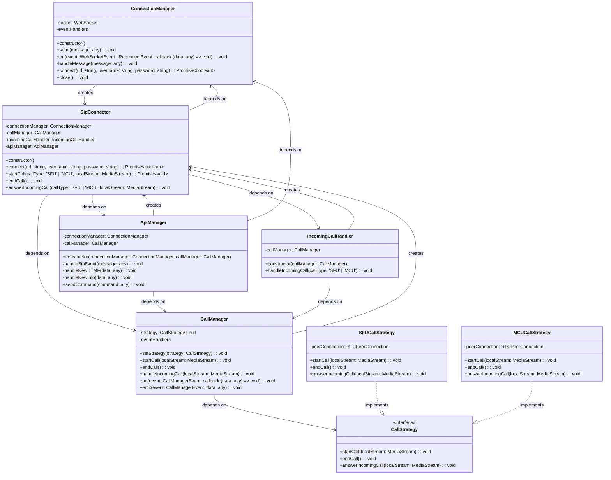

### Архитектура

#### 1. **ConnectionManager**

```ts
type WebSocketEvent = 'auth_response' | 'newRTCSession' | 'sipEvent';

class ConnectionManager {
  private socket: WebSocket;
  private eventHandlers: { [event: string]: ((data: any) => void)[] } = {};

  constructor() {
    this.socket = new WebSocket(url);
    this.socket.onmessage = (event) => this.handleMessage(JSON.parse(event.data));
  }

  send(message: any) {
    this.socket.send(JSON.stringify(message));
  }

  on(event: WebSocketEvent | ReconnectEvent, callback: (data: any) => void) {
    if (!this.eventHandlers[event]) {
      this.eventHandlers[event] = [];
    }
    this.eventHandlers[event].push(callback);
  }

  private handleMessage(message: any) {
    const event = message.type;
    if (this.eventHandlers[event]) {
      this.eventHandlers[event].forEach((handler) => handler(message));
    }
  }

  async connect(url: string, username: string, password: string): Promise<boolean> {
    return new Promise((resolve) => {
      const authMessage = {
        type: 'auth',
        username,
        password,
      };

      this.send(authMessage);

      // Ожидаем ответа от сервера
      this.on('auth_response', (message) => {
        if (message.success) {
          resolve(true); // Авторизация успешна
        } else {
          resolve(false); // Авторизация не удалась
        }
      });
    });
  }

  close() {
    // Implementation of close method
  }
}
```

---

#### 2. **CallManager**

```ts
type CallManagerEvent = 'newDTMF' | 'newInfo';

class CallManager {
  private strategy: CallStrategy | null = null;
  private eventHandlers: { [event: string]: ((data: any) => void)[] } = {};

  setStrategy(strategy: CallStrategy) {
    this.strategy = strategy;
  }

  startCall() {
    if (!this.strategy) {
      throw new Error('Call strategy is not set');
    }
    this.strategy.startCall();
  }

  endCall() {
    if (!this.strategy) {
      throw new Error('Call strategy is not set');
    }
    this.strategy.endCall();
  }

  handleIncomingCall() {
    if (!this.strategy) {
      throw new Error('Call strategy is not set');
    }
    this.strategy.handleIncomingCall();
  }

  on(event: CallManagerEvent, callback: (data: any) => void) {
    if (!this.eventHandlers[event]) {
      this.eventHandlers[event] = [];
    }
    this.eventHandlers[event].push(callback);
  }

  emit(event: CallManagerEvent, data: any) {
    if (this.eventHandlers[event]) {
      this.eventHandlers[event].forEach((handler) => handler(data));
    }
  }
}
```

---

#### 3. **CallStrategy**

```ts
interface CallStrategy {
  startCall(localStream: MediaStream): void;
  endCall(): void;
  answerIncomingCall(localStream: MediaStream): void;
}
```

---

#### 4. **SFUCallStrategy**

Реализация стратегии для SFU.

```ts
class SFUCallStrategy implements CallStrategy {
  private peerConnection: RTCPeerConnection;

  constructor() {
    this.peerConnection = new RTCPeerConnection();
  }

  startCall(localStream: MediaStream) {
    console.log('Starting SFU call');
    // Добавляем локальные треки в peerConnection
    localStream.getTracks().forEach((track) => {
      this.peerConnection.addTrack(track, localStream);
    });
    // Логика для SFU
  }

  endCall() {
    console.log('Ending SFU call');
    // Логика для SFU
  }

  answerIncomingCall(localStream: MediaStream) {
    console.log('Answering incoming SFU call');
    // Добавляем локальные треки в peerConnection
    localStream.getTracks().forEach((track) => {
      this.peerConnection.addTrack(track, localStream);
    });
    // Логика для SFU
  }
}
```

---

#### 5. **MCUCallStrategy**

Реализация стратегии для MCU.

```ts
class MCUCallStrategy implements CallStrategy {
  private peerConnection: RTCPeerConnection;

  constructor() {
    this.peerConnection = new RTCPeerConnection();
  }

  startCall(localStream: MediaStream) {
    console.log('Starting MCU call');
    // Добавляем локальные треки в peerConnection
    localStream.getTracks().forEach((track) => {
      this.peerConnection.addTrack(track, localStream);
    });
    // Логика для MCU
  }

  endCall() {
    console.log('Ending MCU call');
    // Логика для MCU
  }

  answerIncomingCall(localStream: MediaStream) {
    console.log('Answering incoming MCU call');
    // Добавляем локальные треки в peerConnection
    localStream.getTracks().forEach((track) => {
      this.peerConnection.addTrack(track, localStream);
    });
    // Логика для MCU
  }
}
```

---

#### 6. **SipConnector**

```ts
class SipConnector {
  private connectionManager: ConnectionManager;
  private callManager: CallManager;
  private incomingCallHandler: IncomingCallHandler;
  private apiManager: ApiManager;

  constructor(url: string) {
    this.connectionManager = new ConnectionManager(url);
    this.callManager = new CallManager();
    this.apiManager = new ApiManager(this.connectionManager, this.callManager);
    this.incomingCallHandler = new IncomingCallHandler(this.callManager);

    // Подписываемся на событие входящего звонка
    this.connectionManager.on('newRTCSession', (message) => {
      this.incomingCallHandler.handleIncomingCall(message.callType);
    });
  }

  async authorize(username: string, password: string): Promise<boolean> {
    return this.connectionManager.authorize(username, password);
  }

  async startCall(callType: 'SFU' | 'MCU', localStream: MediaStream) {
    const strategy = callType === 'SFU' ? new SFUCallStrategy() : new MCUCallStrategy();
    this.callManager.setStrategy(strategy);
    this.callManager.startCall(localStream);
  }

  endCall() {
    this.callManager.endCall();
  }

  answerIncomingCall(callType: 'SFU' | 'MCU', localStream: MediaStream) {
    const strategy = callType === 'SFU' ? new SFUCallStrategy() : new MCUCallStrategy();
    this.callManager.setStrategy(strategy);
    this.callManager.handleIncomingCall(localStream);
  }
}
```

---



---

Данный модуль инкапсулирует логику звонков. Архитектура модуля построена с использованием принципов **SOLID** и нескольких **паттернов проектирования**, что делает её гибкой, расширяемой и легко поддерживаемой.

---

### Основные компоненты и их зоны ответственности

1. **ConnectionManager**:
   - **Ответственность**:
     1. Управление WebSocket-соединением (отправка / приём сообщений, авторизация).
     2. Обеспечение **устойчивости** соединения: автоматическое переподключение с экспоненциальным _back-off_, повторная авторизация, проброс событий `reconnecting`, `reconnected`, `connection_failed`.
   - **Зависимости**: Нет.
   - **Методы**:
     - `send(message: any)`: Отправка сообщения на сервер.
     - `on(event: WebSocketEvent | ReconnectEvent, callback: (data: any) => void)`: Подписка на события WebSocket и реконнекта.
     - `authorize(username: string, password: string)`: Авторизация на сервере.
     - `close()`: Явное закрытие соединения и отмена логики авто-реконнекта.

2. **CallManager**:
   - **Ответственность**: Управление звонками (старт, завершение, обработка входящих звонков), обработка событий (`newDTMF`, `newInfo`).
   - **Зависимости**: Зависит от `CallStrategy` (использует стратегии для управления звонками).
   - **Методы**:
     - `setStrategy(strategy: CallStrategy)`: Установка стратегии звонка (SFU или MCU).
     - `startCall(localStream: MediaStream)`: Начало звонка.
     - `endCall()`: Завершение звонка.
     - `handleIncomingCall(localStream: MediaStream)`: Обработка входящего звонка.
     - `on(event: CallManagerEvent, callback: (data: any) => void)`: Подписка на события звонка.

3. **ApiManager**:
   - **Ответственность**: Обработка команд и событий, связанных с API (например, SIP-события, DTMF, INFO-сообщения).
   - **Зависимости**: Зависит от `ConnectionManager` и `CallManager`.
   - **Методы**:
     - `sendCommand(command: any)`: Отправка команды на сервер.
     - Обработчики событий: `handleSipEvent`, `handleNewDTMF`, `handleNewInfo`.

4. **IncomingCallHandler**:
   - **Ответственность**: Обработка входящих звонков.
   - **Зависимости**: Зависит от `CallManager`.
   - **Методы**:
     - `handleIncomingCall(callType: 'SFU' | 'MCU')`: Обработка входящего звонка.

5. **CallStrategy** (интерфейс):
   - **Ответственность**: Определение общего интерфейса для стратегий звонков (SFU и MCU).
   - **Методы**:
     - `startCall(localStream: MediaStream)`: Начало звонка.
     - `endCall()`: Завершение звонка.
     - `answerIncomingCall(localStream: MediaStream)`: Ответ на входящий звонок.

6. **SFUCallStrategy** и **MCUCallStrategy**:
   - **Ответственность**: Реализация логики звонков для SFU и MCU соответственно.
   - **Зависимости**: Нет.
   - **Методы**:
     - Управление `RTCPeerConnection` и медиапотоками.

7. **SipConnector**:
   - **Ответственность**: Основной класс, который объединяет все компоненты и предоставляет API для работы с модулем.
   - **Зависимости**: Зависит от `ConnectionManager`, `CallManager`, `ApiManager`, `IncomingCallHandler`.
   - **Методы**:
     - `authorize(username: string, password: string)`: Авторизация на сервере.
     - `startCall(callType: 'SFU' | 'MCU', localStream: MediaStream)`: Начало звонка.
     - `endCall()`: Завершение звонка.
     - `answerIncomingCall(callType: 'SFU' | 'MCU', localStream: MediaStream)`: Ответ на входящий звонок.

8. **ReconnectStrategy**:
   - **Ответственность**: Вычисление задержки между попытками переподключения (например, экспоненциальный _back-off_).
   - **Методы**:
     - `nextDelay(attempt: number): number` — вернуть задержку (мс) для `attempt`-й попытки.
   - **Реализации**:
     - `ExponentialBackoff` — задержка _baseDelay × factor^attempt_ с _maxDelay_ и _maxAttempts_.

#### Детали реализации реконнекта

```ts
export type ReconnectEvent = 'reconnecting' | 'reconnected' | 'connection_failed';

export interface ReconnectStrategy {
  maxAttempts: number;
  nextDelay(attempt: number): number; // мс
}

export class ExponentialBackoff implements ReconnectStrategy {
  constructor(
    public maxAttempts = 10,
    private baseDelay = 1_000,
    private factor = 2,
    private maxDelay = 30_000,
  ) {}
  nextDelay(attempt: number): number {
    return Math.min(this.baseDelay * this.factor ** attempt, this.maxDelay);
  }
}
```

Ниже приведён фрагмент расширенного `ConnectionManager`, демонстрирующий использование стратегии реконнекта и проброс событий:

```ts
class ConnectionManager {
  private socket!: WebSocket;
  private attempt = 0;
  private strategy: ReconnectStrategy = new ExponentialBackoff();
  private creds: { username: string; password: string } | null = null;
  private url!: string;

  constructor(url: string) {
    this.url = url;
    this.open();
  }

  private open() {
    this.socket = new WebSocket(this.url);
    this.socket.onopen = () => {
      this.attempt = 0;
      this.emit('reconnected');
      if (this.creds) this.authorize(this.creds.username, this.creds.password);
    };
    this.socket.onmessage = (e) => this.handleMessage(JSON.parse(e.data));
    this.socket.onerror = this.handleClose;
    this.socket.onclose = this.handleClose;
  }

  private handleClose = () => {
    if (this.attempt >= this.strategy.maxAttempts) {
      this.emit('connection_failed');
      return;
    }
    const delay = this.strategy.nextDelay(this.attempt++);
    this.emit('reconnecting', delay);
    setTimeout(() => this.open(), delay);
  };
}
```

`CallManager` подписывается на события `reconnecting` и `reconnected`, чтобы приостановить передачу медиапотоков (состояние `Paused`) и восстановить их после успешного реконнекта.

```ts
connectionManager.on('reconnecting', () => session.pause());
connectionManager.on('reconnected', () => session.resume());
```

#### Тесты

1. **Юнит**: `ExponentialBackoff.nextDelay()` возвращает ожидаемые значения.
2. **Интеграция**: эмулировать `onclose` сокета и убедиться, что запускается реконнект и после `onopen` происходит повторная авторизация.

---

### Правила зависимостей

1. **Модульность**:
   - Каждый компонент отвечает за свою задачу и не зависит от других, если это не требуется.
   - Например, `ConnectionManager` не зависит от других компонентов, а `ApiManager` зависит только от `ConnectionManager` и `CallManager`.

2. **Инверсия зависимостей**:
   - Высокоуровневые компоненты (например, `SipConnector`) зависят от абстракций (например, `CallStrategy`), а не от конкретных реализаций.

3. **Слабая связанность**:
   - Компоненты взаимодействуют через события и интерфейсы, что позволяет легко заменять или расширять их.

---

### Применённые паттерны проектирования

1. **Стратегия (Strategy)**:
   - Используется для реализации разных типов звонков (SFU и MCU). Каждая стратегия (`SFUCallStrategy`, `MCUCallStrategy`) реализует общий интерфейс `CallStrategy`, что позволяет динамически менять логику звонков.

2. **Наблюдатель (Observer)**:
   - Используется для обработки событий (например, `sipEvent`, `newDTMF`, `newInfo`). Компоненты подписываются на события и реагируют на них.

3. **Фасад (Facade)**:
   - `SipConnector` выступает в роли фасада, предоставляя простой интерфейс для работы с модулем и скрывая сложность внутренних компонентов.

---

### Преимущества архитектуры

1. **Гибкость**:
   - Легко добавлять новые типы звонков (например, P2P) или изменять логику существующих.

2. **Модульность**:
   - Компоненты слабо связаны, что упрощает тестирование и поддержку.

3. **Расширяемость**:
   - Новые функции (например, обработка новых событий) можно добавлять без изменения существующего кода.

4. **Чистая архитектура**:
   - Соблюдение принципов SOLID и использование паттернов делает код понятным и легко поддерживаемым.

---

### Пример использования

```ts
const sipConnector = new SipConnector('ws://example.com');

// Авторизация на сервере
const isAuthorized = await sipConnector.authorize('user123', 'password123');
if (!isAuthorized) {
  console.error('Authorization failed');
  return;
}

// Получение локального медиапотока (например, через getUserMedia)
const localStream = await navigator.mediaDevices.getUserMedia({ video: true, audio: true });

// Начинаем звонок типа SFU
await sipConnector.startCall('SFU', localStream);

// Завершаем звонок
sipConnector.endCall();

// Ответ на входящий звонок
sipConnector.answerIncomingCall('MCU', localStream);
```

---

### Итог

Архитектура модуля построена с использованием паттернов **Стратегия**, **Наблюдатель** и **Фасад**, что делает её гибкой, расширяемой и легко поддерживаемой. Каждый компонент имеет чёткую зону ответственности, а зависимости между ними минимизированы и управляются через интерфейсы и события. Это позволяет легко адаптировать модуль под новые требования и интегрировать его в различные системы.
