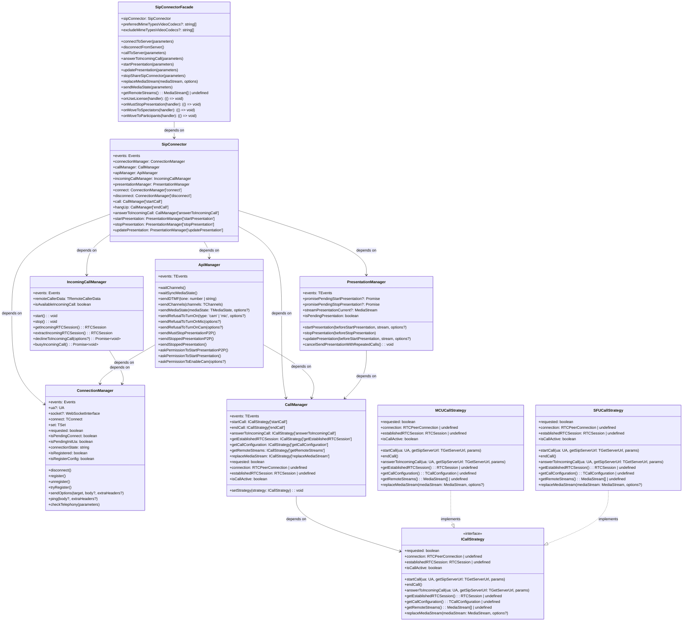

### Архитектура

#### 1. **SipConnectorFacade** (Входная точка)

```ts
class SipConnectorFacade implements IProxyMethods {
  public readonly sipConnector: SipConnector;
  private readonly preferredMimeTypesVideoCodecs?: string[];
  private readonly excludeMimeTypesVideoCodecs?: string[];

  constructor(
    sipConnector: SipConnector,
    {
      preferredMimeTypesVideoCodecs,
      excludeMimeTypesVideoCodecs,
    }: {
      preferredMimeTypesVideoCodecs?: string[];
      excludeMimeTypesVideoCodecs?: string[];
    } = {},
  ) {
    // Proxy для проксирования методов из SipConnector
    return new Proxy(this, {
      get: (target, property, receiver) => {
        if (proxyMethods.has(property as keyof IProxyMethods)) {
          return Reflect.get(this.sipConnector, property, this.sipConnector);
        }
        return Reflect.get(target, property, receiver);
      },
    });
  }

  // Основные методы для работы с сервером
  connectToServer(parameters): Promise<{ ua?: UA; isSuccessful: boolean }>;
  disconnectFromServer(): Promise<{ isSuccessful: boolean }>;
  callToServer(parameters): Promise<RTCPeerConnection>;
  answerToIncomingCall(parameters): Promise<RTCPeerConnection | undefined>;

  // Методы для управления медиа в звонке
  replaceMediaStream(mediaStream, options): Promise<void>;

  // Методы для презентации
  startPresentation(parameters): Promise<MediaStream | undefined>;
  updatePresentation(parameters): Promise<MediaStream | undefined>;
  stopShareSipConnector(parameters): Promise<void>;

  // Синтаксический сахар над методами работы с  API
  sendMediaState(parameters): Promise<void>;
  sendRefusalToTurnOnMic(): Promise<void>;
  sendRefusalToTurnOnCam(): Promise<void>;
  onUseLicense(handler): () => void;
  onMustStopPresentation(handler): () => void;
  onMoveToSpectators(handler): () => void;
  onMoveToParticipants(handler): () => void;

  // Утилитарные методы
  getRemoteStreams(): MediaStream[] | undefined;
}
```

---

#### 2. **SipConnector** (Основной координатор)

```ts
class SipConnector {
  public readonly events: Events<typeof EVENT_NAMES>;
  public readonly connectionManager: ConnectionManager;
  public readonly callManager: CallManager;
  public readonly apiManager: ApiManager;
  public readonly incomingCallManager: IncomingCallManager;
  public readonly presentationManager: PresentationManager;

  constructor({ JsSIP }: { JsSIP: TJsSIP }) {
    this.events = new Events<typeof EVENT_NAMES>(EVENT_NAMES);
    this.connectionManager = new ConnectionManager({ JsSIP });
    this.callManager = new CallManager();
    this.apiManager = new ApiManager({
      connectionManager: this.connectionManager,
      callManager: this.callManager,
    });
    this.incomingCallManager = new IncomingCallManager(this.connectionManager);
    this.presentationManager = new PresentationManager({
      callManager: this.callManager,
    });

    this.subscribe();
  }

  // Проксирование методов менеджеров
  connect: ConnectionManager['connect'];
  disconnect: ConnectionManager['disconnect'];
  call: CallManager['startCall'];
  hangUp: CallManager['endCall'];
  answerToIncomingCall: CallManager['answerToIncomingCall'];
  startPresentation: PresentationManager['startPresentation'];
  stopPresentation: PresentationManager['stopPresentation'];
  updatePresentation: PresentationManager['updatePresentation'];
}
```

---

#### 3. **ConnectionManager** (Управление соединением)

```ts
class ConnectionManager {
  public readonly events: Events<typeof EVENT_NAMES>;
  public ua?: UA;
  public socket?: WebSocketInterface;

  private readonly uaFactory: UAFactory;
  private readonly registrationManager: RegistrationManager;
  private readonly stateMachine: ConnectionStateMachine;
  private readonly connectionFlow: ConnectionFlow;
  private readonly sipOperations: SipOperations;
  private readonly configurationManager: ConfigurationManager;

  constructor({ JsSIP }: { JsSIP: TJsSIP }) {
    this.JsSIP = JsSIP;
    this.events = new Events<typeof EVENT_NAMES>(EVENT_NAMES);
    this.uaFactory = new UAFactory(JsSIP);
    this.registrationManager = new RegistrationManager({
      events: this.events,
      getUaProtected: this.getUaProtected,
    });
    this.stateMachine = new ConnectionStateMachine(this.events);
    this.configurationManager = new ConfigurationManager({
      getUa: this.getUa,
    });
    this.sipOperations = new SipOperations({
      uaFactory: this.uaFactory,
      getUaProtected: this.getUaProtected,
    });
    this.connectionFlow = new ConnectionFlow({
      JsSIP: this.JsSIP,
      events: this.events,
      uaFactory: this.uaFactory,
      stateMachine: this.stateMachine,
      registrationManager: this.registrationManager,
      getUa: this.getUa,
      getConnectionConfiguration: this.getConnectionConfiguration,
      setConnectionConfiguration: (config) => {
        this.configurationManager.set(config);
      },
      updateConnectionConfiguration: (key: 'displayName', value: string) => {
        this.configurationManager.update(key, value);
      },
      setUa: (ua: UA | undefined) => {
        this.ua = ua;
      },
      setSipServerUrl: (getSipServerUrl: TGetServerUrl) => {
        this.getSipServerUrl = getSipServerUrl;
      },
      setSocket: (socket: WebSocketInterface) => {
        this.socket = socket;
      },
    });
  }

  // Основные методы
  connect: TConnect;
  set: TSet;
  disconnect(): Promise<void>;
  register(): Promise<RegisteredEvent>;
  unregister(): Promise<UnRegisteredEvent>;
  tryRegister(): Promise<void>;
  sendOptions(target, body?, extraHeaders?): Promise<void>;
  ping(body?, extraHeaders?): Promise<void>;
  checkTelephony(parameters): Promise<void>;

  // Геттеры состояния
  get requested(): boolean;
  get isPendingConnect(): boolean;
  get isPendingInitUa(): boolean;
  get connectionState(): string;
  get isRegistered(): boolean;
  get isRegisterConfig(): boolean;
}
```

---

#### 4. **CallManager** (Управление звонками)

```ts
class CallManager {
  public readonly events: TEvents;
  private strategy: ICallStrategy;

  constructor(strategy?: ICallStrategy) {
    this.events = new Events<typeof EVENT_NAMES>(EVENT_NAMES);
    this.strategy = strategy ?? new MCUCallStrategy(this.events);
  }

  // Основные методы
  setStrategy(strategy: ICallStrategy): void;
  startCall: ICallStrategy['startCall'];
  endCall: ICallStrategy['endCall'];
  answerToIncomingCall: ICallStrategy['answerToIncomingCall'];
  getEstablishedRTCSession: ICallStrategy['getEstablishedRTCSession'];
  getCallConfiguration: ICallStrategy['getCallConfiguration'];
  getRemoteStreams: ICallStrategy['getRemoteStreams'];
  replaceMediaStream: ICallStrategy['replaceMediaStream'];

  // Геттеры состояния
  get requested(): boolean;
  get connection(): RTCPeerConnection | undefined;
  get establishedRTCSession(): RTCSession | undefined;
  get isCallActive(): boolean;
}
```

---

#### 5. **ApiManager** (Управление API)

```ts
class ApiManager {
  public readonly events: TEvents;
  private readonly connectionManager: ConnectionManager;
  private readonly callManager: CallManager;

  constructor({
    connectionManager,
    callManager,
  }: {
    connectionManager: ConnectionManager;
    callManager: CallManager;
  }) {
    this.connectionManager = connectionManager;
    this.callManager = callManager;
    this.events = new Events<typeof EVENT_NAMES>(EVENT_NAMES);
    this.subscribe();
  }

  // Основные методы
  waitChannels(): Promise<TChannels>;
  waitSyncMediaState(): Promise<{ isSyncForced: boolean }>;
  sendDTMF(tone: number | string): Promise<void>;
  sendChannels(channels: TChannels): Promise<void>;
  sendMediaState(mediaState: TMediaState, options?): Promise<void>;
  sendRefusalToTurnOn(type: 'cam' | 'mic', options?): Promise<void>;
  sendRefusalToTurnOnMic(options?): Promise<void>;
  sendRefusalToTurnOnCam(options?): Promise<void>;
  sendMustStopPresentationP2P(): Promise<void>;
  sendStoppedPresentationP2P(): Promise<void>;
  sendStoppedPresentation(): Promise<void>;
  askPermissionToStartPresentationP2P(): Promise<void>;
  askPermissionToStartPresentation(): Promise<void>;
  askPermissionToEnableCam(options?): Promise<void>;
}
```

---

#### 6. **PresentationManager** (Управление презентацией)

```ts
class PresentationManager {
  public readonly events: TEvents;
  public promisePendingStartPresentation?: Promise<MediaStream>;
  public promisePendingStopPresentation?: Promise<MediaStream | undefined>;
  public streamPresentationCurrent?: MediaStream;

  private cancelableSendPresentationWithRepeatedCalls:
    | ReturnType<typeof repeatedCallsAsync<MediaStream>>
    | undefined;

  private readonly callManager: CallManager;

  constructor({ callManager }: { callManager: CallManager }) {
    this.callManager = callManager;
    this.events = new Events<typeof EVENT_NAMES>(EVENT_NAMES);
    this.subscribe();
  }

  // Основные методы
  startPresentation(beforeStartPresentation, stream, options?): Promise<MediaStream>;
  stopPresentation(beforeStopPresentation): Promise<MediaStream | undefined>;
  updatePresentation(beforeStartPresentation, stream, options?): Promise<MediaStream | undefined>;
  cancelSendPresentationWithRepeatedCalls(): void;

  // Геттеры состояния
  get isPendingPresentation(): boolean;
}
```

---

#### 7. **IncomingCallManager** (Управление входящими звонками)

```ts
class IncomingCallManager {
  public readonly events: Events<typeof EVENT_NAMES>;
  private incomingRTCSession?: RTCSession;
  private readonly connectionManager: ConnectionManager;

  constructor(connectionManager: ConnectionManager) {
    this.connectionManager = connectionManager;
    this.events = new Events<typeof EVENT_NAMES>(EVENT_NAMES);
    this.start();
  }

  // Основные методы
  start(): void;
  stop(): void;
  getIncomingRTCSession(): RTCSession;
  extractIncomingRTCSession(): RTCSession;
  declineToIncomingCall(options?): Promise<void>;
  busyIncomingCall(): Promise<void>;

  // Геттеры состояния
  get remoteCallerData(): TRemoteCallerData;
  get isAvailableIncomingCall(): boolean;
}
```

---

#### 8. **CallStrategy** (Стратегии звонков)

```ts
interface ICallStrategy {
  startCall(ua: UA, getSipServerUrl: TGetServerUrl, params): Promise<RTCPeerConnection>;
  endCall(): Promise<void>;
  answerToIncomingCall(ua: UA, getSipServerUrl: TGetServerUrl, params): Promise<RTCPeerConnection>;
  getEstablishedRTCSession(): RTCSession | undefined;
  getCallConfiguration(): TCallConfiguration | undefined;
  getRemoteStreams(): MediaStream[] | undefined;
  replaceMediaStream(mediaStream: MediaStream, options?): Promise<void>;

  // Геттеры состояния
  get requested(): boolean;
  get connection(): RTCPeerConnection | undefined;
  get establishedRTCSession(): RTCSession | undefined;
  get isCallActive(): boolean;
}

class MCUCallStrategy implements ICallStrategy {
  // Реализация для MCU
}

class SFUCallStrategy implements ICallStrategy {
  // Реализация для SFU
}
```

---



---

Данный модуль инкапсулирует логику SIP-соединений и видеозвонков. Архитектура модуля построена с использованием принципов **SOLID** и нескольких **паттернов проектирования**, что делает её гибкой, расширяемой и легко поддерживаемой.

---

### Основные компоненты и их зоны ответственности

1. **SipConnectorFacade** (Входная точка):
   - **Ответственность**:
     1. Предоставление упрощённого API для работы с SIP-соединениями.
     2. Проксирование методов из `SipConnector` через Proxy.
     3. Обработка ошибок и возврат структурированных результатов.
     4. Управление конфигурацией кодеков (preferred/exclude MIME types).
   - **Зависимости**: Зависит от `SipConnector`.
   - **Методы**:
     - `connectToServer(parameters)`: Подключение к серверу с обработкой ошибок.
     - `disconnectFromServer()`: Отключение от сервера.
     - `callToServer(parameters)`: Исходящий звонок с полным жизненным циклом.
     - `answerToIncomingCall(parameters)`: Ответ на входящий звонок.
     - `startPresentation(parameters)`: Начало презентации.
     - `updatePresentation(parameters)`: Обновление презентации.
     - `stopShareSipConnector(parameters)`: Остановка презентации.
     - `replaceMediaStream(mediaStream, options)`: Замена медиапотока.
     - `sendMediaState(parameters)`: Отправка состояния медиа.
     - `getRemoteStreams()`: Получение удалённых потоков.
     - Проксированные методы: `on`, `once`, `onceRace`, `wait`, `off`, `sendDTMF`, `hangUp`, `declineToIncomingCall`, `sendChannels`, `checkTelephony`, `waitChannels`, `ping`, `connection`, `isConfigured`, `isRegistered`.

2. **SipConnector** (Основной координатор):
   - **Ответственность**:
     1. Координация всех менеджеров и их взаимодействия.
     2. Предоставление единого API для всех операций.
     3. Управление событиями и их подписками.
     4. Проксирование методов менеджеров.
   - **Зависимости**: Зависит от всех менеджеров (`ConnectionManager`, `CallManager`, `ApiManager`, `IncomingCallManager`, `PresentationManager`).
   - **Методы**:
     - Проксированные методы от `ConnectionManager`: `connect`, `set`, `disconnect`, `register`, `unregister`, `tryRegister`, `sendOptions`, `ping`, `checkTelephony`, `isConfigured`, `getConnectionConfiguration`, `getSipServerUrl`.
     - Проксированные методы от `CallManager`: `call`, `hangUp`, `answerToIncomingCall`, `getEstablishedRTCSession`, `getCallConfiguration`, `getRemoteStreams`, `replaceMediaStream`.
     - Проксированные методы от `PresentationManager`: `startPresentation`, `stopPresentation`, `updatePresentation`.
     - Проксированные методы от `ApiManager`: `waitChannels`, `waitSyncMediaState`, `sendDTMF`, `sendChannels`, `sendMediaState`, `sendRefusalToTurnOn`, `sendRefusalToTurnOnMic`, `sendRefusalToTurnOnCam`, `sendMustStopPresentationP2P`, `sendStoppedPresentationP2P`, `sendStoppedPresentation`, `askPermissionToStartPresentationP2P`, `askPermissionToStartPresentation`, `askPermissionToEnableCam`.
     - Проксированные методы от `IncomingCallManager`: `declineToIncomingCall`.

3. **ConnectionManager**:
   - **Ответственность**:
     1. Управление SIP-соединением (создание UA, WebSocket, авторизация).
     2. Управление состоянием соединения через `ConnectionStateMachine`.
     3. Регистрация/отмена регистрации через `RegistrationManager`.
     4. Конфигурация соединения через `ConfigurationManager`.
     5. SIP-операции через `SipOperations`.
     6. Поток соединения через `ConnectionFlow`.
   - **Зависимости**: Зависит от `JsSIP`, внутренние менеджеры.
   - **Методы**:
     - `connect(data, options)`: Подключение к серверу.
     - `set({ displayName })`: Обновление конфигурации.
     - `disconnect()`: Отключение от сервера.
     - `register()`: Регистрация на сервере.
     - `unregister()`: Отмена регистрации.
     - `tryRegister()`: Попытка регистрации.
     - `sendOptions(target, body?, extraHeaders?)`: Отправка OPTIONS.
     - `ping(body?, extraHeaders?)`: Отправка PING.
     - `checkTelephony(parameters)`: Проверка телефонии.

4. **CallManager**:
   - **Ответственность**: Управление звонками через стратегии (MCU/SFU).
   - **Зависимости**: Зависит от `ICallStrategy` (по умолчанию `MCUCallStrategy`).
   - **Методы**:
     - `setStrategy(strategy: ICallStrategy)`: Установка стратегии звонка.
     - `startCall(ua, getSipServerUrl, params)`: Начало звонка.
     - `endCall()`: Завершение звонка.
     - `answerToIncomingCall(ua, getSipServerUrl, params)`: Ответ на входящий звонок.
     - `getEstablishedRTCSession()`: Получение активной сессии.
     - `getCallConfiguration()`: Получение конфигурации звонка.
     - `getRemoteStreams()`: Получение удалённых потоков.
     - `replaceMediaStream(mediaStream, options?)`: Замена медиапотока.

5. **ApiManager**:
   - **Ответственность**:
     1. Обработка SIP-событий и INFO-сообщений.
     2. Управление DTMF-сигналами.
     3. Отправка команд на сервер.
     4. Обработка уведомлений о состоянии медиа.
   - **Зависимости**: Зависит от `ConnectionManager` и `CallManager`.
   - **Методы**:
     - `waitChannels()`: Ожидание каналов.
     - `waitSyncMediaState()`: Ожидание синхронизации медиа.
     - `sendDTMF(tone)`: Отправка DTMF.
     - `sendChannels(channels)`: Отправка каналов.
     - `sendMediaState(mediaState, options?)`: Отправка состояния медиа.
     - `sendRefusalToTurnOn(type, options?)`: Отправка отказа включения.
     - `sendMustStopPresentationP2P()`: Отправка команды остановки презентации P2P.
     - `sendStoppedPresentationP2P()`: Отправка уведомления об остановке презентации P2P.
     - `sendStoppedPresentation()`: Отправка уведомления об остановке презентации.
     - `askPermissionToStartPresentationP2P()`: Запрос разрешения на презентацию P2P.
     - `askPermissionToStartPresentation()`: Запрос разрешения на презентацию.
     - `askPermissionToEnableCam(options?)`: Запрос разрешения на включение камеры.

6. **PresentationManager**:
   - **Ответственность**:
     1. Управление презентацией (старт, остановка, обновление).
     2. Обработка дублированных вызовов презентации.
     3. Управление состоянием презентации.
   - **Зависимости**: Зависит от `CallManager`.
   - **Методы**:
     - `startPresentation(beforeStartPresentation, stream, options?)`: Начало презентации.
     - `stopPresentation(beforeStopPresentation)`: Остановка презентации.
     - `updatePresentation(beforeStartPresentation, stream, options?)`: Обновление презентации.
     - `cancelSendPresentationWithRepeatedCalls()`: Отмена отправки презентации.

7. **IncomingCallManager**:
   - **Ответственность**:
     1. Обработка входящих звонков.
     2. Управление данными вызывающего абонента.
     3. Отклонение входящих звонков.
   - **Зависимости**: Зависит от `ConnectionManager`.
   - **Методы**:
     - `start()`: Запуск обработки входящих звонков.
     - `stop()`: Остановка обработки входящих звонков.
     - `getIncomingRTCSession()`: Получение входящей сессии.
     - `extractIncomingRTCSession()`: Извлечение входящей сессии.
     - `declineToIncomingCall(options?)`: Отклонение входящего звонка.
     - `busyIncomingCall()`: Отклонение с кодом "занято".

8. **ICallStrategy** (интерфейс):
   - **Ответственность**: Определение общего интерфейса для стратегий звонков.
   - **Методы**:
     - `startCall(ua, getSipServerUrl, params)`: Начало звонка.
     - `endCall()`: Завершение звонка.
     - `answerToIncomingCall(ua, getSipServerUrl, params)`: Ответ на входящий звонк.
     - `getEstablishedRTCSession()`: Получение активной сессии.
     - `getCallConfiguration()`: Получение конфигурации звонка.
     - `getRemoteStreams()`: Получение удалённых потоков.
     - `replaceMediaStream(mediaStream, options?)`: Замена медиапотока.

9. **MCUCallStrategy** и **SFUCallStrategy**:
   - **Ответственность**: Реализация логики звонков для MCU и SFU соответственно.
   - **Зависимости**: Нет.
   - **Методы**: Реализация всех методов интерфейса `ICallStrategy`.

#### Детали реализации Proxy в SipConnectorFacade

```ts
const proxyMethods = new Set<keyof IProxyMethods>([
  'on',
  'once',
  'onceRace',
  'wait',
  'off',
  'sendDTMF',
  'hangUp',
  'declineToIncomingCall',
  'sendChannels',
  'checkTelephony',
  'waitChannels',
  'ping',
  'connection',
  'isConfigured',
  'isRegistered',
]);

return new Proxy(this, {
  get: (target, property, receiver) => {
    if (
      typeof property === 'string' &&
      proxyMethods.has(property as keyof IProxyMethods) &&
      property in this.sipConnector
    ) {
      const value = Reflect.get(this.sipConnector, property, this.sipConnector) as unknown;
      return typeof value === 'function' ? value.bind(this.sipConnector) : value;
    }

    const value = Reflect.get(target, property, receiver) as unknown;
    return typeof value === 'function' ? value.bind(target) : value;
  },
});
```

Этот Proxy автоматически проксирует методы из `SipConnector`, что позволяет `SipConnectorFacade` предоставлять упрощённый API, сохраняя при этом доступ ко всем методам базового класса.

---

### Правила зависимостей

1. **Модульность**:
   - Каждый компонент отвечает за свою задачу и не зависит от других, если это не требуется.
   - `SipConnectorFacade` зависит только от `SipConnector`.
   - `SipConnector` координирует все менеджеры, но каждый менеджер независим в своей области.

2. **Инверсия зависимостей**:
   - Высокоуровневые компоненты (например, `SipConnector`) зависят от абстракций (например, `ICallStrategy`), а не от конкретных реализаций.
   - `CallManager` использует стратегии через интерфейс `ICallStrategy`.

3. **Слабая связанность**:
   - Компоненты взаимодействуют через события и интерфейсы.
   - `SipConnectorFacade` использует Proxy для слабой связанности с `SipConnector`.

---

### Применённые паттерны проектирования

1. **Фасад (Facade)**:
   - `SipConnectorFacade` выступает в роли фасада, предоставляя простой интерфейс для работы с модулем и скрывая сложность внутренних компонентов.

2. **Стратегия (Strategy)**:
   - Используется для реализации разных типов звонков (MCU и SFU). Каждая стратегия (`MCUCallStrategy`, `SFUCallStrategy`) реализует общий интерфейс `ICallStrategy`.

3. **Наблюдатель (Observer)**:
   - Используется для обработки событий во всех менеджерах. Компоненты подписываются на события и реагируют на них.

4. **Прокси (Proxy)**:
   - `SipConnectorFacade` использует JavaScript Proxy для автоматического проксирования методов из `SipConnector`.

5. **Композиция**:
   - `SipConnector` использует композицию для объединения всех менеджеров.
   - `CallManager` использует композицию со стратегиями.

---

### Преимущества архитектуры

1. **Гибкость**:
   - Легко добавлять новые типы звонков (например, P2P) или изменять логику существующих через стратегии.
   - `SipConnectorFacade` предоставляет упрощённый API, скрывая сложность.

2. **Модульность**:
   - Компоненты слабо связаны, что упрощает тестирование и поддержку.
   - Каждый менеджер отвечает за свою область.

3. **Расширяемость**:
   - Новые функции можно добавлять без изменения существующего кода.
   - Proxy в `SipConnectorFacade` автоматически проксирует новые методы.

4. **Чистая архитектура**:
   - Соблюдение принципов SOLID.
   - Использование паттернов делает код понятным и легко поддерживаемым.

5. **Упрощённый API**:
   - `SipConnectorFacade` предоставляет удобный интерфейс для клиентов.
   - Автоматическое проксирование методов снижает дублирование кода.

---

### Пример использования

```ts
import { SipConnectorFacade } from './SipConnectorFacade';
import { SipConnector } from './SipConnector';

// Создание экземпляра
const sipConnector = new SipConnector({ JsSIP });
const sipConnectorFacade = new SipConnectorFacade(sipConnector, {
  preferredMimeTypesVideoCodecs: ['video/VP8'],
  excludeMimeTypesVideoCodecs: ['video/H264'],
});

// Подключение к серверу
const { isSuccessful } = await sipConnectorFacade.connectToServer({
  userAgent: 'Chrome',
  sipWebSocketServerURL: 'wss://example.com:8089/ws',
  sipServerUrl: 'sip:example.com',
  displayName: 'User Name',
  name: 'username',
  password: 'password',
  isRegisteredUser: true,
});

if (!isSuccessful) {
  console.error('Connection failed');
  return;
}

// Получение локального медиапотока
const mediaStream = await navigator.mediaDevices.getUserMedia({
  video: true,
  audio: true,
});

// Исходящий звонок
const peerConnection = await sipConnectorFacade.callToServer({
  conference: 'conference123',
  mediaStream,
  setRemoteStreams: (streams) => {
    console.log('Remote streams received:', streams);
  },
  onBeforeProgressCall: (conference) => {
    console.log('Starting call to:', conference);
  },
  onSuccessProgressCall: ({ isPurgatory }) => {
    console.log('Call successful, isPurgatory:', isPurgatory);
  },
  onEnterConference: ({ isSuccessProgressCall }) => {
    console.log('Entered conference, success:', isSuccessProgressCall);
  },
  onFailProgressCall: () => {
    console.log('Call failed');
  },
  onEndedCall: () => {
    console.log('Call ended');
  },
});

// Начало презентации
const presentationStream = await sipConnectorFacade.startPresentation({
  mediaStream: presentationMediaStream,
  isP2P: false,
  maxBitrate: 1000000,
  contentHint: 'detail',
});

// Отправка состояния медиа
await sipConnectorFacade.sendMediaState({
  isEnabledCam: true,
  isEnabledMic: false,
});

// Подписка на события
const unsubscribeUseLicense = sipConnectorFacade.onUseLicense((license) => {
  console.log('License used:', license);
});

const unsubscribeMustStopPresentation = sipConnectorFacade.onMustStopPresentation(() => {
  console.log('Must stop presentation');
});

// Отключение от сервера
await sipConnectorFacade.disconnectFromServer();
```

---

### Итог

Архитектура модуля построена с использованием паттернов **Фасад**, **Стратегия**, **Наблюдатель**, **Прокси** и **Композиция**, что делает её гибкой, расширяемой и легко поддерживаемой. `SipConnectorFacade` служит входной точкой и предоставляет упрощённый API, скрывая сложность внутренних компонентов. Каждый компонент имеет чёткую зону ответственности, а зависимости между ними минимизированы и управляются через интерфейсы и события. Это позволяет легко адаптировать модуль под новые требования и интегрировать его в различные системы.

---

## План рефакторинга VideoSendingBalancer

### Текущие проблемы

1. **Нарушение SRP (Single Responsibility Principle)**
   - Класс объединяет подписку на события, бизнес-логику балансировки, очередь промисов и обработку ошибок
   - Метод `processSender` выполняет бизнес-логику, тогда как класс уже занимается инфраструктурой

2. **Магические числа и строки**
   - `scaleResolutionDownByTarget = 200` (строка 149-155)
   - `scaleResolutionDownByTarget = 1` (строка 168-182)
   - Строка формата `'<width>x<height>'` распарсена напрямую (строки 196-205)

3. **Скрытое подавление ошибок**
   - Метод `runStackPromises` логирует ошибку и проглатывает её, возвращая `undefined`
   - Нарушает ожидаемый контракт `Promise<TResult>`

4. **Потенциально невалидный `resultNoChanged`**
   - Объект формируется «вручную», без гарантии соответствия реальным параметрам `RTCRtpSendParameters`
   - При изменении контракта — риск рассинхронизации

5. **Жёсткая связность с внешними утилитами**
   - Зависимости (`findVideoSender`, `getCodecFromSender`, `setEncodingsToSender`) подключаются напрямую
   - Усложняет юнит-тесты

6. **Дублирование кода**
   - Вычисление `maxBitrate` и отправка в `addToStackScaleResolutionDownBySender` повторяется в трёх методах
   - Константы `scaleResolutionDownByTarget` различаются только числом

7. **Неочевидная очередь промисов**
   - `stack-promises` не документирован, труднее понять политики повтора/отмены

### План рефакторинга

#### 1. Разделение ответственности

**Создать новые классы:**

```typescript
// Контроллер/фасад
class VideoSendingBalancer {
  private readonly eventHandler: VideoSendingEventHandler;
  private readonly senderBalancer: SenderBalancer;
  private readonly taskQueue: TaskQueue<TResult>;

  constructor(sipConnector: SipConnector, options: BalancerOptions) {
    this.eventHandler = new VideoSendingEventHandler(sipConnector);
    this.senderBalancer = new SenderBalancer(options);
    this.taskQueue = new TaskQueue();
  }

  subscribe(): void {
    this.eventHandler.subscribe(this.handleMainCamControl.bind(this));
  }

  private async handleMainCamControl(headers: MainCamHeaders): Promise<void> {
    const result = await this.senderBalancer.balance(headers);
    this.taskQueue.add(() => this.applyResult(result));
  }
}

// Бизнес-логика балансировки
class SenderBalancer {
  private readonly strategies: Map<EEventsMainCAM, BalancingStrategy>;

  constructor(options: BalancerOptions) {
    this.strategies = this.createStrategies(options);
  }

  async balance(headers: MainCamHeaders): Promise<TResult> {
    const strategy = this.strategies.get(headers.mainCam) ?? this.strategies.get(undefined);
    return strategy.execute(headers);
  }
}

// Обработчик событий
class VideoSendingEventHandler {
  constructor(private readonly sipConnector: SipConnector) {}

  subscribe(handler: (headers: MainCamHeaders) => void): void {
    this.sipConnector.on('api:main-cam-control', handler);
  }

  unsubscribe(): void {
    this.sipConnector.off('api:main-cam-control');
  }
}

// Очередь задач
class TaskQueue<T> {
  private readonly stackPromises = createStackPromises<T>();

  add(task: () => Promise<T>): Promise<T> {
    this.stackPromises.add(task);
    return this.execute();
  }

  private async execute(): Promise<T> {
    return this.stackPromises().catch((error: unknown) => {
      logger.error('TaskQueue: error', error);
      throw error; // Пробрасываем ошибку наружу
    });
  }
}
```

#### 2. Вынесение констант и конфигурации

```typescript
// Константы
const SCALE_RESOLUTION = {
  DOWNGRADED: 200,
  DEFAULT: 1,
} as const;

const BITRATE_LIMITS = {
  MIN: getMinimumBitrate,
  MAX: getMaximumBitrate,
} as const;

// Конфигурация
interface BalancerOptions {
  ignoreForCodec?: string;
  onSetParameters?: TOnSetParameters;
  scaleResolution?: typeof SCALE_RESOLUTION;
  bitrateLimits?: typeof BITRATE_LIMITS;
}
```

#### 3. Улучшение обработки ошибок

```typescript
// Типобезопасный resultNoChanged
private createNoChangedResult(): TResult {
  return {
    isChanged: false,
    parameters: {
      encodings: [{}],
      transactionId: '0',
      codecs: [],
      headerExtensions: [],
      rtcp: {},
    },
  };
}

// Правильная обработка ошибок
private async executeTask<T>(task: () => Promise<T>): Promise<T> {
  try {
    return await task();
  } catch (error) {
    logger.error('VideoSendingBalancer: error', error);
    return this.createNoChangedResult() as T;
  }
}
```

#### 4. Стратегия вместо switch

```typescript
// Интерфейс стратегии
interface BalancingStrategy {
  execute(context: BalancingContext): Promise<TResult>;
}

// Контекст для стратегий
interface BalancingContext {
  sender: RTCRtpSender;
  videoTrack: MediaStreamVideoTrack;
  codec?: string;
  resolutionMainCam?: string;
}

// Реализации стратегий
class PauseMainCamStrategy implements BalancingStrategy {
  async execute({ sender, codec }: BalancingContext): Promise<TResult> {
    const scaleResolutionDownBy = SCALE_RESOLUTION.DOWNGRADED;
    const maxBitrate = BITRATE_LIMITS.MIN(codec);

    return setEncodingsToSender(sender, { scaleResolutionDownBy, maxBitrate });
  }
}

class ResumeMainCamStrategy implements BalancingStrategy {
  async execute({ sender, videoTrack, codec }: BalancingContext): Promise<TResult> {
    const settings = videoTrack.getSettings();
    const widthCurrent = settings.width;

    const maxBitrate =
      widthCurrent === undefined
        ? BITRATE_LIMITS.MAX(codec)
        : calcMaxBitrateByWidthAndCodec(widthCurrent, codec);

    return setEncodingsToSender(sender, {
      scaleResolutionDownBy: SCALE_RESOLUTION.DEFAULT,
      maxBitrate,
    });
  }
}

class MaxResolutionStrategy implements BalancingStrategy {
  async execute({
    sender,
    videoTrack,
    codec,
    resolutionMainCam,
  }: BalancingContext): Promise<TResult> {
    if (!resolutionMainCam) {
      return new ResumeMainCamStrategy().execute({ sender, videoTrack, codec });
    }

    const [widthTarget, heightTarget] = resolutionMainCam.split('x');
    const targetSize = {
      width: Number(widthTarget),
      height: Number(heightTarget),
    };

    const scaleResolutionDownBy = calcScaleResolutionDownBy({ videoTrack, targetSize });
    const maxBitrate = calcMaxBitrateByWidthAndCodec(targetSize.width, codec);

    return setEncodingsToSender(sender, { scaleResolutionDownBy, maxBitrate });
  }
}
```

#### 5. Улучшение тестируемости через DI

```typescript
// Интерфейсы для зависимостей
interface ISenderFinder {
  findVideoSender(senders: RTCRtpSender[]): RTCRtpSender | undefined;
}

interface ICodecProvider {
  getCodecFromSender(sender: RTCRtpSender): Promise<string>;
}

interface IParametersSetter {
  setEncodingsToSender(
    sender: RTCRtpSender,
    parameters: EncodingParameters,
    onSetParameters?: TOnSetParameters,
  ): Promise<TResult>;
}

// Внедрение зависимостей
class SenderBalancer {
  constructor(
    private readonly senderFinder: ISenderFinder,
    private readonly codecProvider: ICodecProvider,
    private readonly parametersSetter: IParametersSetter,
    options: BalancerOptions,
  ) {
    this.strategies = this.createStrategies(options);
  }
}
```

#### 6. Документация и комментарии

````typescript
/**
 * Балансировщик видеопотоков для управления качеством передачи
 *
 * @param sipConnector - Экземпляр SipConnector для подписки на события
 * @param options - Опции конфигурации
 *
 * @example
 * ```typescript
 * const balancer = new VideoSendingBalancer(sipConnector, {
 *   ignoreForCodec: 'H264',
 *   onSetParameters: (result) => console.log('Parameters set:', result)
 * });
 *
 * balancer.subscribe();
 * ```
 */
class VideoSendingBalancer {
  /**
   * Подписывается на события управления главной камерой
   */
  public subscribe(): void {
    // ...
  }

  /**
   * Отписывается от событий и сбрасывает состояние
   */
  public unsubscribe(): void {
    // ...
  }
}
````

### Метрики прогресса

1. **Сокращение покрытия `VideoSendingBalancer` в unit-тестах до ≤ 20%**
   - Остальное покрытие переносится в новые, мелкие модули

2. **100% юнит-тесты бизнес-логики `SenderBalancer`**
   - Тестирование стратегий без зависимости от `SipConnector`

3. **Показатель `cyclomatic complexity` каждого метода ≤ 5**
   - Упрощение логики через разделение на стратегии

4. **Удаление всех «магических» чисел из кода-продукта**
   - Вынесение в константы и конфигурацию

5. **Улучшение покрытия тестами до 90%+**
   - За счёт упрощения компонентов и внедрения зависимостей

### Приоритеты выполнения

1. **Высокий приоритет:**
   - Разделение ответственности (контроллер, сервис, очередь)
   - Вынесение констант
   - Исправление обработки ошибок

2. **Средний приоритет:**
   - Замена switch на стратегии
   - Внедрение зависимостей через DI
   - Улучшение документации

3. **Низкий приоритет:**
   - Потенциальное кеширование результатов
   - Дополнительные оптимизации производительности

### Ожидаемые результаты

- **Упрощение поддержки:** каждый класс имеет одну ответственность
- **Улучшение тестируемости:** возможность тестировать бизнес-логику изолированно
- **Повышение читаемости:** устранение магических чисел и дублирования
- **Гибкость:** легко добавлять новые стратегии балансировки
- **Надёжность:** правильная обработка ошибок и типобезопасность
